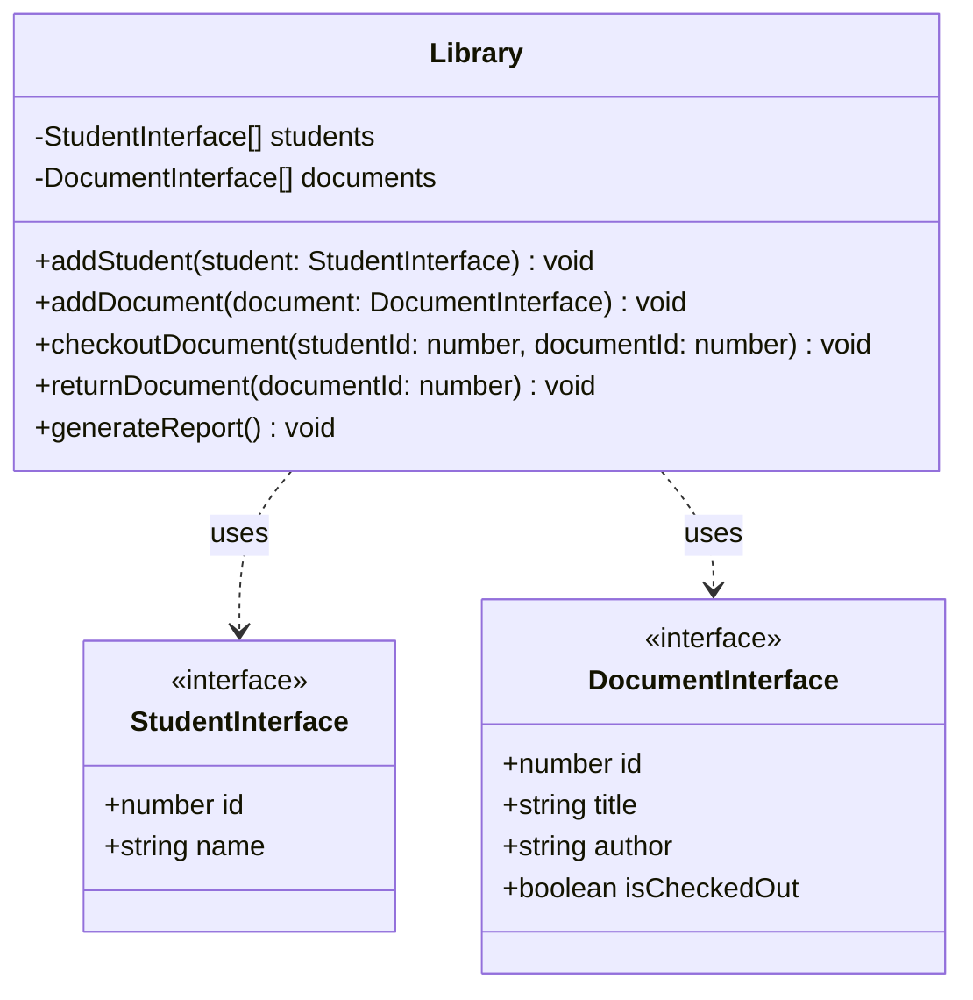
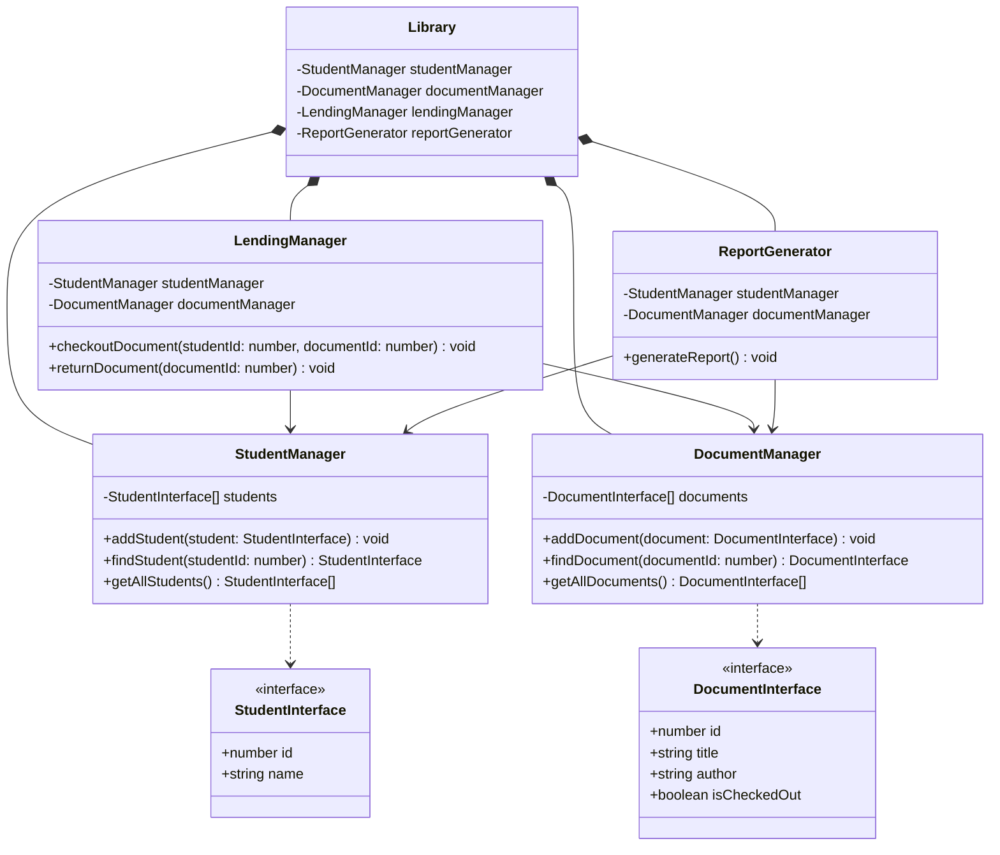
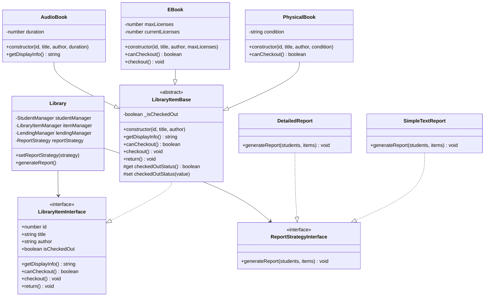
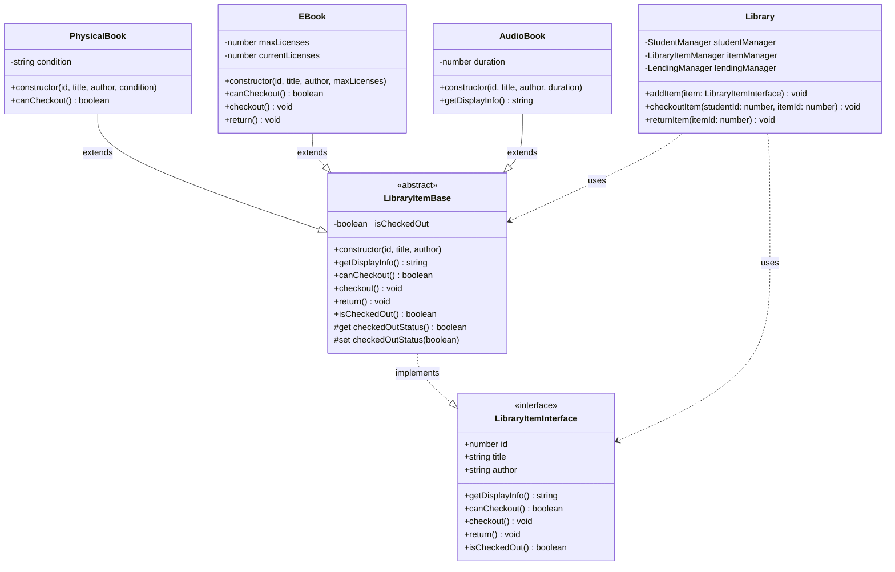
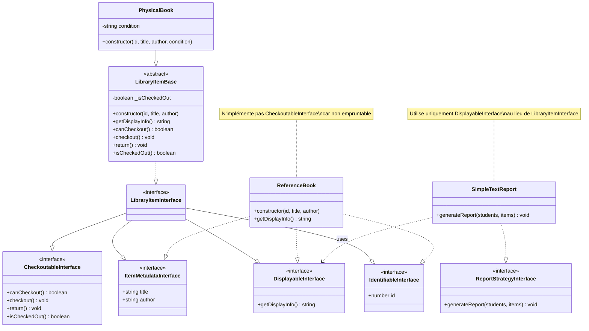
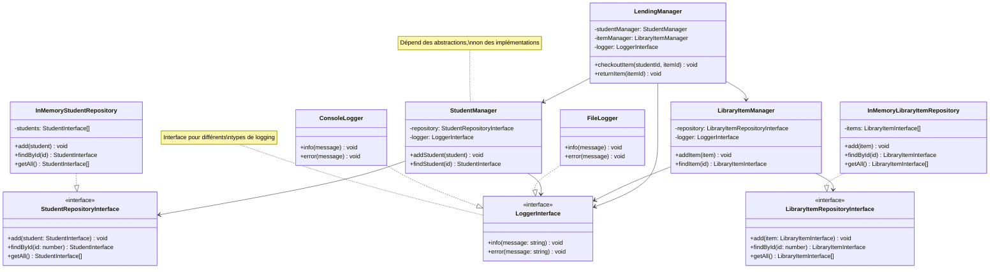
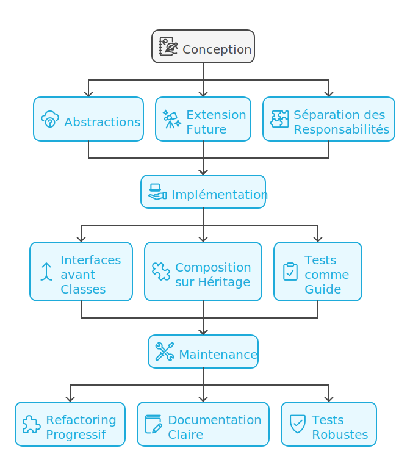
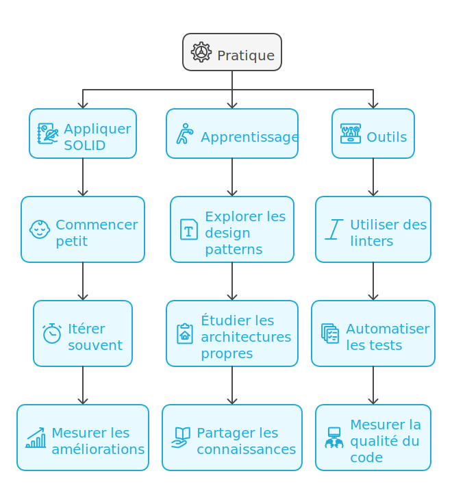

.jpg>)

# 🚀 Cours sur les Principes SOLID en JavaScript/TypeScript 🎯

## 🔍 Introduction

👉 Imaginez que vous construisez une maison. Comme dans la construction, le développement logiciel nécessite des fondations solides et des principes directeurs pour créer quelque chose de durable et adaptable. Les principes SOLID sont comme les règles fondamentales de l'architecture en construction :

### 🏗️ L'Analogie de la Construction

1. **Single Responsibility (SRP)** - Comme un électricien qui se concentre uniquement sur l'électricité

    - Un électricien ne s'occupe pas de la plomberie
    - Chaque expert a son domaine
    - Dans le code : chaque classe a une seule responsabilité

2. **Open/Closed (OCP)** - Comme l'extension d'une maison

    - On peut ajouter une pièce sans démolir les murs existants
    - La structure initiale reste intacte
    - Dans le code : on étend les fonctionnalités sans modifier le code existant

3. **Liskov Substitution (LSP)** - Comme les prises électriques standardisées

    - N'importe quel appareil aux normes peut être branché
    - Pas besoin d'adapter la prise
    - Dans le code : les sous-classes peuvent remplacer leurs classes parentes

4. **Interface Segregation (ISP)** - Comme les différents interrupteurs d'une pièce

    - Un interrupteur pour la lumière
    - Un autre pour la ventilation
    - Dans le code : des interfaces spécifiques plutôt qu'une seule interface générale

5. **Dependency Inversion (DIP)** - Comme les connexions modulaires d'une maison
    - Les appareils se branchent sur des prises standardisées
    - On peut changer d'appareil sans modifier l'installation
    - Dans le code : dépendre des abstractions, pas des implémentations

### 🎯 Pourquoi SOLID ?

Tout comme une maison bien construite :

-   🏠 Le code est stable et durable
-   🔧 Les modifications sont plus faciles
-   🎨 L'extension est naturelle
-   🧰 La maintenance est simplifiée
-   ⚡ Les problèmes sont isolés

Dans ce cours, nous allons explorer chaque principe en profondeur à travers un exemple concret : la création d'une bibliothèque numérique. Comme la construction d'une maison, nous verrons comment chaque principe contribue à créer un système robuste, flexible et maintenable. 📚

## 🔍 Vue d'ensemble du cours

Dans ce cours, nous explorerons chaque principe en profondeur, illustré par un exemple concret : la création d'une bibliothèque numérique via la classe Library. 📚

### 📚 Structure du Cours

Le cours suit une approche progressive :

📉 Présentation de la situation initiale (une implémentation de classe Library non SOLID)

-   🔎 Analyse des inconvénients
-   💡 Introduction du principe SOLID
-   🚀 Démonstration des améliorations
-   ⚖️ Comparaison avant/après

### 🎯 Objectifs d'Apprentissage

À la fin de ce cours, vous serez capable de :

-   ✅ Comprendre chacun des principes SOLID
-   🔍 Identifier les violations de SOLID dans le code existant
-   🔧 Appliquer ces principes pour améliorer la conception de votre code
-   📝 Écrire un code maintenable, extensible et testable
-   ⚖️ Analyser les avantages du code avant et après l'application des principes SOLID

### 🎓 Exemple Pratique

**Système de Gestion de Bibliothèque**

[📦 Tout le code est disponible dans le dépôt](https://github.com/giak/design-patterns-typescript/tree/main/src/SOLID/library)

Pour illustrer nos principes, nous travaillerons sur un exemple concret : un système de gestion de bibliothèque. Voici un aperçu de notre classe Library de départ, qui ne respecte pas encore les principes SOLID.

### 🎯 Situation Initiale

Dans notre projet, la classe Library gère plusieurs responsabilités :

-   👥 Gestion des étudiants
-   📚 Gestion des documents
-   🔄 Gestion des prêts et retours
-   📊 Génération de rapports

<<< @/SOLID/library/00_source.ts



### ⚠️ Problèmes de l'Implémentation Initiale

Cette première version de la classe Library présente plusieurs défauts :

Responsabilité unique manquante : la classe gère les étudiants, les documents, les prêts, et les rapports.

Difficulté d'extension sans perturber d'autres fonctionnalités.

Flexibilité limitée et réutilisabilité réduite.

Complexité des tests unitaires en raison des multiples responsabilités.

📌 Note : Tout au long du cours, nous allons appliquer les principes SOLID pour améliorer cette implémentation, étape par étape, afin de créer un code robuste, flexible et maintenable.

## Single Responsibility Principle (SRP)

### 🎯 Définition

Le Single Responsibility Principle (SRP) stipule qu'une classe ne devrait avoir qu'une seule raison de changer. En d'autres termes, une classe devrait avoir une seule responsabilité bien définie.

### 🏗️ Analogie avec la Construction d'une Maison

Imaginons la construction d'une maison. Dans une approche non-SRP, nous aurions un "super-artisan" qui serait responsable de tout :

-   🔧 Plomberie
-   ⚡ Électricité
-   🧱 Maçonnerie
-   🎨 Peinture
-   🪟 Installation des fenêtres

Cette approche pose plusieurs problèmes :

1. Si le "super-artisan" est malade, tout s'arrête
2. La qualité peut être inégale (personne ne peut être expert en tout)
3. Les travaux sont séquentiels au lieu d'être parallèles
4. Difficile de remplacer l'artisan si son travail n'est pas satisfaisant

Dans une approche SRP, nous avons :

-   🔧 Un plombier qui ne s'occupe que de la plomberie
-   ⚡ Un électricien spécialisé dans l'électricité
-   🧱 Un maçon expert en construction des murs
-   🎨 Un peintre pour les finitions
-   🪟 Un vitrier pour les fenêtres

Avantages :

1. Chaque artisan est expert dans son domaine
2. Les travaux peuvent être menés en parallèle
3. Facile de remplacer un artisan si nécessaire
4. Responsabilités et garanties clairement définies

Le chef de chantier (équivalent à notre classe `Library`) coordonne ces différents corps de métier, sans faire le travail lui-même.

Cette analogie illustre parfaitement le SRP dans notre code :

-   Les artisans spécialisés → Nos managers spécialisés (`StudentManager`, `DocumentManager`, etc.)
-   Le chef de chantier → Notre classe `Library` qui coordonne
-   Les domaines d'expertise → Les responsabilités uniques
-   La coordination des travaux → L'orchestration des différentes opérations

### ❌ Problème Initial

Dans notre implémentation initiale, la classe `Library` viole le SRP en gérant plusieurs responsabilités :

```typescript
class Library {
    private students: StudentInterface[] = [];
    private documents: DocumentInterface[] = [];

    addStudent(student: StudentInterface): void {
        /* ... */
    }
    addDocument(document: DocumentInterface): void {
        /* ... */
    }
    checkoutDocument(studentId: number, documentId: number): void {
        /* ... */
    }
    returnDocument(documentId: number): void {
        /* ... */
    }
    generateReport(): void {
        /* ... */
    }
}
```

Problèmes identifiés :

-   📚 Gestion des étudiants
-   📖 Gestion des documents
-   🔄 Gestion des prêts/retours
-   📊 Génération de rapports

Cette conception pose plusieurs problèmes :

1. **Couplage élevé** : Les modifications d'une fonctionnalité peuvent affecter les autres
2. **Difficulté de maintenance** : La classe devient difficile à maintenir avec l'ajout de nouvelles fonctionnalités
3. **Tests complexes** : Tester une fonctionnalité nécessite de configurer tout le contexte
4. **Réutilisation limitée** : Impossible de réutiliser une fonctionnalité sans embarquer toute la classe

### ✅ Application du SRP

Pour respecter le SRP, nous avons divisé la classe en plusieurs classes ayant chacune une responsabilité unique :

```typescript
class StudentManager {
    private students: StudentInterface[] = [];
    addStudent(student: StudentInterface): void {
        /* ... */
    }
    findStudent(studentId: number): StudentInterface | undefined {
        /* ... */
    }
    getAllStudents(): StudentInterface[] {
        /* ... */
    }
}

class DocumentManager {
    private documents: DocumentInterface[] = [];
    addDocument(document: DocumentInterface): void {
        /* ... */
    }
    findDocument(documentId: number): DocumentInterface | undefined {
        /* ... */
    }
    getAllDocuments(): DocumentInterface[] {
        /* ... */
    }
}

class LendingManager {
    constructor(private studentManager: StudentManager, private documentManager: DocumentManager) {}
    checkoutDocument(studentId: number, documentId: number): void {
        /* ... */
    }
    returnDocument(documentId: number): void {
        /* ... */
    }
}

class ReportGenerator {
    constructor(private studentManager: StudentManager, private documentManager: DocumentManager) {}
    generateReport(): void {
        /* ... */
    }
}
```



### 🎉 Avantages Obtenus

1. **Responsabilités Claires** :

    - `StudentManager` : Gère uniquement les opérations liées aux étudiants
    - `DocumentManager` : Gère uniquement les opérations liées aux documents
    - `LendingManager` : Gère uniquement les opérations de prêt
    - `ReportGenerator` : Gère uniquement la génération des rapports

2. **Maintenance Facilitée** :

    - Chaque classe a un périmètre bien défini
    - Les modifications sont localisées
    - Le code est plus facile à comprendre

3. **Tests Simplifiés** :

    - Chaque classe peut être testée indépendamment
    - Les mocks sont plus simples à mettre en place
    - La couverture de tests est plus facile à atteindre

4. **Meilleure Réutilisabilité** :
    - Les classes peuvent être réutilisées séparément
    - L'injection des dépendances facilite la composition
    - Les fonctionnalités sont modulaires

### 🔄 Coordination des Responsabilités

La classe `Library` devient un point de coordination qui utilise ces différents managers :

```typescript
class Library {
    private studentManager: StudentManager;
    private documentManager: DocumentManager;
    private lendingManager: LendingManager;
    private reportGenerator: ReportGenerator;

    constructor() {
        this.studentManager = new StudentManager();
        this.documentManager = new DocumentManager();
        this.lendingManager = new LendingManager(this.studentManager, this.documentManager);
        this.reportGenerator = new ReportGenerator(this.studentManager, this.documentManager);
    }

    // Méthodes de délégation aux managers appropriés
}
```

### 💡 Points Clés à Retenir

1. **Une Seule Raison de Changer** :

    - Chaque classe a une responsabilité unique et cohérente
    - Les modifications sont isolées et prévisibles

2. **Cohésion Élevée** :

    - Toutes les méthodes d'une classe sont liées à sa responsabilité
    - Le code est plus organisé et plus facile à maintenir

3. **Couplage Faible** :

    - Les classes communiquent via des interfaces bien définies
    - Les dépendances sont explicites et gérables

4. **Évolutivité** :
    - Nouvelles fonctionnalités plus faciles à ajouter
    - Impact minimal sur le code existant

Le SRP est souvent le premier pas vers une meilleure architecture. Il pose les bases pour l'application des autres principes SOLID et facilite l'évolution future du code.

## 🔒 Open/Closed Principle (OCP)

### 🎯 Définition

Le principe Open/Closed stipule que les entités logicielles (classes, modules, fonctions) doivent être :

-   **Ouvertes à l'extension** : On peut ajouter de nouveaux comportements
-   **Fermées à la modification** : Le code existant ne doit pas être modifié

### 🏗️ Analogie avec la Construction d'une Maison

Imaginons une maison moderne :

1. **Extension sans Modification** :

    - 🏠 La maison a une structure de base solide
    - 🔌 Prises électriques standardisées pour brancher de nouveaux appareils
    - 🚰 Système de plomberie avec des raccords normalisés
    - 🛋️ Pièces modulables pour différents aménagements

2. **Contre-Exemple (Non-OCP)** :

    - 🔨 Casser un mur pour ajouter une prise
    - 🔧 Modifier la plomberie existante pour un nouvel appareil
    - 🏚️ Reconstruction partielle pour chaque changement

3. **Approche OCP** :
    - ➕ Ajout de nouveaux éléments via des interfaces standardisées
    - 🔄 Remplacement facile des composants
    - 🎛️ Configuration sans modification structurelle

### ❌ Problème Initial

Notre implémentation précédente présente plusieurs limitations :

```typescript
interface LibraryItemInterface {
    id: number;
    title: string;
    author: string;
    isCheckedOut: boolean;
    getDisplayInfo(): string;
    canCheckout(): boolean;
    checkout(): void;
    return(): void;
}

// Pas d'abstraction pour différents types d'items
class PhysicalBook implements LibraryItemInterface {
    // Implémentation rigide...
}
```

Problèmes identifiés :

1. 📚 Impossible d'ajouter de nouveaux types de documents sans modifier le code
2. 📊 Format de rapport fixe et non extensible
3. 🔒 Comportements de prêt codés en dur

### ✅ Application de l'OCP

Nous avons appliqué l'OCP de plusieurs manières :

1. **Hiérarchie d'Items Extensible** :

```typescript
interface LibraryItemInterface
    extends IdentifiableInterface,
        ItemMetadataInterface,
        DisplayableInterface,
        CheckoutableInterface {}

// Nouveaux types facilement ajoutables
class PhysicalBook extends LibraryItemBase {
    constructor(id: number, title: string, author: string, private condition: 'good' | 'damaged' = 'good') {
        /* ... */
    }
}

class EBook extends LibraryItemBase {
    constructor(id: number, title: string, author: string, private maxLicenses: number = 3) {
        /* ... */
    }
}

class AudioBook extends LibraryItemBase {
    constructor(id: number, title: string, author: string, private duration: number = 0) {
        /* ... */
    }
}
```

2. **Stratégie de Rapport Flexible** :

```typescript
interface ReportStrategyInterface {
    generateReport(students: StudentInterface[], items: DisplayableInterface[]): void;
}

class SimpleTextReport implements ReportStrategyInterface {
    generateReport(students: StudentInterface[], items: DisplayableInterface[]): void {
        // Format simple
    }
}

class DetailedReport implements ReportStrategyInterface {
    generateReport(students: StudentInterface[], items: LibraryItemInterface[]): void {
        // Format détaillé avec statistiques
    }
}
```



### 🎉 Avantages Obtenus

1. **Extension Facilitée** :

    - ➕ Nouveaux types de documents ajoutables sans modification
    - 📊 Nouveaux formats de rapport intégrables facilement
    - 🔄 Comportements personnalisables par type

2. **Maintenance Sécurisée** :

    - 🛡️ Code existant non modifié = pas de régression
    - 📝 Tests existants restent valides
    - 🔍 Changements localisés et isolés

3. **Flexibilité Accrue** :
    - 🎯 Comportements spécifiques par type d'item
    - 🔄 Stratégies interchangeables
    - 🧩 Composition plutôt que modification

### 💡 Points Clés à Retenir

1. **Abstraction et Héritage** :

    - Utiliser des interfaces et classes abstraites
    - Définir des contrats clairs
    - Permettre les extensions via l'héritage

2. **Composition et Stratégie** :

    - Favoriser la composition à l'héritage quand possible
    - Utiliser le pattern Stratégie pour les comportements variables
    - Injecter les dépendances plutôt que les créer

3. **Design Patterns Utiles** :

    - 🎯 Strategy Pattern (pour les rapports)
    - 🏭 Factory Pattern (pour la création d'items)
    - 🔌 Plugin Pattern (pour les extensions)

4. **Bonnes Pratiques** :
    - Prévoir l'extension dès la conception
    - Identifier les points de variation
    - Créer des abstractions appropriées

L'OCP nous permet de créer un système véritablement extensible, où de nouvelles fonctionnalités peuvent être ajoutées sans risquer de casser l'existant. C'est un principe fondamental pour créer des systèmes maintenables et évolutifs.

## 🚀 Liskov Substitution Principle (LSP)

### 🎯 Définition

Le principe de substitution de Liskov stipule que les objets d'une classe dérivée doivent pouvoir remplacer les objets de la classe de base sans altérer la cohérence du programme. En d'autres termes, si S est un sous-type de T, alors les objets de type T peuvent être remplacés par des objets de type S sans altérer les propriétés désirables du programme.

### 🏗️ Analogie avec la Construction d'une Maison

Imaginons le système électrique d'une maison :

1. **Exemple Conforme au LSP** :

    - 🔌 Toutes les prises électriques suivent la même norme
    - 📱 N'importe quel appareil aux normes fonctionne sur n'importe quelle prise
    - 💡 Les lampes LED peuvent remplacer les ampoules classiques
    - 🔄 Les interrupteurs sont interchangeables tant qu'ils respectent le standard

2. **Violation du LSP** :

    - ⚡ Une prise non standard qui endommage les appareils normaux
    - 💥 Un interrupteur qui ne coupe pas complètement le courant
    - ⚠️ Une ampoule qui nécessite un voltage différent

3. **Bénéfices du LSP** :
    - 🛡️ Sécurité garantie par le respect des normes
    - 🔄 Interchangeabilité des composants
    - 🛠️ Maintenance simplifiée

### ❌ Problème Initial

Notre implémentation précédente présentait des risques de violation du LSP :

```typescript
class PhysicalBook implements LibraryItemInterface {
    isCheckedOut: boolean;

    checkout(): void {
        // Logique spécifique qui pourrait violer le contrat
        if (this.condition === 'damaged') {
            // Comportement inattendu
            throw new Error('Cannot checkout damaged book');
        }
    }
}

class EBook implements LibraryItemInterface {
    isCheckedOut: boolean;

    checkout(): void {
        // Logique différente qui pourrait surprendre
        if (this.currentLicenses >= this.maxLicenses) {
            this.isCheckedOut = true; // État incohérent
        }
    }
}
```

Problèmes identifiés :

1. 🔍 Comportements incohérents entre les sous-types
2. 🎭 États internes gérés différemment
3. ⚠️ Préconditions et postconditions non respectées
4. 🔀 Substitution impossible sans vérifier le type

### ✅ Application du LSP

Nous avons appliqué le LSP en créant une hiérarchie cohérente :

```typescript
abstract class LibraryItemBase implements LibraryItemInterface {
    private _isCheckedOut = false;

    constructor(public readonly id: number, public readonly title: string, public readonly author: string) {}

    // Comportement de base cohérent
    canCheckout(): boolean {
        return !this._isCheckedOut;
    }

    checkout(): void {
        if (!this.canCheckout()) {
            throw new Error('Item cannot be checked out');
        }
        this._isCheckedOut = true;
    }

    return(): void {
        this._isCheckedOut = false;
    }

    isCheckedOut(): boolean {
        return this._isCheckedOut;
    }

    // État interne protégé et cohérent
    protected get checkedOutStatus(): boolean {
        return this._isCheckedOut;
    }

    protected set checkedOutStatus(value: boolean) {
        this._isCheckedOut = value;
    }
}

// Les sous-classes respectent le contrat
class PhysicalBook extends LibraryItemBase {
    override canCheckout(): boolean {
        return super.canCheckout() && this.condition !== 'damaged';
    }
}

class EBook extends LibraryItemBase {
    override canCheckout(): boolean {
        return this.currentLicenses < this.maxLicenses;
    }

    override checkout(): void {
        if (!this.canCheckout()) {
            throw new Error('No available licenses');
        }
        this.currentLicenses++;
        this.checkedOutStatus = this.currentLicenses >= this.maxLicenses;
    }
}
```



### 🎉 Avantages Obtenus

1. **Comportement Cohérent** :

    - ✅ Tous les types d'items suivent le même contrat
    - 🔒 État interne géré de manière cohérente
    - 🛡️ Préconditions et postconditions respectées

2. **Substitution Sûre** :

    - 🔄 Les sous-types sont vraiment interchangeables
    - 🎯 Pas besoin de vérifier les types concrets
    - 🧩 Polymorphisme utilisable en toute confiance

3. **Maintenance Facilitée** :
    - 📝 Code plus prévisible
    - 🔍 Bugs plus faciles à détecter
    - 🛠️ Modifications plus sûres

### 💡 Points Clés à Retenir

1. **Contrat de Base** :

    - Définir des comportements cohérents
    - Protéger l'état interne
    - Documenter les préconditions et postconditions

2. **Héritage Correct** :

    - Respecter le comportement attendu
    - Ne pas affaiblir les préconditions
    - Ne pas renforcer les postconditions

3. **Tests de Substitution** :

    - Vérifier l'interchangeabilité
    - Tester tous les contextes d'utilisation
    - Valider les comportements spécifiques

4. **Bonnes Pratiques** :
    - Utiliser des classes abstraites pour le comportement commun
    - Favoriser la composition quand l'héritage pose problème
    - Documenter les contraintes de substitution

Le LSP est crucial pour créer des hiérarchies de classes robustes et fiables. Il garantit que notre système reste cohérent et prévisible, même lors de l'ajout de nouveaux types d'items.

## 🚀 Interface Segregation Principle (ISP)

### 🎯 Définition

Le principe de Ségrégation des Interfaces stipule qu'aucun client ne devrait être forcé de dépendre d'interfaces qu'il n'utilise pas. En d'autres termes, il est préférable d'avoir plusieurs interfaces petites et spécifiques plutôt qu'une seule interface large et générique.

### 🏗️ Analogie avec la Construction d'une Maison

Imaginons l'organisation d'un chantier de construction :

1. **Approche Non-ISP (Interface Unique)** :

    - 📋 Un contrat unique pour tous les travaux
    - 🏗️ Chaque artisan doit signer le même contrat complet
    - ⚠️ Les plombiers doivent connaître les clauses d'électricité
    - 🔧 Les peintres doivent valider les spécifications de plomberie

2. **Approche ISP (Interfaces Séparées)** :

    - 📑 Contrats spécifiques par corps de métier
    - 🔨 Le maçon ne signe que le contrat de maçonnerie
    - ⚡ L'électricien ne s'occupe que des spécifications électriques
    - 🎨 Le peintre se concentre sur les finitions

3. **Bénéfices** :
    - 📌 Responsabilités clairement définies
    - 🎯 Expertise ciblée
    - 📝 Documentation simplifiée
    - 🔄 Modifications facilitées

### ❌ Problème Initial

Notre interface initiale était trop large et monolithique :

```typescript
interface LibraryItemInterface {
    id: number;
    title: string;
    author: string;
    isCheckedOut: boolean;
    getDisplayInfo(): string;
    canCheckout(): boolean;
    checkout(): void;
    return(): void;
}
```

Problèmes identifiés :

1. 🔍 Interface trop générique
2. 📚 Mélange de différentes responsabilités
3. 🔧 Implémentations forcées de méthodes non nécessaires
4. 🎭 Manque de spécialisation

### ✅ Application de l'ISP

Nous avons divisé l'interface en composants plus spécifiques :

```typescript
interface IdentifiableInterface {
    id: number;
}

interface ItemMetadataInterface {
    title: string;
    author: string;
}

interface DisplayableInterface {
    getDisplayInfo(): string;
}

interface CheckoutableInterface {
    canCheckout(): boolean;
    checkout(): void;
    return(): void;
    isCheckedOut(): boolean;
}

// Interface composée pour les items complets
interface LibraryItemInterface
    extends IdentifiableInterface,
        ItemMetadataInterface,
        DisplayableInterface,
        CheckoutableInterface {}
```



### 🎉 Avantages Obtenus

1. **Interfaces Ciblées** :

    - ✨ Chaque interface a un rôle spécifique
    - 🎯 Responsabilités clairement séparées
    - 🧩 Composition flexible des fonctionnalités

2. **Implémentation Flexible** :

    - 📦 Les classes n'implémentent que ce dont elles ont besoin
    - 🔄 Réutilisation facilitée des interfaces
    - 🛠️ Maintenance simplifiée

3. **Meilleure Évolutivité** :
    - ➕ Ajout facile de nouvelles interfaces
    - 🔀 Modifications localisées
    - 🔍 Impact réduit des changements

### 💡 Application Pratique

1. **Rapports Simplifiés** :

```typescript
interface ReportStrategyInterface {
    // N'utilise que DisplayableInterface au lieu de LibraryItemInterface
    generateReport(students: StudentInterface[], items: DisplayableInterface[]): void;
}

class SimpleTextReport implements ReportStrategyInterface {
    generateReport(students: StudentInterface[], items: DisplayableInterface[]): void {
        // N'a besoin que de getDisplayInfo()
        for (const item of items) {
            console.log(`- ${item.getDisplayInfo()}`);
        }
    }
}
```

2. **Types Spécialisés** :

```typescript
// Peut implémenter uniquement les interfaces nécessaires
class ReferenceBook implements IdentifiableInterface, ItemMetadataInterface, DisplayableInterface {
    // Pas besoin d'implémenter CheckoutableInterface
    // car les livres de référence ne sont pas empruntables
}
```

### 💡 Points Clés à Retenir

1. **Conception des Interfaces** :

    - Petites interfaces cohésives
    - Séparation des préoccupations
    - Interfaces basées sur les clients

2. **Composition vs Héritage** :

    - Favoriser la composition d'interfaces
    - Éviter les interfaces monolithiques
    - Permettre des implémentations partielles

3. **Impact sur le Code** :

    - Couplage réduit
    - Meilleure testabilité
    - Maintenance facilitée

4. **Bonnes Pratiques** :
    - Interfaces basées sur les besoins clients
    - Éviter les méthodes non utilisées
    - Préférer plusieurs interfaces spécifiques

L'ISP nous aide à créer des interfaces plus cohésives et plus maintenables, en évitant le problème des dépendances inutiles. C'est un principe clé pour créer des systèmes modulaires et flexibles.

## 🔄 Dependency Inversion Principle (DIP)

### 🌟 Définition

Le Principe d'Inversion des Dépendances stipule que :

1. Les modules de haut niveau ne devraient pas dépendre des modules de bas niveau. Les deux devraient dépendre d'abstractions.
2. Les abstractions ne devraient pas dépendre des détails. Les détails devraient dépendre des abstractions.

### 🏗️ Analogie avec la Construction d'une Maison

Imaginons la construction d'une maison moderne :

1. **Approche Non-DIP (Dépendances Directes)** :

    - 🔌 Câblage électrique directement soudé aux appareils
    - 🚰 Tuyauterie fixée de manière permanente aux équipements
    - 🏠 Meubles intégrés non modulables
    - ⚠️ Impossible de changer un composant sans tout recâbler

2. **Approche DIP (Interfaces Standardisées)** :

    - 🔌 Prises électriques standardisées
    - 🚰 Raccords de plomberie normalisés
    - 🏠 Systèmes modulaires
    - ✅ Remplacement facile des composants

3. **Bénéfices** :
    - 🔄 Flexibilité maximale
    - 🛠️ Maintenance simplifiée
    - 📈 Évolutivité garantie
    - 🧪 Tests facilités

### ❌ Problème Initial

Notre implémentation initiale créait des dépendances directes :

```typescript
class Library {
    private students: Student[] = []; // Dépendance directe
    private documents: Document[] = []; // Dépendance directe

    addStudent(student: Student): void {
        this.students.push(student);
        console.log(`Added student: ${student.name}`); // Logging en dur
    }

    checkoutDocument(studentId: number, documentId: number): void {
        // Logique directement couplée aux implémentations
    }
}
```

Problèmes identifiés :

1. 🔒 Couplage fort aux implémentations
2. 📝 Logging en dur dans le code
3. 🧪 Tests difficiles à réaliser
4. 🔄 Changements complexes à implémenter

### ✅ Application du DIP

Nous avons appliqué le DIP en introduisant des abstractions :

```typescript
// Interfaces pour les repositories
interface StudentRepositoryInterface {
    add(student: StudentInterface): void;
    findById(id: number): StudentInterface | undefined;
    getAll(): StudentInterface[];
}

interface LibraryItemRepositoryInterface {
    add(item: LibraryItemInterface): void;
    findById(id: number): LibraryItemInterface | undefined;
    getAll(): LibraryItemInterface[];
}

// Interface pour le logging
interface LoggerInterface {
    info(message: string): void;
    error(message: string): void;
}

// Implémentations concrètes
class InMemoryStudentRepository implements StudentRepositoryInterface {
    private students: StudentInterface[] = [];

    add(student: StudentInterface): void {
        this.students.push(student);
    }
    // ...
}

class ConsoleLogger implements LoggerInterface {
    info(message: string): void {
        console.log(`[INFO] ${message}`);
    }
    // ...
}

// Classes de haut niveau dépendant des abstractions
class StudentManager {
    constructor(private repository: StudentRepositoryInterface, private logger: LoggerInterface) {}

    addStudent(student: StudentInterface): void {
        this.repository.add(student);
        this.logger.info(`Added student: ${student.name}`);
    }
}
```



### 🎉 Avantages Obtenus

1. **Découplage** :

    - 🔓 Indépendance des implémentations
    - 🔄 Changements facilités
    - 🧩 Modules interchangeables

2. **Testabilité** :

    - 🧪 Mocks faciles à créer
    - ✅ Tests unitaires simplifiés
    - 🔍 Meilleure couverture

3. **Flexibilité** :
    - 📦 Nouvelles implémentations faciles à ajouter
    - 🔌 Plugins possibles
    - 🔄 Changements sans impact

### 💡 Application Pratique

1. **Gestion du Stockage** :

```typescript
// Différentes implémentations possibles
class SQLStudentRepository implements StudentRepositoryInterface {
    // Stockage SQL
}

class MongoStudentRepository implements StudentRepositoryInterface {
    // Stockage MongoDB
}

// Utilisation transparente
const studentManager = new StudentManager(new SQLStudentRepository(), new ConsoleLogger());
```

2. **Gestion des Logs** :

```typescript
class FileLogger implements LoggerInterface {
    info(message: string): void {
        // Écriture dans un fichier
    }
}

class CloudLogger implements LoggerInterface {
    info(message: string): void {
        // Envoi vers un service cloud
    }
}
```

### 💡 Points Clés à Retenir

1. **Conception** :

    - Dépendre des abstractions
    - Inverser le flux de contrôle
    - Isoler les détails d'implémentation

2. **Architecture** :

    - Modules découplés
    - Interfaces stables
    - Implémentations interchangeables

3. **Bonnes Pratiques** :

    - Injection de dépendances
    - Interfaces basées sur les besoins
    - Tests avec des mocks

4. **Avantages** :
    - Maintenance facilitée
    - Évolution simplifiée
    - Tests robustes

Le DIP est un principe fondamental qui permet de créer des systèmes flexibles et maintenables. En dépendant d'abstractions plutôt que d'implémentations concrètes, nous créons un code plus robuste et plus facile à faire évoluer.

## Schéma général final

### 🔄 Comparaison des Schémas

#### 📊 Schéma Initial

-   **Structure Simple et Monolithique** :
    -   2 interfaces basiques (`StudentInterface`, `DocumentInterface`)
    -   1 classe principale (`Library`) gérant toutes les responsabilités
    -   Relations directes et couplage fort
    -   Pas d'abstraction ni de séparation des responsabilités

#### 📈 Schéma Final Optimisé

-   **Architecture Riche et Modulaire** :

    -   **Interfaces Segmentées** :

        -   Interfaces de base (`IdentifiableInterface`, `ItemMetadataInterface`, `DisplayableInterface`, `CheckoutableInterface`)
        -   Interfaces repository (`StudentRepositoryInterface`, `LibraryItemRepositoryInterface`)
        -   Interface de logging (`LoggerInterface`)

    -   **Hiérarchie de Classes** :

        -   Classe abstraite `LibraryItemBase`
        -   Implémentations spécialisées (`PhysicalBook`, `EBook`, `AudioBook`)

    -   **Managers Spécialisés** :
        -   `StudentManager`
        -   `LibraryItemManager`
        -   `LendingManager`

#### 🎯 Principales Améliorations

1. **Séparation des Responsabilités** (SRP)

    - D'une classe unique à plusieurs managers spécialisés
    - Responsabilités clairement définies et isolées

2. **Extension Facilitée** (OCP)

    - Nouvelle hiérarchie d'items de bibliothèque
    - Système extensible via les interfaces

3. **Substitution Cohérente** (LSP)

    - Hiérarchie bien définie avec `LibraryItemBase`
    - Comportements cohérents dans les sous-classes

4. **Interfaces Segmentées** (ISP)

    - D'interfaces monolithiques à interfaces spécifiques
    - Dépendances minimales et ciblées

5. **Inversion des Dépendances** (DIP)
    - Introduction des interfaces repository
    - Découplage via les abstractions

Cette évolution montre une transformation d'un système monolithique en une architecture modulaire, flexible et maintenable, illustrant parfaitement les bénéfices de l'application des principes SOLID.

```mermaid
classDiagram
    %% Interfaces de base
    class StudentInterface {
        <<interface>>
        +number id
        +string name
    }

    class IdentifiableInterface {
        <<interface>>
        +number id
    }

    class ItemMetadataInterface {
        <<interface>>
        +string title
        +string author
    }

    class DisplayableInterface {
        <<interface>>
        +getDisplayInfo() string
    }

    class CheckoutableInterface {
        <<interface>>
        +canCheckout() boolean
        +checkout() void
        +return() void
        +isCheckedOut() boolean
    }

    class LibraryItemInterface {
        <<interface>>
    }

    %% Interfaces Repository et Logger
    class StudentRepositoryInterface {
        <<interface>>
        +add(student: StudentInterface) void
        +findById(id: number) StudentInterface
        +getAll() StudentInterface[]
    }

    class LibraryItemRepositoryInterface {
        <<interface>>
        +add(item: LibraryItemInterface) void
        +findById(id: number) LibraryItemInterface
        +getAll() LibraryItemInterface[]
    }

    class LoggerInterface {
        <<interface>>
        +log(message: string) void
    }

    %% Classes de base
    class LibraryItemBase {
        <<abstract>>
        -boolean _isCheckedOut
        +constructor(id, title, author)
        +abstract getDisplayInfo() string
        +canCheckout() boolean
        +checkout() void
        +return() void
        +isCheckedOut() boolean
        #get checkedOutStatus() boolean
        #set checkedOutStatus(value) void
    }

    %% Implémentations concrètes des items
    class PhysicalBook {
        -string condition
        +constructor(id, title, author, condition)
        +getDisplayInfo() string
        +canCheckout() boolean
    }

    class EBook {
        -number maxLicenses
        -number currentLicenses
        +constructor(id, title, author, maxLicenses)
        +getDisplayInfo() string
        +canCheckout() boolean
        +checkout() void
        +return() void
    }

    class AudioBook {
        -number duration
        +constructor(id, title, author, duration)
        +getDisplayInfo() string
    }

    %% Implémentations Repository et Logger
    class InMemoryStudentRepository {
        -StudentInterface[] students
        +add(student) void
        +findById(id) StudentInterface
        +getAll() StudentInterface[]
    }

    class InMemoryLibraryItemRepository {
        -LibraryItemInterface[] items
        +add(item) void
        +findById(id) LibraryItemInterface
        +getAll() LibraryItemInterface[]
    }

    class ConsoleLogger {
        +log(message) void
    }

    %% Managers
    class StudentManager {
        -StudentRepositoryInterface repository
        -LoggerInterface logger
        +constructor(repository, logger)
        +addStudent(student) void
        +findStudent(id) StudentInterface
        +getAllStudents() StudentInterface[]
    }

    class LibraryItemManager {
        -LibraryItemRepositoryInterface repository
        -LoggerInterface logger
        +constructor(repository, logger)
        +addItem(item) void
        +findItem(id) LibraryItemInterface
        +getAllItems() LibraryItemInterface[]
    }

    class LendingManager {
        -StudentManager studentManager
        -LibraryItemManager itemManager
        -LoggerInterface logger
        +constructor(studentManager, itemManager, logger)
        +checkoutItem(studentId, itemId) void
        +returnItem(itemId) void
    }

    %% Relations d'héritage et d'implémentation
    LibraryItemInterface --|> IdentifiableInterface
    LibraryItemInterface --|> ItemMetadataInterface
    LibraryItemInterface --|> DisplayableInterface
    LibraryItemInterface --|> CheckoutableInterface

    LibraryItemBase ..|> LibraryItemInterface
    PhysicalBook --|> LibraryItemBase
    EBook --|> LibraryItemBase
    AudioBook --|> LibraryItemBase

    InMemoryStudentRepository ..|> StudentRepositoryInterface
    InMemoryLibraryItemRepository ..|> LibraryItemRepositoryInterface
    ConsoleLogger ..|> LoggerInterface

    %% Relations de dépendance
    StudentManager --> StudentRepositoryInterface
    StudentManager --> LoggerInterface
    LibraryItemManager --> LibraryItemRepositoryInterface
    LibraryItemManager --> LoggerInterface
    LendingManager --> StudentManager
    LendingManager --> LibraryItemManager
    LendingManager --> LoggerInterface

    %% Notes explicatives
    note for LibraryItemBase "Implémente le comportement\nde base commun"
    note for LendingManager "Coordonne les opérations\nde prêt via les managers"
    note for LoggerInterface "Abstraction pour la\ngestion des logs"
```



## 🎯 Conclusion

### 🌟 Synthèse des Principes SOLID

Nous avons exploré en détail les cinq principes SOLID à travers notre système de gestion de bibliothèque :

1. **Single Responsibility Principle (SRP)** 📚

    - ✅ Séparation des responsabilités (`StudentManager`, `DocumentManager`, etc.)
    - 🎯 Une seule raison de changer par classe
    - 📈 Maintenance et tests simplifiés

2. **Open/Closed Principle (OCP)** 🚀

    - ✅ Extension sans modification (`PhysicalBook`, `EBook`, `AudioBook`)
    - 🎯 Nouveaux types d'items sans toucher au code existant
    - 📈 Évolution sûre et prévisible

3. **Liskov Substitution Principle (LSP)** 🔄

    - ✅ Sous-types interchangeables et cohérents
    - 🎯 Comportements prévisibles dans la hiérarchie
    - 📈 Polymorphisme fiable

4. **Interface Segregation Principle (ISP)** 🎯

    - ✅ Interfaces ciblées et spécifiques
    - 🎯 Dépendances minimales
    - 📈 Flexibilité maximale

5. **Dependency Inversion Principle (DIP)** ⚡
    - ✅ Dépendances vers les abstractions
    - 🎯 Découplage des modules
    - 📈 Testabilité améliorée

### 💫 Bénéfices Globaux

1. **Qualité du Code** 📊

    - ✨ Code plus lisible et maintenable
    - 🧩 Modules découplés et réutilisables
    - 🛡️ Moins de bugs et de régressions

2. **Productivité** ⚡

    - 🚀 Développement plus rapide
    - 🔄 Modifications facilitées
    - 🎯 Tests plus simples à écrire

3. **Évolutivité** 📈
    - ➕ Nouvelles fonctionnalités sans friction
    - 🔄 Adaptabilité aux changements
    - 🎯 Scalabilité naturelle

### 🎓 Leçons Apprises

1. **Conception** 🏗️

    - Penser en termes d'abstractions
    - Prévoir l'extension future
    - Séparer les responsabilités

2. **Implémentation** 💻

    - Interfaces avant les classes
    - Composition sur l'héritage
    - Tests comme guide

3. **Maintenance** 🛠️
    - Refactoring progressif
    - Documentation claire
    - Tests robustes



### 🚀 Prochaines Étapes

Pour continuer à améliorer votre code :

1. **Pratique** 💪

    - Appliquer SOLID sur des projets existants
    - Commencer petit, itérer souvent
    - Mesurer les améliorations

2. **Apprentissage** 📚

    - Explorer les design patterns
    - Étudier les architectures propres
    - Partager les connaissances

3. **Outils** 🛠️
    - Utiliser des linters
    - Automatiser les tests
    - Mesurer la qualité du code



Les principes SOLID ne sont pas des règles rigides mais des guides pour créer un code meilleur. Leur application judicieuse, combinée à une bonne compréhension du contexte, permet de créer des systèmes robustes, maintenables et évolutifs.

[📦 Tout le code est disponible dans le dépôt](https://github.com/giak/design-patterns-typescript/tree/main/src/SOLID/library)
