# Application du Principe d'Inversion des Dépendances (DIP)

## Architecture du Système

```mermaid
classDiagram
    %% Core Domain Types
    class RoomInterface {
        <<interface>>
        +id number
        +type string
        +pricePerNight number
        +available boolean
    }

    class CustomerInterface {
        <<interface>>
        +id number
        +name string
        +email string
    }

    class BookingResultType {
        <<type>>
        +success boolean
        +message string
        +error? string
    }

    %% Abstractions de haut niveau
    class BookingServiceInterface {
        <<interface>>
        +bookRoom(customer, roomId, dates) Promise~BookingResultType~
        +cancelBooking(bookingId) Promise~boolean~
    }

    class NotificationServiceInterface {
        <<interface>>
        +sendConfirmation(customer, booking) Promise~boolean~
        +sendCancellation(customer, booking) Promise~boolean~
    }

    class RoomRepositoryInterface {
        <<interface>>
        +findAvailable(dates) Promise~RoomInterface[]~
        +updateAvailability(roomId, available) Promise~boolean~
    }

    %% Implémentations de bas niveau
    class InMemoryRoomRepository {
        -rooms Map~number, RoomInterface~
        +findAvailable(dates) Promise~RoomInterface[]~
        +updateAvailability(roomId, available) Promise~boolean~
    }

    class EmailNotificationService {
        -emailClient EmailClientInterface
        +sendConfirmation(customer, booking) Promise~boolean~
        +sendCancellation(customer, booking) Promise~boolean~
    }

    class HotelBookingService {
        -roomRepository RoomRepositoryInterface
        -notificationService NotificationServiceInterface
        +bookRoom(customer, roomId, dates) Promise~BookingResultType~
        +cancelBooking(bookingId) Promise~boolean~
    }

    %% Factory pour l'injection de dépendances
    class BookingServiceFactory {
        +createBookingService() BookingServiceInterface
        -createRoomRepository() RoomRepositoryInterface
        -createNotificationService() NotificationServiceInterface
    }

    %% Relations
    InMemoryRoomRepository ..|> RoomRepositoryInterface : implements
    EmailNotificationService ..|> NotificationServiceInterface : implements
    HotelBookingService ..|> BookingServiceInterface : implements

    HotelBookingService ..> RoomRepositoryInterface : depends on
    HotelBookingService ..> NotificationServiceInterface : depends on
    BookingServiceFactory ..> BookingServiceInterface : creates
    BookingServiceFactory ..> RoomRepositoryInterface : creates
    BookingServiceFactory ..> NotificationServiceInterface : creates

    %% Notes explicatives
    note for BookingServiceInterface "Abstraction de haut niveau\ndéfinissant le contrat métier"
    note for RoomRepositoryInterface "Abstraction pour\nl'accès aux données"
    note for NotificationServiceInterface "Abstraction pour\nles notifications"
    note for BookingServiceFactory "Gère la création et\nl'injection des dépendances"
```



## Analogie avec la Construction d'une Maison

Pour comprendre le Principe d'Inversion des Dépendances, imaginons la construction d'une maison moderne :

### La Maison Non-DIP

-   **Dépendances Directes** :
    -   Les murs dépendent directement d'un type de brique spécifique
    -   Les prises sont câblées directement au système électrique
    -   La plomberie est soudée aux appareils
    -   Le chauffage est intégré à la structure
-   **Problèmes** :
    -   Impossible de changer de matériaux
    -   Modifications coûteuses et complexes
    -   Maintenance difficile
    -   Évolution limitée

### La Maison DIP

-   **Interfaces Standardisées** :
    -   Murs avec systèmes de fixation universels
    -   Prises électriques normalisées
    -   Raccords de plomberie standards
    -   Connecteurs de chauffage universels
-   **Avantages** :
    -   Matériaux interchangeables
    -   Modifications simples
    -   Maintenance facilitée
    -   Évolution possible

## Application dans le Code

### 1. Abstractions de Haut Niveau

```typescript
// Core Business Logic Interface (High-level)
interface BookingServiceInterface {
    bookRoom(
        customer: Readonly<CustomerInterface>,
        criteria: RoomSearchCriteriaInterface,
        numberOfOccupants: number,
    ): Promise<BookingResultType>;
}

// Repository Abstraction (High-level)
interface RoomRepositoryInterface {
    findAvailableRoom(criteria: RoomSearchCriteriaInterface): Promise<Readonly<RoomInterface> | null>;
    updateRoomAvailability(roomId: number, available: boolean): Promise<boolean>;
}
```

### 2. Implémentations de Bas Niveau

```typescript
// Infrastructure Implementation (Low-level)
class InMemoryRoomRepository implements RoomRepositoryInterface {
    private rooms: Map<number, RoomInterface> = new Map();

    async findAvailableRoom(criteria: RoomSearchCriteriaInterface): Promise<Readonly<RoomInterface> | null> {
        // Implémentation spécifique...
    }
}

// Service Implementation (depends on abstractions)
class HotelBookingService implements BookingServiceInterface {
    constructor(
        private readonly roomRepository: RoomRepositoryInterface,
        private readonly notificationService: NotificationInterface,
    ) {}
}
```

### 3. Injection des Dépendances

```typescript
// Dependency Injection Container
class BookingServiceFactory {
    static createBookingService(): BookingServiceInterface {
        const roomRepository = new InMemoryRoomRepository();
        const notificationService = new EmailNotificationService();
        return new HotelBookingService(roomRepository, notificationService);
    }
}
```

## Bénéfices de l'Application du DIP

### 1. Découplage

-   Modules indépendants
-   Changements localisés
-   Tests facilités

### 2. Flexibilité

-   Implémentations interchangeables
-   Évolution indépendante
-   Adaptabilité accrue

### 3. Testabilité

-   Mocks simples à créer
-   Tests unitaires isolés
-   Scénarios de test flexibles

## Exemples d'Utilisation

### 1. Test avec Mock Repository

```typescript
class MockRoomRepository implements RoomRepositoryInterface {
    private mockRooms: RoomInterface[] = [];

    setMockRooms(rooms: RoomInterface[]): void {
        this.mockRooms = rooms;
    }

    async findAvailableRoom(): Promise<Readonly<RoomInterface> | null> {
        return this.mockRooms[0] ?? null;
    }
}
```

### 2. Changement d'Implémentation

```typescript
// Facile de passer d'une implémentation à une autre
const sqlRepository = new SQLRoomRepository();
const mongoRepository = new MongoRoomRepository();

const sqlBasedService = new HotelBookingService(sqlRepository, notificationService);
const mongoBasedService = new HotelBookingService(mongoRepository, notificationService);
```

## Conclusion

L'application du DIP dans notre système apporte :

1. **Architecture Flexible**

    - Modules découplés
    - Dépendances vers les abstractions
    - Évolution facilitée

2. **Qualité du Code**

    - Tests simplifiés
    - Maintenance aisée
    - Réutilisation possible

3. **Évolutivité**
    - Nouvelles implémentations faciles
    - Changements sans impact
    - Adaptabilité aux besoins
