# Application du Principe de Ségrégation des Interfaces (ISP)

## Architecture du Système

```mermaid
classDiagram
    %% Interfaces ségrégées pour les entités
    class RoomBasicInterface {
        <<interface>>
        +id number
        +type string
        +pricePerNight number
    }

    class RoomAvailabilityInterface {
        <<interface>>
        +available boolean
        +maxOccupants number
    }

    class RoomInterface {
        <<interface>>
    }

    RoomInterface --|> RoomBasicInterface : extends
    RoomInterface --|> RoomAvailabilityInterface : extends

    %% Interfaces ségrégées pour les repositories
    class ReadableRepositoryInterface~T~ {
        <<interface>>
        +findById(id) Promise~T~
        +exists(id) Promise~boolean~
    }

    class WritableRepositoryInterface~T~ {
        <<interface>>
        +save(entity) Promise~void~
        +delete(id) Promise~boolean~
    }

    class RepositoryInterface~T~ {
        <<interface>>
    }

    RepositoryInterface --|> ReadableRepositoryInterface : extends
    RepositoryInterface --|> WritableRepositoryInterface : extends

    %% Interfaces ségrégées pour les notifications
    class MessageValidatorInterface {
        <<interface>>
        +validateRecipient(recipient) boolean
        +validateContent(content) boolean
    }

    class MessageSenderInterface {
        <<interface>>
        +sendMessage(recipient, content) Promise~boolean~
    }

    class NotificationInterface {
        <<interface>>
        +sendNotification(recipient, subject, content) Promise~boolean~
    }

    NotificationInterface --|> MessageValidatorInterface : extends
    NotificationInterface --|> MessageSenderInterface : extends

    %% Implémentations
    class EmailNotificationService {
        +validateRecipient(recipient) boolean
        +validateContent(content) boolean
        +sendMessage(recipient, content) Promise~boolean~
        +sendNotification(recipient, subject, content) Promise~boolean~
    }

    class SMSNotificationService {
        +validateRecipient(recipient) boolean
        +validateContent(content) boolean
        +sendMessage(recipient, content) Promise~boolean~
        +sendNotification(recipient, subject, content) Promise~boolean~
    }

    EmailNotificationService ..|> NotificationInterface : implements
    SMSNotificationService ..|> NotificationInterface : implements

    %% Notes explicatives
    note for RoomInterface "Composition d'interfaces\npour les propriétés"
    note for RepositoryInterface "Séparation des opérations\nde lecture et écriture"
    note for NotificationInterface "Ségrégation des responsabilités\nde validation et d'envoi"
```



## Analogie avec la Construction d'une Maison

Pour comprendre le Principe de Ségrégation des Interfaces, imaginons la gestion d'une maison moderne :

### La Maison Non-ISP

-   **Contrat Unique de Service** :
    -   Un seul prestataire pour tout gérer
    -   Doit maîtriser plomberie, électricité, jardinage, ménage
    -   Forcé d'implémenter des services non utilisés
    -   Surcharge de responsabilités
-   **Problèmes** :
    -   Dépendances inutiles
    -   Complexité accrue
    -   Difficile de trouver un expert polyvalent
    -   Coût élevé pour des services non utilisés

### La Maison ISP

-   **Contrats Spécialisés** :
    -   Plombier pour la plomberie uniquement
    -   Électricien pour l'électricité
    -   Jardinier pour l'extérieur
    -   Femme de ménage pour l'entretien
-   **Avantages** :
    -   Expertise ciblée
    -   Services à la carte
    -   Facilité de remplacement
    -   Coût optimisé

## Application dans le Code

### 1. Interfaces Ségrégées pour les Entités

```typescript
// Au lieu d'une interface monolithique
interface RoomBasicInterface {
    id: number;
    type: string;
    pricePerNight: number;
}

interface RoomAvailabilityInterface {
    available: boolean;
    maxOccupants: number;
}

interface RoomInterface extends RoomBasicInterface, RoomAvailabilityInterface {}
```

### 2. Ségrégation des Repositories

```typescript
interface ReadableRepositoryInterface<T> {
    findById(id: number): Promise<Readonly<T> | null>;
    exists(id: number): Promise<boolean>;
}

interface WritableRepositoryInterface<T> {
    save(entity: Readonly<T>): Promise<void>;
    delete(id: number): Promise<boolean>;
}

interface RepositoryInterface<T> extends ReadableRepositoryInterface<T>, WritableRepositoryInterface<T> {}
```

### 3. Ségrégation des Notifications

```typescript
interface MessageValidatorInterface {
    validateRecipient(recipient: string): boolean;
    validateContent?(content: string): boolean;
}

interface MessageSenderInterface {
    sendMessage(recipient: string, content: string): Promise<boolean>;
}

interface NotificationInterface extends MessageValidatorInterface, MessageSenderInterface {
    sendNotification(recipient: string, subject: string, content: string): Promise<boolean>;
}
```

## Bénéfices de l'Application de l'ISP

### 1. Cohésion Améliorée

-   Interfaces plus petites et focalisées
-   Responsabilités clairement définies
-   Implémentations plus simples

### 2. Couplage Réduit

-   Dépendances minimales
-   Changements localisés
-   Évolution facilitée

### 3. Flexibilité Accrue

-   Implémentations partielles possibles
-   Composition d'interfaces
-   Adaptabilité aux besoins

## Exemples d'Utilisation

### 1. Client en Lecture Seule

```typescript
class ReadOnlyRoomViewer {
    constructor(private readonly repository: ReadableRepositoryInterface<RoomInterface>) {}

    async viewRoom(id: number): Promise<Readonly<RoomInterface> | null> {
        return this.repository.findById(id);
    }
}
```

### 2. Service de Notification Minimal

```typescript
class SimpleEmailSender implements MessageSenderInterface {
    async sendMessage(recipient: string, content: string): Promise<boolean> {
        // Implémentation simple sans validation
        return true;
    }
}
```

## Conclusion

L'application de l'ISP dans notre système de réservation d'hôtel apporte :

1. **Modularité**

    - Interfaces ciblées
    - Composition flexible
    - Évolution indépendante

2. **Maintenabilité**

    - Code plus clair
    - Changements localisés
    - Tests simplifiés

3. **Adaptabilité**
    - Implémentations sur mesure
    - Évolution progressive
    - Réutilisation facilitée
