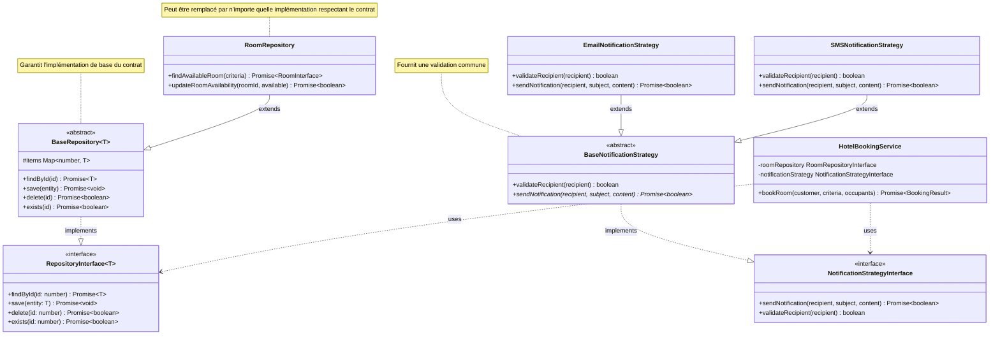

# Application du Principe de Substitution de Liskov (LSP)

## Architecture du Système



## Analogie avec la Construction d'une Maison

Pour comprendre le Principe de Substitution de Liskov, imaginons une maison avec des pièces interchangeables :

### La Maison Non-LSP

-   **Problèmes de Substitution** :
    -   Une chambre ne peut pas remplacer un salon (fonctions différentes)
    -   Un radiateur électrique ne peut pas remplacer un chauffage central
    -   Une fenêtre fixe à la place d'une fenêtre ouvrable
-   **Conséquences** :
    -   Perte de fonctionnalités
    -   Incompatibilités
    -   Dysfonctionnements

### La Maison LSP

-   **Composants Substituables** :
    -   Modules de pièces standardisés
    -   Systèmes de chauffage compatibles
    -   Fenêtres aux dimensions normalisées
-   **Avantages** :
    -   Remplacement sans perte de fonctionnalité
    -   Compatibilité garantie
    -   Évolution progressive possible

## Application dans le Code

### 1. Contrats de Base Stricts

```typescript
// Interface de base avec contrat clair
interface RepositoryInterface<T> {
    findById(id: number): Promise<Readonly<T> | null>;
    save(entity: Readonly<T>): Promise<void>;
    delete(id: number): Promise<boolean>;
    exists(id: number): Promise<boolean>;
}

// Classe abstraite garantissant le respect du contrat
abstract class BaseRepository<T> implements RepositoryInterface<T> {
    protected items: Map<number, T> = new Map();
    // Implémentation des méthodes de base...
}
```

### 2. Extensions Respectant LSP

```typescript
// Extension qui respecte le contrat de base
interface RoomRepositoryInterface extends RepositoryInterface<RoomInterface> {
    findAvailableRoom(criteria: RoomSearchCriteria): Promise<Readonly<RoomInterface> | null>;
    updateRoomAvailability(roomId: number, available: boolean): Promise<boolean>;
}
```

### 3. Stratégies de Notification

```typescript
// Contrat de base pour les notifications
interface NotificationStrategyInterface {
    sendNotification(recipient: string, subject: string, content: string): Promise<boolean>;
    validateRecipient(recipient: string): boolean;
}

// Implémentation de base respectant LSP
abstract class BaseNotificationStrategy implements NotificationStrategyInterface {
    abstract sendNotification(recipient: string, subject: string, content: string): Promise<boolean>;
    validateRecipient(recipient: string): boolean {
        return recipient.length > 0;
    }
}
```

## Bénéfices de l'Application du LSP

### 1. Sécurité du Code

-   Contrats clairs et explicites
-   Validation au moment de la compilation
-   Comportements prévisibles

### 2. Flexibilité

-   Remplacement facile des implémentations
-   Extension sans risque
-   Réutilisation sécurisée

### 3. Maintenabilité

-   Code plus robuste
-   Tests plus simples
-   Documentation implicite

## Exemples Concrets

### 1. Repositories Interchangeables

```typescript
// Peut être remplacé par n'importe quelle implémentation respectant le contrat
class RoomRepository extends BaseRepository<RoomInterface> {
    async findAvailableRoom(criteria: RoomSearchCriteria): Promise<Readonly<RoomInterface> | null> {
        // Implémentation spécifique...
    }
}
```

### 2. Notifications Substituables

```typescript
// Les stratégies sont interchangeables car elles respectent le même contrat
class EmailNotificationStrategy extends BaseNotificationStrategy {
    validateRecipient(recipient: string): boolean {
        return super.validateRecipient(recipient) && recipient.includes('@');
    }
}

class SMSNotificationStrategy extends BaseNotificationStrategy {
    validateRecipient(recipient: string): boolean {
        return super.validateRecipient(recipient) && /^\+?[\d\s-]{10,}$/.test(recipient);
    }
}
```

## Conclusion

L'application du LSP dans notre système de réservation d'hôtel nous permet de :

1. **Garantir la Substituabilité**

    - Les sous-classes peuvent toujours remplacer leurs classes de base
    - Les implémentations sont interchangeables
    - Les contrats sont respectés

2. **Améliorer la Robustesse**

    - Validation stricte des types
    - Comportements cohérents
    - Tests simplifiés

3. **Faciliter l'Évolution**
    - Nouvelles implémentations sûres
    - Extension sans risque
    - Maintenance simplifiée
