# Application du Principe Ouvert/Fermé (OCP)

## Introduction

Le Principe Ouvert/Fermé (OCP) est l'un des principes SOLID fondamentaux en programmation orientée objet. Il stipule qu'une classe doit être :

-   **Ouverte à l'extension** : On peut ajouter de nouveaux comportements
-   **Fermée à la modification** : Le code existant ne doit pas être modifié

Dans notre système de réservation d'hôtel, nous avons appliqué ce principe pour créer une architecture flexible et extensible. Voici comment nous avons transformé le code monolithique initial en un système modulaire respectant l'OCP.

## Analogie avec la Construction d'une Maison

Pour comprendre le Principe Ouvert/Fermé, imaginons une maison moderne et modulaire :

### La Maison Traditionnelle (Sans OCP)

-   **Structure Rigide** :
    -   Murs porteurs fixes et non modifiables
    -   Installation électrique encastrée dans les murs
    -   Plomberie coulée dans la dalle
    -   Chauffage central unique et figé
-   **Problèmes** :
    -   Impossible d'ajouter une pièce sans casser des murs
    -   Modification du système électrique complexe
    -   Changement de chauffage nécessite une rénovation totale
    -   Extension verticale non prévue

### La Maison Modulaire (Avec OCP)

-   **Structure Flexible** :
    -   Cloisons mobiles sur rails
    -   Gaines techniques accessibles
    -   Prises et connexions standardisées
    -   Systèmes de chauffage interchangeables
-   **Avantages** :
    -   Ajout de modules sans modification de l'existant
    -   Mise à niveau facile des installations
    -   Adaptation aux nouveaux besoins
    -   Extension possible dans toutes les directions

### Parallèle avec Notre Code

Tout comme une maison modulaire, notre code a été conçu pour être extensible :

| Maison               | Code                                  |
| -------------------- | ------------------------------------- |
| Cloisons mobiles     | Interfaces pour chaque fonctionnalité |
| Prises standardisées | Contrats d'interface bien définis     |
| Gaines techniques    | Points d'extension prévus             |
| Modules additionnels | Nouvelles implémentations possibles   |
| Plan d'extension     | Architecture extensible               |

### Bénéfices de la Modularité

-   **Extensibilité** : Ajout de fonctionnalités sans modification
-   **Maintenance** : Systèmes indépendants et remplaçables
-   **Évolution** : Mise à niveau progressive possible
-   **Adaptabilité** : Réponse rapide aux nouveaux besoins

## Architecture du Système

```mermaid
classDiagram
    class HotelBookingManager {
        -roomRepository: RoomRepositoryInterface
        -bookingRepository: BookingRepositoryInterface
        -notificationStrategy: NotificationStrategyInterface
        -priceCalculator: PriceCalculatorInterface
        -bookingValidator: BookingValidatorInterface
        +bookRoom(customer, roomId, checkInDate, checkOutDate, discountCode?) Promise~BookingResultType~
    }

    %% Interfaces
    class RoomRepositoryInterface {
        <<interface>>
        +findById(id: number) Promise~RoomInterface~
        +findAvailableRoom(roomId: number) Promise~RoomInterface~
        +updateRoomAvailability(roomId: number, available: boolean) Promise~void~
    }

    class BookingRepositoryInterface {
        <<interface>>
        +findById(id: number) Promise~BookingInterface~
        +findByCustomerId(customerId: number) Promise~BookingInterface[]~
        +save(booking: BookingInterface) Promise~void~
    }

    class NotificationStrategyInterface {
        <<interface>>
        +sendBookingConfirmation(customer, room, booking) Promise~void~
    }

    class PriceCalculatorInterface {
        <<interface>>
        +calculateTotalPrice(pricePerNight, nights, discountCode?) Promise~number~
    }

    class BookingValidatorInterface {
        <<interface>>
        +validateDates(checkInDate, checkOutDate) Promise~boolean~
        +validateCustomer?(customer) Promise~boolean~
        +validateRoom?(room) Promise~boolean~
    }

    %% Implementations
    class InMemoryRoomRepository {
        -rooms: RoomInterface[]
    }

    class EmailNotificationStrategy {
    }

    class SMSNotificationStrategy {
    }

    class WhatsAppNotificationStrategy {
    }

    class StandardPriceCalculator {
        -discounts: DiscountMapType
    }

    class PremiumPriceCalculator {
        -discounts: DiscountMapType
    }

    class StandardBookingValidator {
    }

    class StrictBookingValidator {
    }

    %% Relations
    HotelBookingManager ..> RoomRepositoryInterface
    HotelBookingManager ..> BookingRepositoryInterface
    HotelBookingManager ..> NotificationStrategyInterface
    HotelBookingManager ..> PriceCalculatorInterface
    HotelBookingManager ..> BookingValidatorInterface

    InMemoryRoomRepository ..|> RoomRepositoryInterface
    EmailNotificationStrategy ..|> NotificationStrategyInterface
    SMSNotificationStrategy ..|> NotificationStrategyInterface
    WhatsAppNotificationStrategy ..|> NotificationStrategyInterface
    StandardPriceCalculator ..|> PriceCalculatorInterface
    PremiumPriceCalculator ..|> PriceCalculatorInterface
    StandardBookingValidator ..|> BookingValidatorInterface
    StrictBookingValidator ..|> BookingValidatorInterface
```



## Transformation du Code

Nous avons appliqué le principe OCP au code existant pour le rendre extensible sans modification. Voici les principales améliorations :

### 1. Types et Interfaces

#### Types Métier

```typescript
// Types avec suffixe Type pour une meilleure lisibilité
type DiscountCodeType = 'SUMMER10' | 'WINTER15';
type DiscountMapType = Record<DiscountCodeType, number>;
type BookingResultType =
    | {
          success: true;
          message: string;
      }
    | {
          success: false;
          error: string;
      };
```

#### Repository Pattern

```typescript
// Interface générique de base
interface RepositoryInterface<T> {
    findById(id: number): Promise<Readonly<T> | null>;
    save(entity: Readonly<T>): Promise<void>;
}

// Interfaces spécialisées
interface RoomRepositoryInterface extends RepositoryInterface<RoomInterface> {
    findAvailableRoom(roomId: number): Promise<Readonly<RoomInterface> | null>;
    updateRoomAvailability(roomId: number, available: boolean): Promise<void>;
}

interface BookingRepositoryInterface extends RepositoryInterface<BookingInterface> {
    findByCustomerId(customerId: number): Promise<ReadonlyArray<Readonly<BookingInterface>>>;
}
```

#### Strategy Pattern

```typescript
interface NotificationStrategyInterface {
    sendBookingConfirmation(
        customer: Readonly<CustomerInterface>,
        room: Readonly<RoomInterface>,
        booking: Readonly<BookingInterface>,
    ): Promise<void>;
}

interface PriceCalculatorInterface {
    calculateTotalPrice(pricePerNight: number, nights: number, discountCode?: DiscountCodeType): Promise<number>;
}

interface BookingValidatorInterface {
    validateDates(checkInDate: Date, checkOutDate: Date): Promise<boolean>;
    validateCustomer?(customer: Readonly<CustomerInterface>): Promise<boolean>;
    validateRoom?(room: Readonly<RoomInterface>): Promise<boolean>;
}
```

### 2. Implémentations Concrètes

#### Design Patterns Utilisés

Nous avons appliqué plusieurs patterns de conception pour respecter l'OCP :

##### Repository Pattern

-   **Objectif** : Abstraire l'accès aux données
-   **Avantage OCP** : Permet d'ajouter de nouvelles sources de données sans modifier le code existant
-   **Exemple** : On peut facilement passer d'une base en mémoire à une base de données SQL

##### Strategy Pattern

-   **Objectif** : Encapsuler des algorithmes interchangeables
-   **Avantage OCP** : Ajout de nouveaux comportements sans modifier les classes existantes
-   **Applications** :
    -   Notifications (Email, SMS, WhatsApp)
    -   Calcul de prix (Standard, Premium)
    -   Validation des réservations

##### Dependency Injection

-   **Objectif** : Découpler la création et l'utilisation des objets
-   **Avantage OCP** : Facilite l'ajout de nouvelles implémentations
-   **Bénéfice** : Testing plus simple avec des mocks

#### Repositories

```typescript
// Implémentation en mémoire
class InMemoryRoomRepository implements RoomRepositoryInterface {
    private readonly rooms: ReadonlyArray<Readonly<RoomInterface>> = [...];

    async findAvailableRoom(roomId: number): Promise<Readonly<RoomInterface> | null> {
        return this.rooms.find(room => room.id === roomId && room.available) ?? null;
    }
}
```

#### Stratégies de Notification

```typescript
// Email
class EmailNotificationStrategy implements NotificationStrategyInterface {
    async sendBookingConfirmation(
        customer: Readonly<CustomerInterface>,
        room: Readonly<RoomInterface>,
        booking: Readonly<BookingInterface>,
    ): Promise<void> {
        // Implémentation email...
    }
}

// SMS
class SMSNotificationStrategy implements NotificationStrategyInterface {
    async sendBookingConfirmation(
        customer: Readonly<CustomerInterface>,
        room: Readonly<RoomInterface>,
        booking: Readonly<BookingInterface>,
    ): Promise<void> {
        // Implémentation SMS...
    }
}
```

#### Calculateurs de Prix

```typescript
// Standard
class StandardPriceCalculator implements PriceCalculatorInterface {
    private readonly discounts: DiscountMapType = {
        SUMMER10: 0.1,
        WINTER15: 0.15,
    };
}

// Premium avec remises améliorées
class PremiumPriceCalculator implements PriceCalculatorInterface {
    private readonly discounts: DiscountMapType = {
        SUMMER10: 0.15,
        WINTER15: 0.2,
    };
}
```

### 3. Injection de Dépendances et Asynchronicité

```typescript
class HotelBookingManager {
    constructor(
        private readonly roomRepository: RoomRepositoryInterface,
        private readonly bookingRepository: BookingRepositoryInterface,
        private readonly notificationStrategy: NotificationStrategyInterface,
        private readonly priceCalculator: PriceCalculatorInterface,
        private readonly bookingValidator: BookingValidatorInterface,
    ) {}

    public async bookRoom(
        customer: Readonly<CustomerInterface>,
        roomId: number,
        checkInDate: Date,
        checkOutDate: Date,
        discountCode?: DiscountCodeType,
    ): Promise<BookingResultType> {
        // Implémentation...
    }
}
```

## Avantages de l'Application du Principe OCP

### 1. Extensibilité et Type-Safety

#### Bénéfices du Typage Strict

-   Détection des erreurs à la compilation
-   Autocomplétion IDE améliorée
-   Documentation intégrée au code
-   Refactoring plus sûr

#### Exemples Concrets d'Extension

```typescript
// 1. Ajout d'un nouveau type de chambre
interface LuxuryRoomInterface extends RoomInterface {
    jacuzzi: boolean;
    minibar: boolean;
}

// 2. Nouveau calculateur pour chambres de luxe
class LuxuryPriceCalculator implements PriceCalculatorInterface {
    async calculateTotalPrice(pricePerNight: number, nights: number, discountCode?: DiscountCodeType): Promise<number> {
        const basePrice = await super.calculateTotalPrice(pricePerNight, nights, discountCode);
        return basePrice * 1.5; // Supplément luxe
    }
}

// 3. Validation spécifique
class LuxuryBookingValidator implements BookingValidatorInterface {
    async validateCustomer(customer: Readonly<CustomerInterface>): Promise<boolean> {
        return customer.vipStatus === true;
    }
}
```

### 2. Asynchronicité et Gestion des Erreurs

#### Gestion Avancée des Erreurs

```typescript
// Type personnalisé pour les erreurs
type BookingErrorType = 'ROOM_UNAVAILABLE' | 'INVALID_DATES' | 'CUSTOMER_NOT_ELIGIBLE' | 'PAYMENT_FAILED';

// Gestionnaire d'erreurs extensible
class BookingErrorHandler {
    private handlers: Map<BookingErrorType, (error: Error) => Promise<void>> = new Map();

    public registerHandler(errorType: BookingErrorType, handler: (error: Error) => Promise<void>): void {
        this.handlers.set(errorType, handler);
    }

    public async handleError(type: BookingErrorType, error: Error): Promise<void> {
        const handler = this.handlers.get(type);
        if (handler) {
            await handler(error);
        }
    }
}
```

### 3. Configuration et Réutilisation

```typescript
// Configuration standard
const standardBookingManager = new HotelBookingManager(
    new InMemoryRoomRepository(),
    new InMemoryBookingRepository(),
    new EmailNotificationStrategy(),
    new StandardPriceCalculator(),
    new StandardBookingValidator(),
);

// Configuration premium
const premiumBookingManager = new HotelBookingManager(
    new InMemoryRoomRepository(),
    new InMemoryBookingRepository(),
    new SMSNotificationStrategy(),
    new PremiumPriceCalculator(),
    new StrictBookingValidator(),
);
```

## Exemple d'Extension : Nouvelle Notification

Pour ajouter un nouveau type de notification (WhatsApp) :

```typescript
class WhatsAppNotificationStrategy implements NotificationStrategyInterface {
    async sendBookingConfirmation(
        customer: Readonly<CustomerInterface>,
        room: Readonly<RoomInterface>,
        booking: Readonly<BookingInterface>,
    ): Promise<void> {
        // Nouvelle implémentation WhatsApp...
    }
}

// Utilisation immédiate sans modifier le code existant
const whatsappBookingManager = new HotelBookingManager(
    new InMemoryRoomRepository(),
    new InMemoryBookingRepository(),
    new WhatsAppNotificationStrategy(),
    new StandardPriceCalculator(),
    new StandardBookingValidator(),
);
```

Cette implémentation du principe OCP démontre comment un système peut être étendu sans modification du code existant, tout en maintenant une sécurité de type stricte et une gestion cohérente des opérations asynchrones.

## Conclusion

L'application du principe OCP dans notre système de réservation d'hôtel a apporté plusieurs avantages majeurs :

### Bénéfices Techniques

-   **Maintenabilité** : Code plus facile à maintenir car les modifications sont isolées
-   **Testabilité** : Chaque composant peut être testé indépendamment
-   **Réutilisabilité** : Les composants sont facilement réutilisables dans d'autres contextes
-   **Évolutivité** : Nouvelles fonctionnalités sans risque de régression

### Bénéfices Business

-   **Time-to-Market** : Développement plus rapide de nouvelles fonctionnalités
-   **Qualité** : Moins de bugs grâce à l'isolation des changements
-   **Flexibilité** : Adaptation facile aux nouveaux besoins business
-   **Coût** : Réduction des coûts de maintenance à long terme

### Bonnes Pratiques Identifiées

1. Toujours définir des interfaces avant les implémentations
2. Utiliser l'injection de dépendances systématiquement
3. Privilégier la composition à l'héritage
4. Maintenir une documentation à jour des extensions possibles

Cette approche nous permet d'avoir un système robuste et évolutif, prêt à accueillir de nouvelles fonctionnalités sans compromettre la stabilité du code existant.
