# Application du Principe de Responsabilité Unique (SRP)

## Analogie avec la Construction d'une Maison

Pour comprendre le Principe de Responsabilité Unique, imaginons la différence entre une maison mal organisée et une maison bien conçue :

### La Maison Mal Organisée (Avant SRP)

-   **Le Majordome-Tout-En-Un** : Une seule personne qui :
    -   Cuisine tous les repas
    -   Fait le ménage partout
    -   Gère la comptabilité
    -   S'occupe du jardin
    -   Répare la plomberie
    -   Rénove les pièces
-   **Problèmes** :
    -   Surcharge de travail
    -   Qualité médiocre dans certaines tâches
    -   Absence en cas de maladie paralyse tout
    -   Impossible de former un remplaçant

### La Maison Bien Organisée (Après SRP)

-   **Équipe Spécialisée** :
    -   Chef cuisinier → Repas
    -   Femme de chambre → Ménage
    -   Comptable → Finances
    -   Jardinier → Extérieurs
    -   Plombier → Installations
    -   Architecte → Rénovations

### Parallèle avec Notre Code

Tout comme une maison bien gérée nécessite des experts dédiés, notre code a été réorganisé avec des classes spécialisées :

| Maison         | Code                                             |
| -------------- | ------------------------------------------------ |
| Chef cuisinier | `RoomRepository` (gestion des chambres)          |
| Comptable      | `PriceCalculator` (calcul des prix)              |
| Réceptionniste | `BookingValidator` (validation des réservations) |
| Service postal | `NotificationService` (communications)           |
| Gestionnaire   | `HotelBookingManager` (coordination)             |

### Bénéfices de la Spécialisation

-   **Expertise** : Chaque classe excelle dans sa tâche
-   **Maintenance** : Modifications isolées et sûres
-   **Évolution** : Facile d'améliorer chaque aspect
-   **Remplacement** : Simple de changer une implémentation

## Transformation du Code

```mermaid
classDiagram
    %% Type definitions
    class DiscountCode {
        <<enumeration>>
        SUMMER10
        WINTER15
    }

    class BookingResult {
        <<union>>
        success boolean
        message string
        error string
    }

    %% Interfaces
    class RoomInterface {
        <<interface>>
        +id number
        +type string
        +pricePerNight number
        +available boolean
    }

    class CustomerInterface {
        <<interface>>
        +id number
        +name string
        +email string
    }

    class BookingInterface {
        <<interface>>
        +customerId number
        +roomId number
        +checkInDate Date
        +checkOutDate Date
        +totalPrice number
    }

    %% Avant la refactorisation
    class HotelBookingService {
        -rooms RoomInterface[]
        -bookings BookingInterface[]
        +bookRoom(customer CustomerInterface, roomId number, checkInDate Date, checkOutDate Date, discountCode string) string
        -calculatePrice(pricePerNight number, nights number, discountCode string) number
        -validateDates(checkIn Date, checkOut Date) boolean
        -sendEmail(to string, subject string, body string) void
        -updateRoom(roomId number, available boolean) void
    }

    %% Après la refactorisation
    class HotelBookingManager {
        -roomRepository RoomRepository
        -bookingRepository BookingRepository
        -notificationService NotificationService
        -priceCalculator PriceCalculator
        -bookingValidator BookingValidator
        +bookRoom(customer Readonly~CustomerInterface~, roomId number, checkInDate Date, checkOutDate Date, discountCode DiscountCode) BookingResult
    }

    class RoomRepository {
        -rooms ReadonlyArray~Readonly~RoomInterface~~
        +findAvailableRoom(roomId number) Readonly~RoomInterface~ | null
        +updateRoomAvailability(roomId number, available boolean) void
    }

    class BookingRepository {
        -bookings ReadonlyArray~Readonly~BookingInterface~~
        +save(booking Readonly~BookingInterface~) void
    }

    class NotificationService {
        +sendBookingConfirmation(customer Readonly~CustomerInterface~, room Readonly~RoomInterface~, booking Readonly~BookingInterface~) void
        -sendEmail(to string, subject string, body string) void
    }

    class PriceCalculator {
        -discounts DiscountMap
        +calculateTotalPrice(pricePerNight number, nights number, discountCode DiscountCode) number
    }

    class BookingValidator {
        +validateDates(checkInDate Date, checkOutDate Date) boolean
    }

    %% Relations avec les interfaces
    RoomRepository ..> RoomInterface : uses
    BookingRepository ..> BookingInterface : uses
    HotelBookingManager ..> CustomerInterface : uses
    HotelBookingManager ..> BookingInterface : uses
    HotelBookingManager ..> BookingResult : returns
    HotelBookingManager ..> DiscountCode : uses
    NotificationService ..> CustomerInterface : uses
    NotificationService ..> RoomInterface : uses
    NotificationService ..> BookingInterface : uses
    PriceCalculator ..> DiscountCode : uses

    %% Relations de dépendance
    HotelBookingManager --> RoomRepository : depends on
    HotelBookingManager --> BookingRepository : depends on
    HotelBookingManager --> NotificationService : depends on
    HotelBookingManager --> PriceCalculator : depends on
    HotelBookingManager --> BookingValidator : depends on

    %% Groupes logiques par commentaires
    %% Domain Models:
    %% - RoomInterface
    %% - CustomerInterface
    %% - BookingInterface
    %% - BookingResult
    %% - DiscountCode

    %% Data Access:
    %% - RoomRepository
    %% - BookingRepository

    %% Business Services:
    %% - NotificationService
    %% - PriceCalculator
    %% - BookingValidator

    %% Core:
    %% - HotelBookingManager
```



## Problèmes du Code Original

Le code original dans `source.ts` présentait plusieurs violations du principe SRP :

1. La classe `HotelBookingService` avait trop de responsabilités :

    - Gestion des chambres et leur disponibilité
    - Stockage des réservations
    - Calcul des prix et gestion des remises
    - Envoi des emails de confirmation
    - Validation des dates
    - Orchestration du processus de réservation

2. La logique métier était mélangée avec :
    - La gestion des données (rooms, bookings)
    - La logique de présentation (formatage des emails)
    - Les calculs (prix, dates)

## Solution Appliquée

### 1. Séparation en Classes Spécialisées avec TypeScript 5.7

#### Types et Interfaces

```typescript
// Interfaces avec typage strict
interface RoomInterface {
    id: number;
    type: string;
    pricePerNight: number;
    available: boolean;
}

// Types spécialisés pour une meilleure sécurité
type DiscountCode = 'SUMMER10' | 'WINTER15';
type DiscountMap = Record<DiscountCode, number>;
type BookingResult =
    | {
          success: true;
          message: string;
      }
    | {
          success: false;
          error: string;
      };
```

#### Repositories avec Immutabilité

```typescript
class RoomRepository {
    private readonly rooms: ReadonlyArray<Readonly<RoomInterface>> = [...];

    findAvailableRoom(roomId: number): Readonly<RoomInterface> | null {
        return this.rooms.find(room => room.id === roomId && room.available) ?? null;
    }
}
```

#### Services avec Typage Strict

```typescript
class NotificationService {
    sendBookingConfirmation(
        customer: Readonly<CustomerInterface>,
        room: Readonly<RoomInterface>,
        booking: Readonly<BookingInterface>,
    ): void {
        // Implémentation...
    }
}
```

### 2. Avantages de la Refactorisation TypeScript

#### Sécurité de Type Améliorée

-   Types littéraux pour les codes de réduction
-   Types discriminés pour les résultats
-   Immutabilité garantie par le système de types
-   Null-safety avec l'opérateur de coalescence nulle

#### Maintenabilité Renforcée

-   Interfaces clairement définies
-   Types réutilisables
-   Validation au moment de la compilation
-   Documentation intégrée via les types

#### Flexibilité Accrue

-   Types discriminés pour la gestion des erreurs
-   Collections immuables pour la sécurité des données
-   Paramètres en lecture seule pour éviter les modifications accidentelles

#### Testabilité Optimisée

-   Interfaces bien définies pour le mocking
-   Types stricts pour les paramètres et retours
-   Séparation claire des responsabilités

### 3. Exemple de Transformation avec Gestion des Erreurs

Avant (code original) :

```typescript
public bookRoom(customer, roomId, checkInDate, checkOutDate, discountCode?) {
    if (nights <= 0) return 'Invalid check-in or check-out date.';
    // ... logique mélangée ...
    return `Booking confirmed for ${customer.name}`;
}
```

Après (avec TypeScript 5.7) :

```typescript
public bookRoom(
    customer: Readonly<CustomerInterface>,
    roomId: number,
    checkInDate: Date,
    checkOutDate: Date,
    discountCode?: DiscountCode
): BookingResult {
    if (!this.bookingValidator.validateDates(checkInDate, checkOutDate)) {
        return { success: false, error: 'Invalid check-in or check-out date.' };
    }
    // ... logique séparée ...
    return {
        success: true,
        message: `Booking confirmed for ${customer.name}`
    };
}
```

### 4. Bonnes Pratiques Appliquées

1. **Immutabilité**

    - Utilisation de `ReadonlyArray<T>`
    - Types `Readonly<T>` pour les paramètres
    - Collections immuables

2. **Gestion des Erreurs**

    - Types discriminés pour les résultats
    - Validation stricte des entrées
    - Messages d'erreur typés

3. **Sécurité des Types**
    - Types littéraux pour les constantes
    - Types d'union pour les résultats
    - Null-safety avec l'opérateur `??`

Cette refactorisation respecte non seulement le principe SRP mais exploite aussi pleinement les fonctionnalités de TypeScript 5.7 pour une meilleure sécurité et maintenabilité du code.
