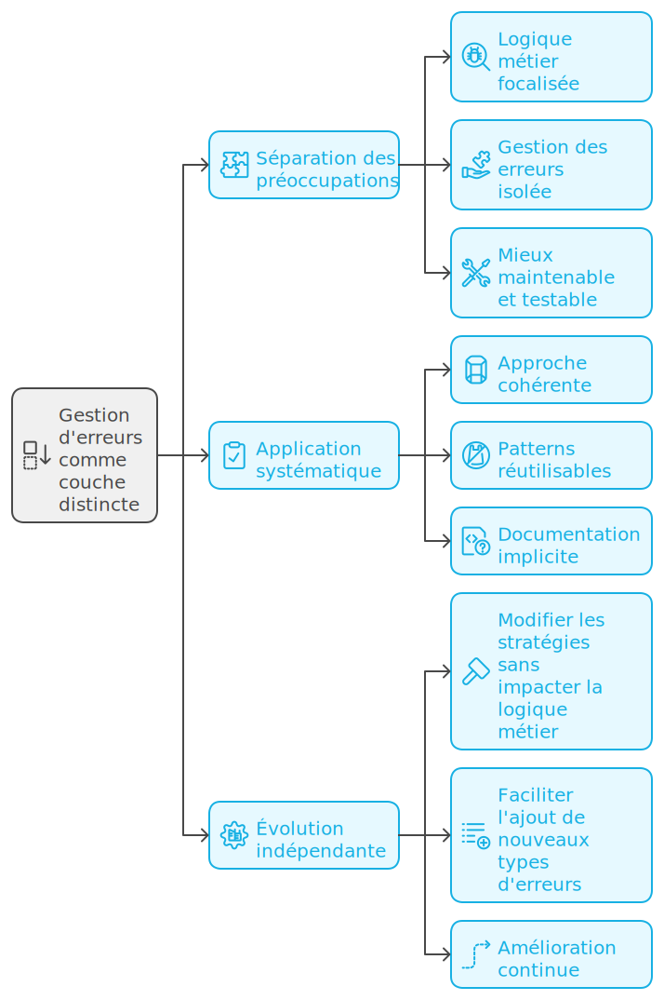
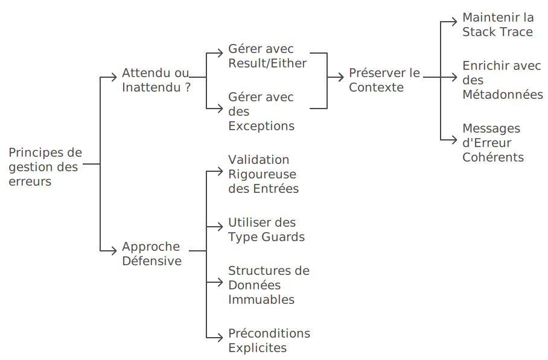
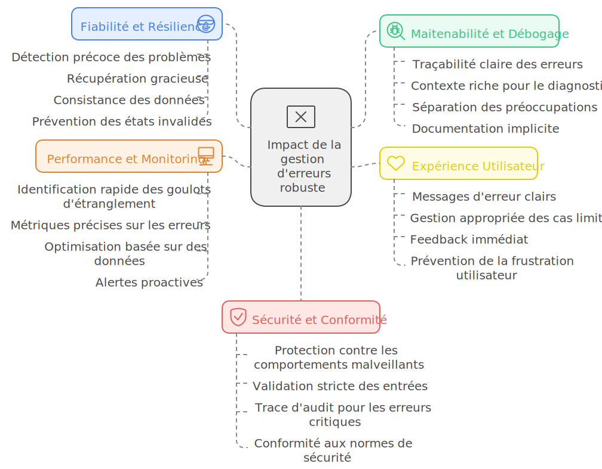
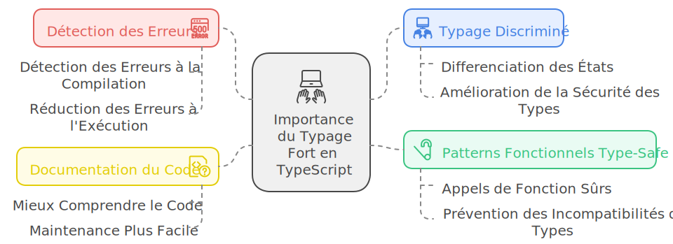
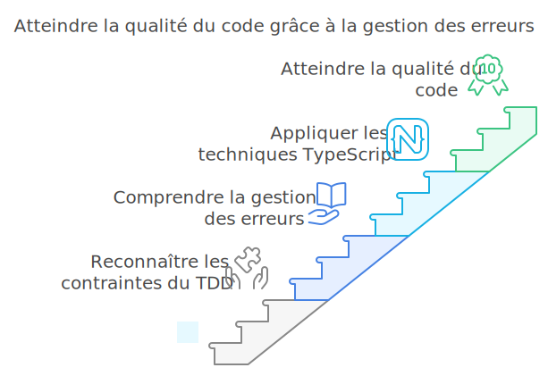
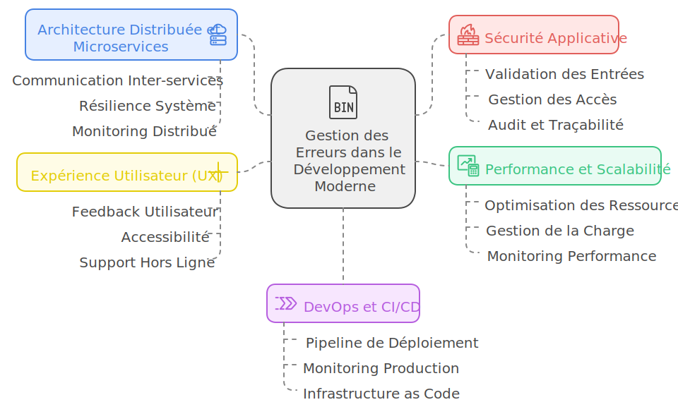

# 🛡️ Maîtriser la Gestion des Erreurs en TypeScript : De la Théorie à l'Architecture

## 🎯 Introduction à la Gestion des Erreurs

Dans le développement d'applications modernes en TypeScript, la gestion d'erreurs n'est pas simplement une option ou une bonne pratique - c'est un élément fondamental et stratégique de l'architecture logicielle.
En tant que Senior Web Developer spécialisé en TypeScript, j'ai constaté que la différence entre une application robuste et une application fragile réside souvent dans la qualité de sa gestion d'erreurs.

> **Aparté personnelle**
> Entre-nous, je n'aime pas la gestion d'erreur. Qui aime les bugs ?
> Le nombre de fois ou j'ai voulu jeter l'ordinateur car je m'arrachais les cheveux pour trouver une implémentation transverse et transparente ...
> C'est en travaillant sur un projet lourd, complexe et compliqué avec la Clean Architecture que j'ai compris qu'il y a plusieurs solutions possibles, chacune en fonction de son contexte.

### 🏗️ La gestion d'erreurs comme couche architecturale

<table style="width: 100%; border: 0;">
<tr>
<td style="
    background: white;
    border-left: 4px solid #e25c4a;
    border-radius: 4px;
    padding: 20px;
    box-shadow: 0 2px 4px rgba(0, 0, 0, 0.1);
">
Mon expérience m'a fait prendre conscience que la gestion d'erreurs doit être considérée comme une couche architecturale distincte qui se superpose au code métier.
</td>
</tr>
</table>

Cette approche présente plusieurs avantages :
1. **Séparation des préoccupations** 🔄
   - Le code métier reste focalisé sur sa logique principale
   - La gestion d'erreurs devient une responsabilité isolée
   - Meilleure maintenabilité et testabilité

2. **Application systématique** 📝
   - Approche cohérente à travers l'application
   - Patterns réutilisables
   - Documentation implicite des cas d'erreur

3. **Évolution indépendante** 🛡️
   - Modification des stratégies de gestion sans impacter le code métier
   - Ajout de nouveaux types d'erreurs facilité
   - Amélioration continue des mécanismes de récupération

Cette vision de "calque" ou de "couche" implique que :
- La gestion d'erreurs est une préoccupation transverse
- Elle doit être pensée en parallèle du développement des fonctionnalités
- Elle nécessite sa propre stratégie architecturale

### 🏗️ Les fondamentaux de la gestion d'erreurs

La gestion d'erreurs est une discipline à part entière.
Cette couche architecturale s'applique sur le code et doit être appliqué méthodiquement.

Cette approche repose sur plusieurs principes fondamentaux :

1. **La distinction entre erreurs attendues et inattendues** 🔄
   - Les erreurs attendues doivent être gérées via des patterns comme Result/Either
   - Les erreurs inattendues justifient l'utilisation d'exceptions

2. **La préservation du contexte** 📝
   - Conservation de la stack trace
   - Enrichissement avec des métadonnées pertinentes
   - Messages d'erreur constants et significatifs

3. **L'approche défensive** 🛡️
   - Validation rigoureuse des entrées
   - Utilisation de type guards
   - Structures de données immuables
   - Préconditions explicites

### 🎯 Impact sur la qualité logicielle

Une gestion d'erreurs robuste influence directement plusieurs aspects critiques du développement :

#### 1. Fiabilité et Résilience 💪
- Détection précoce des problèmes potentiels
- Récupération gracieuse des situations d'erreur
- Maintien de la cohérence des données
- Prévention des états invalides du système

#### 2. Maintenabilité et Débogage 🔧
- Traçabilité claire des erreurs
- Contexte riche pour le diagnostic
- Séparation des préoccupations
- Documentation implicite du comportement attendu

#### 3. Expérience Utilisateur 👥
- Messages d'erreur clairs et actionnables
- Gestion appropriée des cas limites
- Feedback immédiat et pertinent
- Prévention de la frustration utilisateur

#### 4. Performance et Monitoring 📊
- Identification rapide des goulots d'étranglement
- Métriques précises sur les erreurs
- Optimisation basée sur des données réelles
- Alertes proactives sur les problèmes

#### 5. Sécurité et Conformité 🔒
- Protection contre les comportements malveillants
- Validation rigoureuse des entrées
- Audit trail des erreurs critiques
- Respect des normes de sécurité

### 💪 Le Rôle du Typage Fort

TypeScript apporte une dimension supplémentaire à la gestion d'erreurs grâce à son système de types :
- ✨ Détection des erreurs à la compilation
- 🎯 Typage discriminé des états d'erreur
- 🧩 Patterns fonctionnels type-safe
- 📚 Meilleure documentation du code

### 🧪 Intégration avec le TDD (Test-Driven Development)

Le Test-Driven Development n'est pas qu'une simple méthodologie de test, c'est une approche fondamentale qui s'intègre parfaitement avec une gestion d'erreurs robuste. Cette synergie renforce la qualité et la fiabilité du code.

#### 1. Cycle TDD et Gestion d'Erreurs
- **Red** : Écriture des tests d'erreurs attendues
  - Tests des cas limites
  - Validation des messages d'erreur
  - Vérification des types de retour
- **Green** : Implémentation de la gestion d'erreurs
  - Mise en place des mécanismes de récupération
  - Validation des entrées
  - Gestion des cas d'erreur
- **Refactor** : Optimisation et patterns
  - Extraction des patterns communs
  - Amélioration de la lisibilité
  - Renforcement de la réutilisabilité

#### 2. Bonnes Pratiques de Test
- **Tests Unitaires**
  - Isolation des cas d'erreur
  - Mocking des dépendances
  - Couverture des scénarios d'échec
- **Tests d'Intégration**
  - Propagation des erreurs
  - Comportement des middlewares
  - Récupération système
- **Tests de Bout en Bout**
  - Expérience utilisateur
  - Feedback visuel
  - Récupération applicative

#### 3. Patterns de Test Spécifiques
- **Error Boundaries Testing**
  - Capture des erreurs
  - Fallback UI
  - Logging et monitoring
- **Validation Testing**
  - Schémas de validation
  - Types personnalisés
  - Guards et assertions
- **Recovery Testing**
  - Stratégies de retry
  - Circuit breakers
  - État du système

### 🎯 Domaines Critiques de la Gestion d'Erreurs

La gestion d'erreurs s'étend bien au-delà du TDD et impacte de nombreux aspects critiques du développement moderne :

#### 1. Architecture Distribuée et Microservices
- **Communication Inter-services**
  - Gestion des timeouts
  - Retry patterns
  - Circuit breakers
- **Résilience Système**
  - Fallback strategies
  - Service discovery
  - Load balancing
- **Monitoring Distribué**
  - Tracing distribué
  - Agrégation des logs
  - Métriques de santé

#### 2. Sécurité Applicative
- **Validation des Entrées**
  - Sanitization des données
  - Protection XSS/CSRF
  - Validation des tokens
- **Gestion des Accès**
  - Authentication errors
  - Authorization failures
  - Rate limiting
- **Audit et Traçabilité**
  - Logging sécurisé
  - Détection d'intrusion
  - Conformité RGPD

#### 3. Performance et Scalabilité
- **Optimisation des Ressources**
  - Memory leaks
  - Connection pooling
  - Cache invalidation
- **Gestion de la Charge**
  - Throttling
  - Graceful degradation
  - Queue management
- **Monitoring Performance**
  - Profiling
  - Métriques temps réel
  - Alerting

#### 4. Expérience Utilisateur (UX)
- **Feedback Utilisateur**
  - Messages contextuels
  - États de chargement
  - Récupération interactive
- **Accessibilité**
  - Messages d'erreur ARIA
  - Navigation keyboard
  - Screen reader support
- **Offline Support**
  - Synchronisation
  - État hors-ligne
  - Recovery data

#### 5. DevOps et CI/CD
- **Pipeline de Déploiement**
  - Tests automatisés
  - Quality gates
  - Rollback strategies
- **Monitoring Production**
  - Logging centralisé
  - APM (Application Performance Monitoring)
  - Alerting intelligent
- **Infrastructure as Code**
  - Configuration validation
  - Infrastructure testing
  - Disaster recovery

