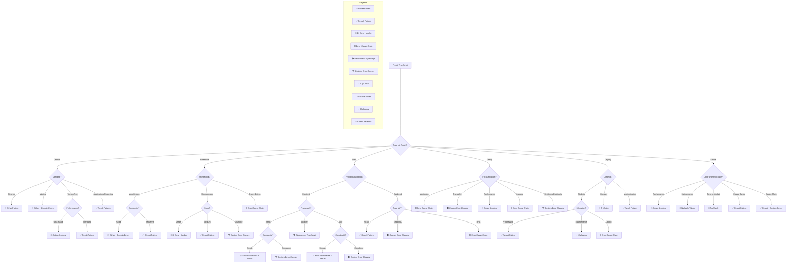

## 🤔 Guide de Sélection des Approches de Gestion d'Erreurs

Le choix d'une approche de gestion d'erreurs dépend de plusieurs facteurs clés. Voici un guide décisionnel pour vous aider à choisir la meilleure approche selon votre contexte.

### 🌳 Analyse Décisionnelle

### 🏆 Classification des Approches

| Niveau | Approche | Score | Cas d'Usage | Points Forts | Points Faibles | Coût |
|--------|----------|--------|-------------|--------------|----------------|-------|
| 🏆 Tier S | Either Pattern | 95/100 | • Applications critiques • Code fonctionnel • Validation complexe • Transformations de données | • Type-safety maximale • Composable • Fonctionnel • Chaînable | • Courbe d'apprentissage • Concepts FP requis • Setup initial complexe | $$$ |
| 🥇 Tier A+ | Result/Option Pattern | 90/100 | • Applications robustes • APIs publiques • Code type-safe • Validation de données | • Type-safety maximale • Explicite • Prévisible • Force le traitement | • Plus verbeux • Setup initial • Apprentissage | $$$ |
| 🥈 Tier A | DI Error Handler | 85/100 | • Applications enterprise • Grands projets • Code modulaire • Systèmes complexes | • Centralisé • Testable • Flexible • Séparation des responsabilités | • Setup complexe • Sur-architecturé • Dépendance DI | $$$ |
| 🥉 Tier B+ | Error Cause Chain | 80/100 | • Debug • Logging avancé • Traçabilité • Monitoring | • Contexte riche • Stack trace complète • Standard ES2022+ • Debug facilité | • Verbeux • Overhead mémoire • Complexité | $$ |
| 🏅 Tier B | Custom Error Classes | 75/100 | • Domaines métier • APIs complexes • Systèmes distribués • Applications critiques | • Hiérarchie claire • Contexte riche • Type-safe • Extensible | • Maintenance • Documentation importante • Possible sur-engineering | $$ |
| 🎖️ Tier B | Décorateurs TypeScript | 75/100 | • Angular • AOP • Code déclaratif • Frameworks déclaratifs | • Séparation concerns • Réutilisable • Élégant • Aspect-oriented | • Configuration • Support expérimental • Setup complexe | $$ |
| ⭐ Tier C+ | Try/Catch Traditionnel | 65/100 | • Code legacy • Scripts simples • Prototypes • APIs asynchrones | • Simple • Familier • Natif • Compatible async/await | • Pas type-safe • Masque erreurs • Flux rompu | $ |
| 🔶 Tier C | Nullable Values | 60/100 | • Cas simples • Valeurs optionnelles • Petits projets • Prototypes | • Simple • Direct • Support TS • Performance optimale | • Pas de contexte • Null pointer • Limité en expressivité | $ |
| 🔷 Tier C- | Callbacks (Node.js) | 55/100 | • Code Node.js legacy • APIs callback-based • Code async ancien • Intégrations anciennes | • Standard Node • Explicite • Async • Compatible legacy | • Callback hell • Verbeux • Obsolète • Difficile à composer | $ |
| 💠 Tier D | Codes de retour | 50/100 | • Systèmes embarqués • Performance critique • Interfaces C/C++ • Protocoles binaires | • Simple • Performant • Léger en mémoire • Prédictible | • Pas de contexte • Documentation cruciale • Propice aux erreurs | $ |

**Score basé sur :**
- Type-safety (25%)
- Maintenabilité (25%)
- Expressivité (20%)
- Facilité d'adoption (15%)
- Tooling support (15%)

**Coût d'implémentation :**
- $ : Faible (1-2 jours)
- $$ : Moyen (1-2 semaines)
- $$$ : Élevé (2+ semaines)

### 📊 Critères de Sélection

**Maturité de l'Équipe**

- Junior → Result Pattern
- Senior → Either Pattern
- Mixte → Result + Custom Errors

**Contraintes Techniques**

- Performance critique → Result + Codes
- Mémoire limitée → Custom Error Classes
- Haute disponibilité → Circuit Breaker

**Budget et Délais**

- Serré → Try/Catch + Custom
- Standard → Result Pattern
- Confortable → Either + Domain

**Maintenance Long Terme**

- Critique → Either Pattern
- Standard → Result Pattern
- Minimale → Custom Errors

### 🎲 Matrices de Décision

| Contexte | Approche Recommandée | Cas d'Usage | Avantages | Inconvénients | Prérequis |
|----------|---------------------|-------------|-----------|---------------|-----------|
| Applications Critiques | Either Pattern | • Systèmes financiers • Applications médicales • Systèmes temps réel • Validation de données complexes | • Type-safety maximale • Composable • Traçabilité complète • Robustesse | • Courbe d'apprentissage • Complexité initiale • Verbosité • Setup complexe | • FP avancé • TypeScript expert • Architecture skills • Design patterns FP |
| Applications Enterprise | DI Error Handler | • Applications large-scale • Systèmes modulaires • Architecture complexe • Systèmes distribués | • Gestion centralisée • Testabilité • Séparation des concerns • Monitoring avancé | • Setup complexe • Overhead DI • Configuration • Maintenance | • DI patterns • Architecture • Testing avancé • Patterns d'intégration |
| Applications Web Standard | Result/Option Pattern | • APIs REST • Services web • Applications CRUD • Validation de données | • Explicite • Prévisible • Type-safe • Maintenabilité | • Plus verbeux • Setup initial • Boilerplate • Apprentissage | • TypeScript intermédiaire • Patterns fonctionnels • API design • API RESTful |
| Applications Legacy | Try/Catch Traditionnel | • Code existant • Migration progressive • Prototypes rapides • Debug et monitoring | • Familier • Simple • Compatible • Compatibilité ES2022+ | • Pas type-safe • Difficile à maintenir • Peu flexible • Risques d'erreurs | • JavaScript basique • Error handling • Debugging • Patterns de migration |
| Applications Angular | Décorateurs TypeScript | • Applications Angular • Projets AOP • Enterprise Angular • Frameworks déclaratifs | • Déclaratif • Réutilisable • Intégré Angular • Aspect-oriented | • Metadata reflection • Configuration TS • Angular-specific • Setup complexe | • Angular avancé • Decorators • TypeScript • AOP patterns |
| Domaine Métier Complexe | Custom Error Classes | • Business logic • Domain-driven • APIs complexes • Systèmes distribués | • Hiérarchie claire • Contexte riche • Extensible • Type-safe | • Maintenance • Complexité • Documentation • Over-engineering | • OOP avancé • Domain modeling • Error design • Patterns DDD |
| Applications Debug-Heavy | Error Cause Chain | • Monitoring • Debugging • Logging • Diagnostics | • Stack traces • Contexte riche • Standard ES2022 • Debug facilité | • Performance • Complexité • Verbosité • Overhead mémoire | • ES2022 • Debugging avancé • Logging • APM tools |
| Applications Simples | Nullable Values | • Petits projets • UI simple • Prototypes • MVPs | • Simple • Léger • Rapide • Performance | • Limité • Null issues • Pas de contexte • Maintenance | • TypeScript basique • Null safety • Optional types • Clean code |
| Legacy Node.js | Callbacks (Node.js) | • Node.js ancien • Code callback • Migration • APIs legacy | • Compatible • Standard Node • Simple • Intégration facile | • Callback hell • Maintenance • Obsolète • Dette technique | • Node.js • Callbacks • Async patterns • Refactoring |
| Systèmes Embarqués | Codes de retour | • IoT • Systèmes temps réel • Performance critique • Systèmes bas niveau | • Performance • Léger • Prédictible • Optimisé | • Pas de contexte • Maintenance • Documentation • Debugging complexe | • Systèmes embarqués • Performance • Low-level • Optimisation |

