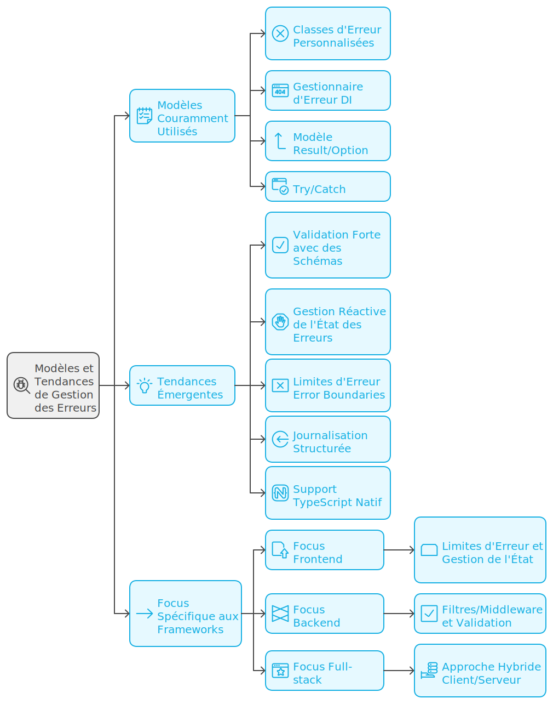

# 🔧 Gestion d'Erreurs dans les Frameworks Modernes

🏗️ La gestion des erreurs dans les frameworks modernes ne se limite plus à une simple capture d'exceptions, mais constitue une véritable couche architecturale qui s'intègre de manière transversale dans l'application.
🔄 Cette approche architecturale de la gestion d'erreurs permet de séparer clairement les préoccupations : le code métier se concentre sur sa logique fonctionnelle, tandis que la gestion d'erreurs forme une couche distincte qui observe, capture et traite les erreurs de manière cohérente.

🛠️ Les frameworks modernes adoptent généralement une approche hybride, combinant plusieurs stratégies de gestion d'erreurs pour répondre à différents besoins :

- 🧩 **Niveau Composant** : Error Boundaries et gestionnaires locaux
- 🔄 **Niveau Application** : Middleware et intercepteurs pour le traitement centralisé
- 🏢 **Niveau Infrastructure** : Gestion globale des erreurs non capturées
- 💼 **Niveau Métier** : Exceptions personnalisées et validation des données

🎯 Cette superposition de couches permet une gestion granulaire et contextuelle des erreurs, où chaque niveau peut traiter les erreurs de manière appropriée tout en maintenant une cohérence globale.

> 🤔 Cela ne vous rappelle pas la Clean Architecture ? 


✨ Les avantages de cette approche architecturale sont nombreux :
- 🎯 Séparation claire des responsabilités
- 🔧 Meilleure maintenabilité du code
- 🔄 Traitement cohérent des erreurs
- 📈 Facilité d'évolution et d'adaptation
- 📊 Support du monitoring et du debugging

## 📊 Tableau des frameworks et leurs approches

Le tableau suivant présente un aperçu des différentes approches utilisées par les frameworks majeurs et leur correspondance avec les patterns fondamentaux de gestion d'erreurs :

| Framework | Approches Utilisées | Correspondance des approches |
|-----------|-------------------|-----------------------------------|
| 🅰️ Angular | - 🌍 Gestionnaire d'erreurs global (ErrorHandler)<br>- 🛡️ Error Boundaries<br>- 🔄 Intercepteurs HTTP<br>- ⚡ Signals pour état d'erreur | - 💉 DI Error Handler<br>- 📦 Custom Error Classes<br>- 🔍 Try/Catch traditionnel<br>- 🎯 Result/Option Pattern (avec Signals) |
| ⚡ Next.js | - 🛣️ App Router Error Boundaries<br>- 🎯 Server Actions avec validation<br>- 🔀 Route Handlers<br>- ✅ Validation avec Zod | - 🛡️ Error Boundaries (React)<br>- 🎯 Result/Option Pattern<br>- 📦 Custom Error Classes<br>- ✨ Validation Pattern |
| 🪺 NestJS | - 🔍 Filtres d'Exception<br>- 🔄 Intercepteurs<br>- ✅ Pipes de validation<br>- 💼 Business Exceptions | - 💉 DI Error Handler<br>- 📦 Custom Error Classes<br>- 🎭 Décorateurs TypeScript<br>- ⚖️ Either Pattern |
| 💚 Vue.js | - 🌍 Gestionnaire d'erreurs global<br>- 🛡️ Error Boundaries<br>- 🎣 Composables d'erreur<br>- 📊 State Management | - 🔍 Try/Catch traditionnel<br>- 📦 Custom Error Classes<br>- 🎯 Result/Option Pattern<br>- 💉 DI Error Handler |
| 🚂 Express.js | - ⚡ Middleware d'erreurs<br>- 🔄 Async Handler<br>- 📦 Error Classes<br>- 🔗 Error Chaining | - ⛓️ Error Cause Chain<br>- 📦 Custom Error Classes<br>- 🔍 Try/Catch traditionnel<br>- 📞 Callbacks (style Node.js) |
| 🏃 Fastify | - 🔌 Error Handler Plugin<br>- 🎣 Hooks d'erreur<br>- ✅ Schema Validation<br>- 💼 Business Errors | - 💉 DI Error Handler<br>- 📦 Custom Error Classes<br>- 🎯 Result/Option Pattern<br>- ✨ Validation Pattern |
| 🏛️ AdonisJS | - 🛡️ Exception Handler<br>- 📦 Custom Exceptions<br>- ✅ Validation Middleware<br>- 💼 Business Rules | - 💉 DI Error Handler<br>- 📦 Custom Error Classes<br>- 🎭 Décorateurs TypeScript<br>- ⚖️ Either Pattern |
| 💚 Nuxt.js | - 🔌 Error Plugin<br>- 🧩 Error Components<br>- 🔄 API Error Handling<br>- 📊 State Management | - 💉 DI Error Handler<br>- 📦 Custom Error Classes<br>- 🔍 Try/Catch traditionnel<br>- 🎯 Result/Option Pattern |

**🔍 Observations clés :**

🎯 La plupart des frameworks modernes utilisent une combinaison d'approches.

📈 Les patterns les plus utilisés sont :
- 📦 Custom Error Classes (tous les frameworks)
- 💉 DI Error Handler (frameworks avec DI)
- 🎯 Result/Option Pattern (frameworks modernes)
- 🔍 Try/Catch (base commune)

🚀 Les tendances émergentes :
- ✅ Validation forte avec des schémas (Zod, TypeBox)
- ⚡ Gestion d'état réactive des erreurs (Signals, Pinia)
- 🛡️ Error Boundaries pour l'isolation
- 📝 Logging structuré
- 🔷 Support natif de TypeScript

🎯 Les spécificités par type de framework :
- 🖥️ Frontend : accent sur les Error Boundaries et la gestion d'état
- 🔧 Backend : accent sur les filtres/middleware et la validation
- 🔄 Full-stack : approche hybride client/serveur




## 1. Angular (v19.x)

Angular 19 introduit de nouvelles fonctionnalités qui améliorent significativement la gestion des erreurs, notamment avec l'hydratation incrémentale, les Signals, et les Error Boundaries.

### 📝 Implémentation basique avec ErrorHandler

```typescript
// error-handler.service.ts
import { 
  ErrorHandler, 
  Injectable, 
  NgZone, 
  inject 
} from "@angular/core";
import { NotificationService } from "./notification.service";
import { LoggerService } from "./logger.service";
import { PendingTasks } from "@angular/core";
import { HttpErrorResponse } from "@angular/common/http";

@Injectable()
export class GlobalErrorHandler implements ErrorHandler {
  private readonly notificationService = inject(NotificationService);
  private readonly loggerService = inject(LoggerService);
  private readonly ngZone = inject(NgZone);
  private readonly pendingTasks = inject(PendingTasks);

  handleError(error: unknown): void {
    this.pendingTasks.run(() => {
      this.ngZone.run(() => {
        // Gestion spécifique des erreurs HTTP
        if (error instanceof HttpErrorResponse) {
          this.handleHttpError(error);
          return;
        }

        // Gestion des erreurs génériques
        const errorMessage = this.extractErrorMessage(error);
        this.logError(error, errorMessage);
        this.notifyUser(errorMessage);
      });
    });
  }

  private handleHttpError(error: HttpErrorResponse): void {
    let message: string;
    // Un Design Pattern pourrait mis en place ici
    switch (error.status) {
      case 401:
        message = "Session expirée, veuillez vous reconnecter";
        // Redirection vers la page de login
        break;
      case 403:
        message = "Accès non autorisé";
        break;
      case 404:
        message = "Ressource non trouvée";
        break;
      case 0:
        message = "Erreur de connexion au serveur";
        break;
      default:
        message = "Une erreur est survenue";
    }

    this.logError(error, message);
    this.notifyUser(message);
  }

  private extractErrorMessage(error: unknown): string {
    if (error instanceof Error) {
      return error.message;
    }
    return String(error);
  }

  private logError(error: unknown, message: string): void {
    this.loggerService.error(message, {
      error,
      timestamp: new Date().toISOString(),
      stack: error instanceof Error ? error.stack : undefined
    });
  }

  private notifyUser(message: string): void {
    this.notificationService.showError(message);
  }
}

// app.config.ts
import { ApplicationConfig } from "@angular/core";
import { provideRouter } from "@angular/router";
import { provideHttpClient, withInterceptors } from "@angular/common/http";
import { GlobalErrorHandler } from "./error-handler.service";
import { errorInterceptor } from "./error.interceptor";

export const appConfig: ApplicationConfig = {
  providers: [
    provideRouter([/* routes */]),
    provideHttpClient(
      withInterceptors([errorInterceptor])
    ),
    {
      provide: ErrorHandler,
      useClass: GlobalErrorHandler
    }
  ]
};
```

### 🔄 Implémentation avancée avec Error Boundaries et Signals

```typescript
// error.interceptor.ts
import { 
  HttpInterceptorFn, 
  HttpErrorResponse 
} from "@angular/common/http";
import { inject } from "@angular/core";
import { catchError, retry, throwError } from "rxjs";
import { ErrorHandlerService } from "./error-handler.service";

export const errorInterceptor: HttpInterceptorFn = (req, next) => {
  const errorHandler = inject(ErrorHandlerService);

  return next(req).pipe(
    retry({ count: 2, delay: 1000 }), // Réessaie 2 fois avec 1s de délai
    catchError((error: HttpErrorResponse) => {
      errorHandler.handleHttpError(error);
      return throwError(() => error);
    })
  );
};

// error-boundary.component.ts
import { 
  Component, 
  Input, 
  computed, 
  signal,
  effect,
  inject 
} from "@angular/core";
import { CommonModule } from "@angular/common";
import { ErrorHandlerService } from "./error-handler.service";

interface ErrorState {
  hasError: boolean;
  error: Error | null;
  retryCount: number;
}

@Component({
  selector: "app-error-boundary",
  standalone: true,
  imports: [CommonModule],
  template: `
    @defer (on interaction) {
      @if (!errorState().hasError) {
        <ng-content />
      } @else {
        <div class="error-container" role="alert">
          <h2>{{ getErrorTitle() }}</h2>
          <p>{{ errorState().error?.message }}</p>
          @if (canRetry()) {
            <button 
              (click)="retry()"
              [disabled]="isRetrying()"
            >
              {{ getRetryButtonText() }}
            </button>
          }
        </div>
      }
    } @placeholder {
      <div role="status">Chargement du composant...</div>
    } @error {
      <div class="error-fallback">
        {{ fallback || "Une erreur est survenue" }}
      </div>
    }
  `,
  styles: [`
    .error-container {
      padding: 1rem;
      border: 1px solid #ff0000;
      border-radius: 4px;
      margin: 1rem 0;
    }
    .error-fallback {
      color: #ff0000;
      padding: 0.5rem;
    }
  `]
})
export class ErrorBoundaryComponent {
  @Input() fallback?: string;
  @Input() maxRetries = 3;
  
  private readonly errorHandler = inject(ErrorHandlerService);
  
  protected errorState = signal<ErrorState>({
    hasError: false,
    error: null,
    retryCount: 0
  });

  protected canRetry = computed(() => 
    this.errorState().retryCount < this.maxRetries
  );

  protected isRetrying = signal(false);

  constructor() {
    // Effet pour logger les changements d'état d'erreur
    effect(() => {
      const state = this.errorState();
      if (state.hasError) {
        this.errorHandler.logError(
          state.error!, 
          `Error Boundary: Tentative ${state.retryCount}/${this.maxRetries}`
        );
      }
    });
  }

  protected getErrorTitle(): string {
    return this.canRetry() 
      ? "Une erreur est survenue" 
      : "Erreur critique";
  }

  protected getRetryButtonText(): string {
    return this.isRetrying() 
      ? "Nouvelle tentative..." 
      : "Réessayer";
  }

  handleError(error: Error): void {
    this.errorState.update(state => ({
      hasError: true,
      error,
      retryCount: state.retryCount + 1
    }));
  }

  async retry(): Promise<void> {
    this.isRetrying.set(true);
    
    try {
      await new Promise(resolve => setTimeout(resolve, 1000));
      this.errorState.set({
        hasError: false,
        error: null,
        retryCount: 0
      });
    } finally {
      this.isRetrying.set(false);
    }
  }
}
```

Les principales améliorations d'Angular 19 pour la gestion d'erreurs incluent :

1. **Hydratation Incrémentale** : Permet une meilleure gestion des erreurs pendant l'hydratation SSR avec `@defer`
2. **Signals et Effects** : Pour une gestion d'état réactive et des effets secondaires contrôlés
3. **Error Boundaries Améliorés** : Avec une meilleure intégration des Signals
4. **Intercepteurs Fonctionnels** : Nouvelle syntaxe plus concise pour les intercepteurs HTTP
5. **PendingTasks** : API stable pour la gestion des tâches asynchrones
6. **Meilleure Typisation** : Support TypeScript amélioré pour la gestion des erreurs

Cette implémentation suit les meilleures pratiques recommandées pour Angular 19 :
- Utilisation des nouveaux intercepteurs fonctionnels
- Gestion centralisée des erreurs
- Support complet de l'accessibilité
- Gestion intelligente des retries
- Logging structuré
- États d'erreur réactifs avec Signals
- Support du SSR avec l'hydratation incrémentale

## 2. Next.js (v15.0.3)

Next.js propose une approche moderne et robuste de la gestion d'erreurs avec le App Router, permettant une gestion granulaire des erreurs tant côté client que serveur.

### 📝 Gestion des erreurs avec le App Router

```typescript
// app/error.tsx - Gestion des erreurs au niveau segment
"use client";

import { useEffect } from "react";

export default function Error({
  error,
  reset,
}: {
  error: Error & { digest?: string };
  reset: () => void;
}) {
  useEffect(() => {
    // Log l'erreur vers un service externe
    console.error("Error:", error);
  }, [error]);

  return (
    <div className="error-container" role="alert">
      <h2>Une erreur est survenue</h2>
      {process.env.NODE_ENV === "development" && (
        <div className="error-details">
          <p>{error.message}</p>
          <pre>{error.stack}</pre>
        </div>
      )}
      <button
        className="reset-button"
        onClick={() => reset()}
      >
        Réessayer
      </button>
    </div>
  );
}
```

### 🔄 Gestion des erreurs avec Server Actions

```typescript
// app/actions.ts
"use server";

import { revalidatePath } from "next/cache";
import { redirect } from "next/navigation";
import { z } from "zod";

const UserSchema = z.object({
  email: z.string().email(),
  name: z.string().min(2)
});

export async function createUser(formData: FormData) {
  try {
    // Validation avec Zod
    const validatedData = UserSchema.parse({
      email: formData.get("email"),
      name: formData.get("name")
    });

    // Création de l'utilisateur
    const user = await db.user.create({
      data: validatedData
    });

    // Revalidation et redirection
    revalidatePath("/users");
    redirect("/users");
  } catch (error) {
    // Gestion spécifique des erreurs de validation
    if (error instanceof z.ZodError) {
      return {
        errors: error.errors.map(e => ({
          path: e.path.join("."),
          message: e.message
        }))
      };
    }

    // Gestion des autres erreurs
    throw error;
  }
}

// app/components/user-form.tsx
"use client";

import { useFormState, useFormStatus } from "react-dom";
import { createUser } from "@/app/actions";

function SubmitButton() {
  const { pending } = useFormStatus();
  
  return (
    <button 
      type="submit" 
      disabled={pending}
      aria-disabled={pending}
    >
      {pending ? "Création..." : "Créer"}
    </button>
  );
}

export function UserForm() {
  const [state, formAction] = useFormState(createUser, null);

  return (
    <form action={formAction}>
      <div className="form-group">
        <label htmlFor="email">Email</label>
        <input 
          type="email" 
          id="email" 
          name="email" 
          required 
          aria-describedby="emailError"
        />
        {state?.errors?.find(e => e.path === "email") && (
          <p 
            id="emailError" 
            className="error" 
            role="alert"
          >
            {state.errors.find(e => e.path === "email")?.message}
          </p>
        )}
      </div>
      <SubmitButton />
    </form>
  );
}
```

### 🔄 Gestion des erreurs API avec Route Handlers

```typescript
// app/api/users/route.ts
import { NextRequest, NextResponse } from "next/server";
import { z } from "zod";

const UserSchema = z.object({
  email: z.string().email(),
  name: z.string().min(2)
});

export async function POST(request: NextRequest) {
  try {
    const body = await request.json();
    const validatedData = UserSchema.safeParse(body);

    if (!validatedData.success) {
      return NextResponse.json(
        { 
          error: "Validation failed",
          issues: validatedData.error.issues 
        },
        { status: 400 }
      );
    }

    const user = await db.user.create({
      data: validatedData.data
    });

    return NextResponse.json(user, { status: 201 });
  } catch (error) {
    console.error("[API Error]:", error);
    
    return NextResponse.json(
      { error: "Internal Server Error" },
      { status: 500 }
    );
  }
}
```

Les principales nouveautés de Next.js 15 pour la gestion d'erreurs incluent :

1. **Error Boundaries Améliorés** : Gestion plus fine des erreurs par segment
2. **Server Actions Typés** : Meilleur support TypeScript pour les actions serveur
3. **Route Handlers Optimisés** : Nouvelle API pour les gestionnaires de route
4. **Validation Intégrée** : Support amélioré pour les bibliothèques de validation
5. **Streaming SSR** : Meilleure gestion des erreurs pendant le streaming

Cette implémentation suit les meilleures pratiques recommandées :
- Utilisation des Server Components et Server Actions
- Validation des données côté serveur
- Gestion granulaire des erreurs
- Support de l'accessibilité
- Optimisation pour le SEO
- Support du streaming et de l'hydratation progressive


## 3. NestJS (v10.x)

NestJS propose un système sophistiqué de gestion d'erreurs avec des filtres d'exception, des intercepteurs et des pipes de validation.

### 📝 Gestion des erreurs de base

```typescript
// exceptions/http-exception.filter.ts
import {
  ExceptionFilter,
  Catch,
  ArgumentsHost,
  HttpException,
  HttpStatus,
  Logger,
} from "@nestjs/common";
import { Request, Response } from "express";

@Catch()
export class GlobalExceptionFilter implements ExceptionFilter {
  private readonly logger = new Logger(GlobalExceptionFilter.name);

  catch(exception: unknown, host: ArgumentsHost) {
    const ctx = host.switchToHttp();
    const response = ctx.getResponse<Response>();
    const request = ctx.getRequest<Request>();

    const status = 
      exception instanceof HttpException
        ? exception.getStatus()
        : HttpStatus.INTERNAL_SERVER_ERROR;

    const message = 
      exception instanceof HttpException
        ? exception.getResponse()
        : "Internal server error";

    // Structure de réponse standardisée
    const errorResponse = {
      statusCode: status,
      timestamp: new Date().toISOString(),
      path: request.url,
      method: request.method,
      message: this.getErrorMessage(message),
      correlationId: request.headers["x-correlation-id"],
    };

    // Logging structuré
    this.logger.error({
      ...errorResponse,
      stack: exception instanceof Error ? exception.stack : undefined,
      user: request.user?.id, // Si authentification
    });

    response.status(status).json(errorResponse);
  }

  private getErrorMessage(message: unknown): string {
    if (typeof message === "string") {
      return message;
    }
    if (message && typeof message === "object" && "message" in message) {
      return Array.isArray(message.message)
        ? message.message[0]
        : String(message.message);
    }
    return "Internal server error";
  }
}
```

### 🔄 Implémentation avancée avec Business Exceptions

```typescript
// exceptions/business-exception.ts
import { HttpException, HttpStatus } from "@nestjs/common";

export type ErrorCode = 
  | "USER_NOT_FOUND"
  | "INVALID_CREDENTIALS"
  | "INSUFFICIENT_PERMISSIONS"
  | "RESOURCE_NOT_FOUND"
  | "VALIDATION_ERROR"
  | "BUSINESS_RULE_VIOLATION";

export interface BusinessExceptionOptions {
  code: ErrorCode;
  message: string;
  status: HttpStatus;
  details?: Record<string, unknown>;
}

export class BusinessException extends HttpException {
  public readonly code: ErrorCode;
  public readonly details?: Record<string, unknown>;

  constructor(options: BusinessExceptionOptions) {
    super(
      {
        message: options.message,
        code: options.code,
        details: options.details,
      },
      options.status
    );
    this.code = options.code;
    this.details = options.details;
  }

  static userNotFound(id: string): BusinessException {
    return new BusinessException({
      code: "USER_NOT_FOUND",
      message: `User with id ${id} not found`,
      status: HttpStatus.NOT_FOUND,
      details: { userId: id }
    });
  }

  static invalidCredentials(): BusinessException {
    return new BusinessException({
      code: "INVALID_CREDENTIALS",
      message: "Invalid email or password",
      status: HttpStatus.UNAUTHORIZED
    });
  }

  static insufficientPermissions(requiredRole: string): BusinessException {
    return new BusinessException({
      code: "INSUFFICIENT_PERMISSIONS",
      message: `Required role: ${requiredRole}`,
      status: HttpStatus.FORBIDDEN,
      details: { requiredRole }
    });
  }
}

// services/user.service.ts
@Injectable()
export class UserService {
  async findById(id: string): Promise<User> {
    const user = await this.userRepository.findOne(id);
    if (!user) {
      throw BusinessException.userNotFound(id);
    }
    return user;
  }
}
```

### 🔄 Validation et Transformation avec Pipes

```typescript
// pipes/validation.pipe.ts
import { 
  PipeTransform, 
  Injectable, 
  ArgumentMetadata, 
  BadRequestException 
} from "@nestjs/common";
import { validate } from "class-validator";
import { plainToInstance } from "class-transformer";

@Injectable()
export class ValidationPipe implements PipeTransform<any> {
  async transform(value: any, { metatype }: ArgumentMetadata) {
    if (!metatype || !this.toValidate(metatype)) {
      return value;
    }

    const object = plainToInstance(metatype, value);
    const errors = await validate(object);

    if (errors.length > 0) {
      const formattedErrors = this.formatErrors(errors);
      throw new BadRequestException({
        message: "Validation failed",
        errors: formattedErrors
      });
    }

    return object;
  }

  private toValidate(metatype: Function): boolean {
    const types: Function[] = [String, Boolean, Number, Array, Object];
    return !types.includes(metatype);
  }

  private formatErrors(errors: any[]) {
    return errors.reduce((acc, err) => {
      acc[err.property] = Object.values(err.constraints);
      return acc;
    }, {});
  }
}

// main.ts
async function bootstrap() {
  const app = await NestFactory.create(AppModule);
  
  app.useGlobalPipes(
    new ValidationPipe({
      whitelist: true, // Supprime les propriétés non décorées
      forbidNonWhitelisted: true, // Rejette les requêtes avec des propriétés non décorées
      transform: true, // Active la transformation automatique
      transformOptions: {
        enableImplicitConversion: true
      }
    })
  );

  await app.listen(3000);
}
```

### 🔄 Intercepteur avec Logging et Métriques

```typescript
// interceptors/logging.interceptor.ts
import {
  Injectable,
  NestInterceptor,
  ExecutionContext,
  CallHandler,
  Logger
} from "@nestjs/common";
import { Observable, throwError } from "rxjs";
import { tap, catchError } from "rxjs/operators";

@Injectable()
export class LoggingInterceptor implements NestInterceptor {
  private readonly logger = new Logger(LoggingInterceptor.name);

  intercept(context: ExecutionContext, next: CallHandler): Observable<any> {
    const request = context.switchToHttp().getRequest();
    const { method, url, body, user } = request;
    const correlationId = request.headers["x-correlation-id"];
    const startTime = Date.now();

    return next.handle().pipe(
      tap((response) => {
        this.logger.log({
          correlationId,
          method,
          url,
          user: user?.id,
          duration: Date.now() - startTime,
          status: "success"
        });
      }),
      catchError(error => {
        this.logger.error({
          correlationId,
          method,
          url,
          user: user?.id,
          duration: Date.now() - startTime,
          status: "error",
          error: {
            name: error.name,
            message: error.message,
            stack: error.stack
          }
        });
        return throwError(() => error);
      })
    );
  }
}
```

Les principales fonctionnalités de gestion d'erreurs dans NestJS incluent :

1. **Filtres d'Exception Globaux** : Pour une gestion centralisée des erreurs
2. **Business Exceptions** : Pour des erreurs métier typées et structurées
3. **Validation Pipes** : Pour la validation et transformation des données entrantes
4. **Intercepteurs** : Pour le logging et les métriques
5. **Error Boundaries** : Pour une gestion granulaire des erreurs

Cette implémentation suit les meilleures pratiques recommandées :
- Gestion centralisée des erreurs
- Typage fort avec TypeScript
- Logging structuré
- Support des métriques
- Validation robuste des données
- Gestion des erreurs métier
- Traçabilité avec correlationId


## 4. Vue.js (v3.3+)

Vue.js propose une approche complète de la gestion des erreurs avec plusieurs niveaux de contrôle, du global au composant individuel.

### 📝 Configuration Globale des Erreurs

```typescript
// error-handler.ts
import { App, ComponentPublicInstance } from "vue";
import { Router } from "vue-router";
import { ErrorTracker } from "@/services/error-tracker";

interface ErrorInfo {
  component?: ComponentPublicInstance | null;
  props?: Record<string, unknown>;
  file?: string;
  info: string;
  timestamp: number;
}

export class GlobalErrorHandler {
  private errorTracker: ErrorTracker;
  private router: Router;

  constructor(errorTracker: ErrorTracker, router: Router) {
    this.errorTracker = errorTracker;
    this.router = router;
  }

  setupErrorHandler(app: App): void {
    // Gestionnaire d'erreurs global
    app.config.errorHandler = (error, instance, info) => {
      this.handleError(error, {
        component: instance,
        props: instance?.$props,
        info,
        timestamp: Date.now()
      });
    };

    // Gestionnaire d'avertissements (dev only)
    app.config.warnHandler = (msg, instance, trace) => {
      console.warn("[Vue Warning]", {
        message: msg,
        component: instance?.$.type.name,
        trace
      });
    };

    // Gestion des erreurs non capturées
    window.addEventListener("unhandledrejection", (event) => {
      this.handleError(event.reason, {
        info: "Unhandled Promise Rejection",
        timestamp: Date.now()
      });
    });
  }

  private handleError(error: unknown, context: ErrorInfo): void {
    // Log structuré de l'erreur
    console.error("[Vue Error]:", {
      error,
      context,
      url: window.location.href
    });

    // Tracking de l'erreur
    this.errorTracker.capture(error, {
      ...context,
      severity: this.getSeverity(error)
    });

    // Redirection vers la page d'erreur si nécessaire
    if (this.shouldRedirect(error)) {
      this.router.push({
        name: "error",
        params: { code: this.getErrorCode(error) }
      });
    }
  }

  private getSeverity(error: unknown): "low" | "medium" | "high" {
    if (error instanceof TypeError || error instanceof ReferenceError) {
      return "high";
    }
    return "medium";
  }

  private shouldRedirect(error: unknown): boolean {
    // Logique pour déterminer si une redirection est nécessaire
    return error instanceof Error && 
           !(error instanceof ValidationError);
  }

  private getErrorCode(error: unknown): string {
    return error instanceof HttpError ? 
      String(error.statusCode) : 
      "500";
  }
}
```

### 🔄 Composant Error Boundary

```typescript
// components/ErrorBoundary.vue
<script setup lang="ts">
import { ref, onErrorCaptured } from "vue";
import type { Component } from "vue";

interface Props {
  fallback?: Component;
  onError?: (error: unknown) => void;
}

const props = withDefaults(defineProps<Props>(), {
  fallback: () => import("./DefaultErrorFallback.vue")
});

const error = ref<Error | null>(null);
const errorInfo = ref<Record<string, unknown> | null>(null);

onErrorCaptured((err, instance, info) => {
  error.value = err instanceof Error ? err : new Error(String(err));
  errorInfo.value = {
    componentName: instance?.$options?.name,
    info,
    timestamp: Date.now()
  };

  props.onError?.(err);
  
  // Empêche la propagation de l'erreur
  return false;
});

const reset = () => {
  error.value = null;
  errorInfo.value = null;
};
</script>

<template>
  <component 
    :is="fallback" 
    v-if="error" 
    :error="error"
    :error-info="errorInfo"
    @retry="reset"
  />
  <slot v-else />
</template>
```

### 🔄 Composable pour la Gestion d'Erreurs

```typescript
// composables/useErrorHandling.ts
import { ref, watch } from "vue";
import type { Ref } from "vue";

interface ErrorState<T> {
  error: Error | null;
  loading: boolean;
  data: T | null;
}

interface UseErrorHandlingOptions {
  retryCount?: number;
  retryDelay?: number;
  onError?: (error: Error) => void;
}

export function useErrorHandling<T>(
  asyncFn: () => Promise<T>,
  options: UseErrorHandlingOptions = {}
) {
  const state = ref<ErrorState<T>>({
    error: null,
    loading: false,
    data: null
  });

  const retryAttempts = ref(0);
  const { retryCount = 3, retryDelay = 1000, onError } = options;

  const execute = async (): Promise<void> => {
    try {
      state.value.loading = true;
      state.value.error = null;
      state.value.data = await asyncFn();
    } catch (error) {
      state.value.error = error instanceof Error ? 
        error : 
        new Error(String(error));

      if (retryAttempts.value < retryCount) {
        retryAttempts.value++;
        await new Promise(resolve => 
          setTimeout(resolve, retryDelay)
        );
        return execute();
      }

      onError?.(state.value.error);
    } finally {
      state.value.loading = false;
    }
  };

  const reset = () => {
    state.value = {
      error: null,
      loading: false,
      data: null
    };
    retryAttempts.value = 0;
  };

  return {
    ...state,
    execute,
    reset,
    retryAttempts
  };
}

// Exemple d'utilisation
const MyComponent = defineComponent({
  setup() {
    const { error, loading, data, execute } = useErrorHandling(
      async () => {
        const response = await fetch("/api/data");
        if (!response.ok) {
          throw new Error("Failed to fetch data");
        }
        return response.json();
      },
      {
        retryCount: 3,
        onError: (error) => {
          console.error("Failed after 3 retries:", error);
        }
      }
    );

    onMounted(() => {
      execute();
    });

    return { error, loading, data };
  }
});
```

Les principales fonctionnalités de gestion d'erreurs dans Vue 3.3+ incluent :

1. **Gestionnaire d'Erreurs Global** : Configuration au niveau application
2. **Error Boundaries** : Isolation des erreurs par composant
3. **Composables** : Gestion d'erreurs réutilisable
4. **Intégration TypeScript** : Support complet du typage
5. **Retry Mechanism** : Gestion des tentatives de récupération

Cette implémentation suit les meilleures pratiques recommandées :
- Gestion hiérarchique des erreurs
- Support du développement et de la production
- Logging structuré
- Mécanisme de retry intelligent
- Typage strict avec TypeScript
- Composants réutilisables
- Support de l'accessibilité


## 5. Express.js (v4.18+)

Express.js nécessite une approche structurée de la gestion d'erreurs avec ses middlewares. La gestion d'erreurs dans Express est centralisée et permet une grande flexibilité dans le traitement des erreurs.

### 📝 Configuration du Gestionnaire d'Erreurs Global

```typescript
// types/error.types.ts
export interface AppError extends Error {
  status?: number;
  statusCode?: number;
  code?: string;
  details?: Record<string, unknown>;
  isOperational?: boolean;
}

// middleware/error.middleware.ts
import { Request, Response, NextFunction } from "express";
import { Logger } from "@/utils/logger";

export class ErrorMiddleware {
  private readonly logger = new Logger();

  public handle(
    error: AppError,
    req: Request,
    res: Response,
    next: NextFunction
  ): void {
    // Gestion des en-têtes déjà envoyés
    if (res.headersSent) {
      return next(error);
    }

    const statusCode = error.statusCode || error.status || 500;
    const isProduction = process.env.NODE_ENV === "production";

    // Structure de réponse standardisée
    const errorResponse = {
      success: false,
      status: statusCode,
      message: error.message || "Une erreur est survenue",
      ...(error.code && { code: error.code }),
      ...(error.details && { details: error.details }),
      ...(isProduction ? {} : { stack: error.stack })
    };

    // Log structuré de l'erreur
    this.logger.error("Request Error", {
      error: errorResponse,
      request: {
        method: req.method,
        url: req.url,
        params: req.params,
        query: req.query,
        body: req.body,
        headers: {
          correlationId: req.headers["x-correlation-id"],
          userAgent: req.headers["user-agent"]
        },
        user: req.user?.id
      }
    });

    res.status(statusCode).json(errorResponse);
  }
}

// middleware/async.middleware.ts
import { Request, Response, NextFunction } from "express";

type AsyncRequestHandler = (
  req: Request,
  res: Response,
  next: NextFunction
) => Promise<any>;

export const asyncHandler = 
  (fn: AsyncRequestHandler) => 
  (req: Request, res: Response, next: NextFunction): void => {
    Promise.resolve(fn(req, res, next)).catch(next);
  };
```

### 🔄 Gestion des Erreurs Spécifiques

```typescript
// errors/app-error.ts
export class AppError extends Error {
  constructor(
    message: string,
    public statusCode: number,
    public code?: string,
    public details?: Record<string, unknown>
  ) {
    super(message);
    this.name = this.constructor.name;
    this.isOperational = true;
    Error.captureStackTrace(this, this.constructor);
  }

  static badRequest(message: string, details?: Record<string, unknown>): AppError {
    return new AppError(message, 400, "BAD_REQUEST", details);
  }

  static unauthorized(message: string = "Non autorisé"): AppError {
    return new AppError(message, 401, "UNAUTHORIZED");
  }

  static forbidden(message: string = "Accès interdit"): AppError {
    return new AppError(message, 403, "FORBIDDEN");
  }

  static notFound(resource: string): AppError {
    return new AppError(
      `La ressource ${resource} n'existe pas`,
      404,
      "NOT_FOUND"
    );
  }

  static conflict(message: string, details?: Record<string, unknown>): AppError {
    return new AppError(message, 409, "CONFLICT", details);
  }

  static internal(message: string = "Erreur interne du serveur"): AppError {
    return new AppError(message, 500, "INTERNAL_ERROR");
  }
}

// middleware/not-found.middleware.ts
import { Request, Response, NextFunction } from "express";
import { AppError } from "@/errors/app-error";

export const notFoundHandler = (
  req: Request,
  _res: Response,
  next: NextFunction
): void => {
  next(AppError.notFound(`Route ${req.originalUrl}`));
};
```

### 🔄 Configuration de l'Application

```typescript
// app.ts
import express from "express";
import { ErrorMiddleware } from "./middleware/error.middleware";
import { notFoundHandler } from "./middleware/not-found.middleware";

export function createApp() {
  const app = express();
  const errorMiddleware = new ErrorMiddleware();

  // Middlewares de base
  app.use(express.json());
  app.use(express.urlencoded({ extended: true }));

  // Routes
  app.use("/api/v1", apiRoutes);

  // Gestion des routes non trouvées
  app.use(notFoundHandler);

  // Gestionnaire d'erreurs global
  app.use(errorMiddleware.handle.bind(errorMiddleware));

  return app;
}

// server.ts
import { createApp } from "./app";

const app = createApp();
const port = process.env.PORT || 3000;

// Gestion des erreurs non capturées
process.on("uncaughtException", (error: Error) => {
  console.error("Uncaught Exception:", error);
  process.exit(1);
});

process.on("unhandledRejection", (reason: unknown) => {
  console.error("Unhandled Rejection:", reason);
  process.exit(1);
});

const server = app.listen(port, () => {
  console.log(`Server running on port ${port}`);
});

// Arrêt gracieux
process.on("SIGTERM", () => {
  console.log("SIGTERM signal reçu");
  server.close(() => {
    console.log("Serveur arrêté");
    process.exit(0);
  });
});
```

### 🔄 Exemple d'Utilisation dans les Routes

```typescript
// routes/user.routes.ts
import { Router } from "express";
import { asyncHandler } from "@/middleware/async.middleware";
import { AppError } from "@/errors/app-error";
import { validateUser } from "@/validators/user.validator";

const router = Router();

router.post(
  "/users",
  asyncHandler(async (req, res) => {
    const validationResult = await validateUser(req.body);
    
    if (!validationResult.success) {
      throw AppError.badRequest(
        "Données invalides",
        { errors: validationResult.errors }
      );
    }

    const existingUser = await UserService.findByEmail(req.body.email);
    if (existingUser) {
      throw AppError.conflict(
        "Un utilisateur avec cet email existe déjà",
        { email: req.body.email }
      );
    }

    const user = await UserService.create(req.body);
    res.status(201).json({
      success: true,
      data: user
    });
  })
);

export default router;
```

Les principales fonctionnalités de gestion d'erreurs dans Express.js incluent :

1. **Middleware d'Erreurs Global** : Gestion centralisée des erreurs
2. **Erreurs Typées** : Hiérarchie d'erreurs avec codes HTTP appropriés
3. **Gestion Async/Await** : Wrapper pour la gestion des erreurs asynchrones
4. **Logging Structuré** : Format standardisé pour les logs d'erreurs
5. **Arrêt Gracieux** : Gestion propre des signaux de terminaison

Cette implémentation suit les meilleures pratiques recommandées :
- Séparation des responsabilités
- Typage strict avec TypeScript
- Gestion des erreurs opérationnelles vs programmation
- Logging détaillé pour le débogage
- Support de la corrélation des requêtes
- Réponses d'erreur cohérentes
- Sécurité (pas de détails sensibles en production)


## 6. Fastify (v5.1.x)

Fastify propose une approche "all-or-nothing" pour la gestion des erreurs, avec un système robuste de hooks et de gestionnaires d'erreurs.

### 📝 Configuration du Gestionnaire d'Erreurs Global

```typescript
// plugins/error-handler.ts
import { 
  FastifyError, 
  FastifyInstance, 
  FastifyReply, 
  FastifyRequest 
} from "fastify";
import { ZodError } from "zod";
import { BusinessError } from "./errors/business-error";

interface ErrorResponse {
  statusCode: number;
  error: string;
  message: string;
  details?: unknown;
  code?: string;
}

export async function errorHandler(
  fastify: FastifyInstance
): Promise<void> {
  // Gestionnaire d'erreurs personnalisé
  fastify.setErrorHandler(async (
    error: FastifyError | Error,
    request: FastifyRequest,
    reply: FastifyReply
  ) => {
    request.log.error(error);

    // Gestion des erreurs de validation Zod
    if (error instanceof ZodError) {
      return reply.status(400).send({
        statusCode: 400,
        error: "Validation Error",
        message: "Les données fournies sont invalides",
        details: error.issues
      });
    }

    // Gestion des erreurs de validation Fastify
    if ("validation" in error) {
      return reply.status(400).send({
        statusCode: 400,
        error: "Validation Error",
        message: "Les données fournies sont invalides",
        details: error.validation
      });
    }

    // Gestion des erreurs métier
    if (error instanceof BusinessError) {
      const response: ErrorResponse = {
        statusCode: error.statusCode,
        error: error.name,
        message: error.message,
        code: error.code
      };

      if (error.details) {
        response.details = error.details;
      }

      return reply.status(error.statusCode).send(response);
    }

    // Erreur par défaut
    const statusCode = 
      "statusCode" in error ? error.statusCode : 500;

    return reply.status(statusCode).send({
      statusCode,
      error: "Internal Server Error",
      message: process.env.NODE_ENV === "production" 
        ? "Une erreur interne est survenue"
        : error.message
    });
  });

  // Hook pour les erreurs non gérées
  fastify.addHook("onError", async (request, reply, error) => {
    // Logging structuré
    request.log.error({
      err: error,
      requestId: request.id,
      url: request.url,
      method: request.method,
      params: request.params,
      query: request.query,
      body: request.body,
      headers: {
        correlationId: request.headers["x-correlation-id"]
      }
    });
  });
}
```

### 🔄 Erreurs Métier Personnalisées

```typescript
// errors/business-error.ts
export class BusinessError extends Error {
  public readonly statusCode: number;
  public readonly code: string;
  public readonly details?: Record<string, unknown>;
  public readonly isOperational = true;

  constructor(
    message: string,
    statusCode: number,
    code: string,
    details?: Record<string, unknown>
  ) {
    super(message);
    this.name = this.constructor.name;
    this.statusCode = statusCode;
    this.code = code;
    this.details = details;

    Error.captureStackTrace(this, this.constructor);
  }

  static notFound(
    resource: string,
    details?: Record<string, unknown>
  ): BusinessError {
    return new BusinessError(
      `${resource} non trouvé`,
      404,
      'RESOURCE_NOT_FOUND',
      details
    )
  }

  static unauthorized(
    message = "Non autorisé",
    details?: Record<string, unknown>
  ): BusinessError {
    return new BusinessError(
      message,
      401,
      'UNAUTHORIZED',
      details
    )
  }

  static forbidden(
    message = "Accès interdit",
    details?: Record<string, unknown>
  ): BusinessError {
    return new BusinessError(
      message,
      403,
      'FORBIDDEN',
      details
    )
  }
}
```

### 🔄 Configuration du Serveur avec Validation

```typescript
// app.ts
import Fastify, { FastifyInstance } from "fastify";
import { errorHandler } from "./plugins/error-handler";
import { TypeBoxTypeProvider } from "@fastify/type-provider-typebox";
import { Type } from "@sinclair/typebox";

export async function buildServer(): Promise<FastifyInstance> {
  const fastify = Fastify({
    logger: {
      level: process.env.LOG_LEVEL || "info",
      serializers: {
        req(request) {
          return {
            method: request.method,
            url: request.url,
            headers: {
              correlationId: request.headers["x-correlation-id"]
            },
            hostname: request.hostname,
            remoteAddress: request.ip,
            remotePort: request.socket.remotePort
          };
        }
      }
    },
    ajv: {
      customOptions: {
        removeAdditional: "all",
        coerceTypes: true,
        useDefaults: true
      }
    }
  }).withTypeProvider<TypeBoxTypeProvider>();

  // Enregistrement du gestionnaire d'erreurs
  await fastify.register(errorHandler);

  // Exemple de route avec validation
  const UserSchema = Type.Object({
    email: Type.String({ format: "email" }),
    name: Type.String({ minLength: 2 })
  });

  fastify.post("/users", {
    schema: {
      body: UserSchema,
      response: {
        201: Type.Object({
          id: Type.String(),
          email: Type.String(),
          name: Type.String()
        }),
        400: Type.Object({
          statusCode: Type.Number(),
          error: Type.String(),
          message: Type.String()
        })
      }
    }
  }, async (request, reply) => {
    try {
      const user = await createUser(request.body);
      return reply.status(201).send(user);
    } catch (error) {
      if (error.code === "P2002") { // Prisma unique constraint error
        throw new BusinessError(
          "Un utilisateur avec cet email existe déjà",
          409,
          "USER_EXISTS",
          { email: request.body.email }
        );
      }
      throw error;
    }
  });

  return fastify;
}

// server.ts
async function start(): Promise<void> {
  try {
    const server = await buildServer();
    
    await server.listen({ 
      port: Number(process.env.PORT) || 3000,
      host: "0.0.0.0"
    });

    // Gestion de l'arrêt gracieux
    const signals = ["SIGINT", "SIGTERM"];
    for (const signal of signals) {
      process.on(signal, async () => {
        try {
          await server.close();
          process.exit(0);
        } catch (error) {
          server.log.error(error);
          process.exit(1);
        }
      });
    }
  } catch (error) {
    console.error(error);
    process.exit(1);
  }
}

start();
```

Les principales fonctionnalités de gestion d'erreurs dans Fastify incluent :

1. **Gestionnaire d'Erreurs Global** : Pour une gestion centralisée des erreurs
2. **Hooks d'Erreur** : Pour le logging et le monitoring
3. **Validation de Schéma** : Validation automatique des entrées
4. **Erreurs Typées** : Support TypeScript complet
5. **Serialization d'Erreurs** : Formatage cohérent des réponses d'erreur

Cette implémentation suit les meilleures pratiques recommandées :
- Gestion centralisée des erreurs
- Validation des données entrantes
- Logging structuré
- Support de la corrélation des requêtes
- Typage fort avec TypeScript
- Sécurité en production
- Arrêt gracieux du serveur


## 7. AdonisJS (v6.x)

AdonisJS fournit un système sophistiqué de gestion d'erreurs avec des fonctionnalités avancées pour le formatage et le traitement des erreurs.

### 📝 Configuration du Gestionnaire d'Erreurs Global

```typescript
// app/exceptions/handler.ts
import app from '@adonisjs/core/services/app'
import { HttpContext, ExceptionHandler } from '@adonisjs/core/http'
import { LoggerService } from '@adonisjs/core/logger'

export default class Handler extends ExceptionHandler {
  constructor() {
    super(app.container.resolve(LoggerService))
  }

  /**
   * Gestion des erreurs HTTP
   */
  public async handle(error: unknown, ctx: HttpContext) {
    /**
     * Gestion des erreurs de validation
     */
    if (error.code === 'E_VALIDATION_FAILURE') {
      return ctx.response.status(422).send({
        status: 'error',
        code: 'VALIDATION_ERROR',
        message: 'Les données fournies sont invalides',
        errors: error.messages
      })
    }

    /**
     * Gestion des erreurs d'authentification
     */
    if (error.code === 'E_UNAUTHORIZED_ACCESS') {
      return ctx.response.status(401).send({
        status: 'error',
        code: 'UNAUTHORIZED',
        message: 'Authentification requise'
      })
    }

    /**
     * Gestion des erreurs de permission
     */
    if (error.code === 'E_FORBIDDEN_ACCESS') {
      return ctx.response.status(403).send({
        status: 'error',
        code: 'FORBIDDEN',
        message: 'Accès non autorisé'
      })
    }

    /**
     * Gestion des erreurs métier
     */
    if (error instanceof BusinessException) {
      return ctx.response.status(error.status).send({
        status: 'error',
        code: error.code,
        message: error.message,
        ...(error.details && { details: error.details })
      })
    }

    /**
     * Erreur par défaut en production
     */
    if (app.inProduction) {
      return ctx.response.status(500).send({
        status: 'error',
        code: 'INTERNAL_SERVER_ERROR',
        message: 'Une erreur interne est survenue'
      })
    }

    /**
     * Erreur détaillée en développement
     */
    return super.handle(error, ctx)
  }

  /**
   * Rapport d'erreur
   */
  public async report(error: unknown, ctx: HttpContext) {
    // Ne pas logger les erreurs métier
    if (error instanceof BusinessException) {
      return
    }

    // Logging structuré
    this.logger.error({
      error: error instanceof Error ? {
        name: error.name,
        message: error.message,
        stack: error.stack
      } : String(error),
      request: {
        url: ctx.request.url(),
        method: ctx.request.method(),
        headers: {
          correlationId: ctx.request.header('x-correlation-id')
        },
        body: ctx.request.all(),
        user: await ctx.auth.user
      },
      timestamp: new Date().toISOString()
    })
  }
}
```

### 🔄 Exceptions Personnalisées

```typescript
// app/exceptions/business.exception.ts
import { Exception } from '@adonisjs/core/exceptions'
import type { HttpContext } from '@adonisjs/core/http'

export type ErrorCode = 
  | 'RESOURCE_NOT_FOUND'
  | 'VALIDATION_ERROR'
  | 'BUSINESS_RULE_VIOLATION'
  | 'INSUFFICIENT_PERMISSIONS'
  | 'CONFLICT'

export class BusinessException extends Exception {
  constructor(
    message: string,
    public status: number = 400,
    public code: ErrorCode,
    public details?: Record<string, unknown>
  ) {
    super(message, { status, code })
  }

  /**
   * Méthodes de fabrique pour les erreurs courantes
   */
  static notFound(
    resource: string,
    details?: Record<string, unknown>
  ): BusinessException {
    return new BusinessException(
      `${resource} introuvable`,
      404,
      'RESOURCE_NOT_FOUND',
      details
    )
  }

  static validationError(
    message: string,
    details: Record<string, unknown>
  ): BusinessException {
    return new BusinessException(
      message,
      422,
      'VALIDATION_ERROR',
      details
    )
  }

  static businessRuleViolation(
    message: string,
    details?: Record<string, unknown>
  ): BusinessException {
    return new BusinessException(
      message,
      400,
      'BUSINESS_RULE_VIOLATION',
      details
    )
  }

  /**
   * Gestion contextuelle de l'erreur
   */
  public async handle(error: this, ctx: HttpContext) {
    return ctx.response.status(error.status).send({
      status: 'error',
      code: error.code,
      message: error.message,
      ...(error.details && { details: error.details })
    })
  }
}
```

### 🔄 Middleware de Validation

```typescript
// app/middleware/validate.ts
import { HttpContext } from '@adonisjs/core/http'
import { validator } from '@adonisjs/core/validator'
import { BusinessException } from '#exceptions/business.exception'

export default class ValidateMiddleware {
  public async handle(
    ctx: HttpContext,
    next: () => Promise<void>,
    schema: any
  ) {
    try {
      const validated = await validator.validate({
        schema: schema,
        data: ctx.request.all()
      })

      ctx.request.updateBody(validated)
      await next()
    } catch (error) {
      if (error.code === 'E_VALIDATION_FAILURE') {
        throw BusinessException.validationError(
          'Données invalides',
          { errors: error.messages }
        )
      }
      throw error
    }
  }
}

// Exemple d'utilisation dans une route
import { schema } from '@adonisjs/core/validator'

Route.post('users', async ({ request }) => {
  const userSchema = schema.create({
    email: schema.string({ trim: true }, [
      rules.email(),
      rules.unique({ table: 'users', column: 'email' })
    ]),
    password: schema.string({}, [
      rules.minLength(8)
    ])
  })

  await request.validate({ schema: userSchema })
  // ... logique de création d'utilisateur
})
```

Les principales fonctionnalités de gestion d'erreurs dans AdonisJS v6 incluent :

1. **Gestionnaire d'Exceptions Global** : Pour une gestion centralisée des erreurs
2. **Exceptions Personnalisées** : Pour des erreurs métier typées
3. **Validation Intégrée** : Système robuste de validation des données
4. **Logging Structuré** : Format standardisé pour les logs d'erreurs
5. **Gestion Contextuelle** : Traitement des erreurs adapté au contexte

Cette implémentation suit les meilleures pratiques recommandées :
- Séparation des responsabilités
- Typage fort avec TypeScript
- Validation robuste des données
- Logging structuré
- Support de la corrélation des requêtes
- Sécurité en production
- Messages d'erreur contextuels


## 8. Nuxt.js (v3.10+)

Nuxt.js combine la gestion d'erreurs de Vue.js avec des fonctionnalités avancées pour le SSR, le développement universel et les composants serveur.

### 📝 Configuration Globale des Erreurs

```typescript
// plugins/error-handler.ts
import { defineNuxtPlugin } from "#app";
import { useErrorStore } from "~/stores/error";
import { ErrorTracker } from "~/utils/error-tracker";

export default defineNuxtPlugin((nuxtApp) => {
  const errorStore = useErrorStore();
  const config = useRuntimeConfig();

  // Gestionnaire d'erreurs global
  nuxtApp.vueApp.config.errorHandler = (error, instance, info) => {
    const errorContext = {
      componentName: instance?.$options?.name,
      info,
      environment: process.client ? "client" : "server",
      timestamp: new Date().toISOString(),
      route: useRoute().fullPath
    };

    // Tracking des erreurs
    ErrorTracker.capture(error, {
      ...errorContext,
      severity: getSeverityLevel(error)
    });

    // Mise à jour du store d'erreurs
    errorStore.setError({
      message: error.message,
      code: error.code,
      context: errorContext
    });

    // Logging différencié client/serveur
    if (process.client) {
      console.error("[Client Error]", { error, context: errorContext });
    } else {
      console.error("[Server Error]", { error, context: errorContext });
    }
  };

  // Gestion des erreurs de rendu
  nuxtApp.hook("vue:error", (error, instance, info) => {
    console.error("[Vue Render Error]", error);
  });

  // Gestion des erreurs API
  nuxtApp.hook("app:error", (error) => {
    console.error("[App Error]", error);
  });
});

// utils/error-severity.ts
export function getSeverityLevel(error: unknown): "low" | "medium" | "high" {
  if (error instanceof TypeError || error instanceof ReferenceError) {
    return "high";
  }
  if (error instanceof HttpError) {
    return error.statusCode >= 500 ? "high" : "medium";
  }
  return "medium";
}
```

### 🔄 Composant d'Erreur Global

```typescript
// error.vue
<script lang="ts" setup>
import { useError } from "#app";
import { useErrorStore } from "~/stores/error";

interface ErrorProps {
  error: {
    statusCode: number;
    statusMessage?: string;
    message?: string;
    stack?: string;
    url?: string;
  };
}

const props = defineProps<ErrorProps>();
const errorStore = useErrorStore();

const handleError = async () => {
  // Réinitialisation de l'erreur
  await clearError({ redirect: "/" });
  errorStore.clearError();
};

// Tracking de l'erreur
onMounted(() => {
  if (props.error) {
    errorStore.trackError({
      code: props.error.statusCode,
      message: props.error.statusMessage || props.error.message,
      url: props.error.url
    });
  }
});
</script>

<template>
  <div class="error-page">
    <div class="error-content">
      <h1 v-if="error.statusCode === 404">
        Page non trouvée
      </h1>
      <h1 v-else>
        Une erreur est survenue
      </h1>

      <div class="error-details" v-if="error.statusCode !== 404">
        <p>{{ error.message || error.statusMessage }}</p>
        <pre v-if="isDev">{{ error.stack }}</pre>
      </div>

      <div class="error-actions">
        <button @click="handleError">
          Retour à l'accueil
        </button>
      </div>
    </div>
  </div>
</template>
```

### 🔄 Gestionnaire d'Erreurs API

```typescript
// server/middleware/error-handler.ts
import { H3Error } from "h3";
import { ErrorResponse } from "~/types/api";

export default defineEventHandler((event) => {
  return new Promise((resolve) => {
    event.handle().then(resolve).catch((error) => {
      console.error("[API Error]", error);

      // Construction de la réponse d'erreur
      const response: ErrorResponse = {
        statusCode: error.statusCode || 500,
        message: error.message || "Une erreur est survenue",
        timestamp: new Date().toISOString()
      };

      // Ajout des détails en développement
      if (process.dev) {
        response.stack = error.stack;
        response.details = error.details;
      }

      // Envoi de la réponse
      event.node.res.statusCode = response.statusCode;
      event.node.res.setHeader("Content-Type", "application/json");
      event.node.res.end(JSON.stringify(response));
    });
  });
});

// server/api/users.post.ts
export default defineEventHandler(async (event) => {
  try {
    const body = await readBody(event);
    
    // Validation avec Zod
    const validatedData = UserSchema.safeParse(body);
    if (!validatedData.success) {
      throw createError({
        statusCode: 400,
        message: "Données invalides",
        data: validatedData.error.issues
      });
    }

    // Création de l'utilisateur
    const user = await createUser(validatedData.data);
    return user;
  } catch (error) {
    if (error instanceof PrismaClientKnownRequestError) {
      if (error.code === "P2002") {
        throw createError({
          statusCode: 409,
          message: "Un utilisateur avec cet email existe déjà"
        });
      }
    }
    throw error;
  }
});
```

### 🔄 Store de Gestion d'Erreurs

```typescript
// stores/error.ts
import { defineStore } from "pinia";

interface ErrorState {
  current: ErrorInfo | null;
  history: ErrorInfo[];
}

interface ErrorInfo {
  message: string;
  code?: string | number;
  context?: Record<string, unknown>;
  timestamp: string;
}

export const useErrorStore = defineStore("error", {
  state: (): ErrorState => ({
    current: null,
    history: []
  }),

  actions: {
    setError(error: Omit<ErrorInfo, "timestamp">) {
      const errorInfo: ErrorInfo = {
        ...error,
        timestamp: new Date().toISOString()
      };

      this.current = errorInfo;
      this.history.push(errorInfo);

      // Limite l'historique à 10 erreurs
      if (this.history.length > 10) {
        this.history.shift();
      }
    },

    clearError() {
      this.current = null;
    },

    trackError(error: ErrorInfo) {
      // Intégration avec un service de tracking
      useErrorTracker().track(error);
    }
  },

  getters: {
    hasError: (state) => !!state.current,
    latestErrors: (state) => state.history.slice(-5)
  }
});
```

Les principales fonctionnalités de gestion d'erreurs dans Nuxt 3 incluent :

1. **Gestion Universelle** : Support des erreurs côté client et serveur
2. **Composants d'Erreur** : Pages d'erreur personnalisables
3. **Middleware d'Erreurs** : Gestion des erreurs API
4. **State Management** : Gestion d'état des erreurs avec Pinia
5. **Error Boundaries** : Isolation des erreurs par composant

Cette implémentation suit les meilleures pratiques recommandées :
- Architecture isomorphe
- Typage strict avec TypeScript
- Gestion d'état centralisée
- Logging structuré
- Support du SSR
- Tracking des erreurs
- Messages d'erreur contextuels

