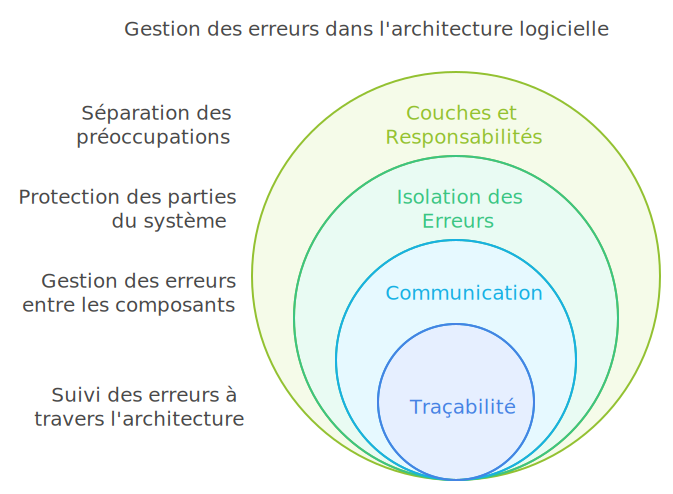
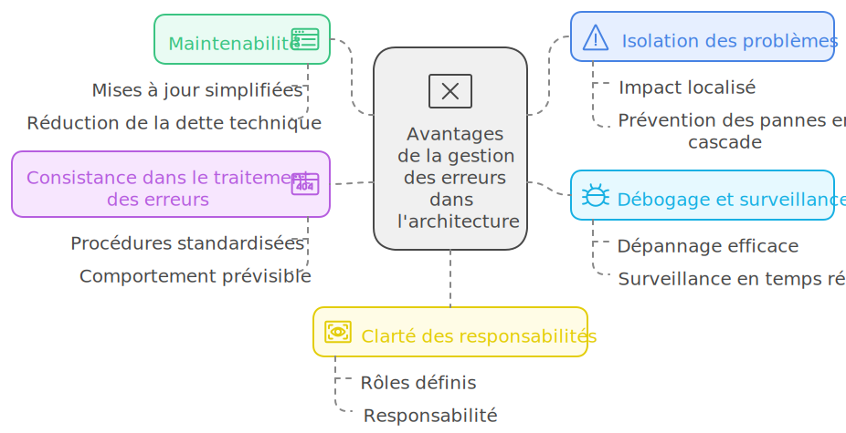
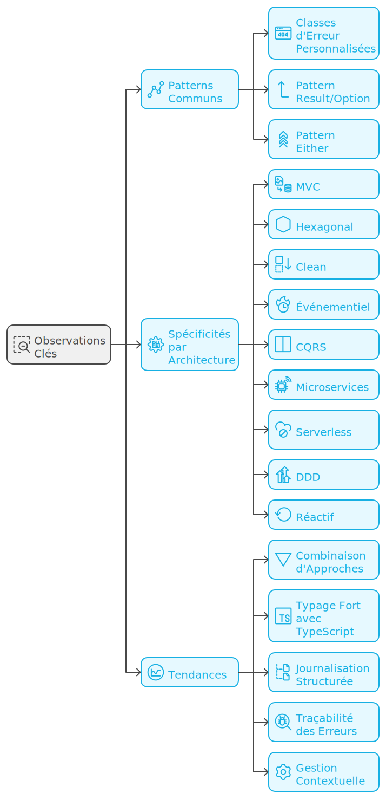

# 🏗️ Gestion d'Erreurs dans Différentes Architectures


� La gestion des erreurs varie considérablement selon l'architecture choisie, chaque approche architecturale apportant ses propres patterns et contraintes. Cette diversité reflète la nécessité d'adapter la gestion d'erreurs aux spécificités et aux objectifs de chaque style architectural.

🔄 Chaque architecture propose une façon unique d'organiser la gestion d'erreurs :
- 🏛️ **Couches et Responsabilités** : Séparation claire des préoccupations
- 🛡️ **Isolation des Erreurs** : Protection des différentes parties du système
- 🔌 **Communication** : Gestion des erreurs entre les composants
- 📊 **Traçabilité** : Suivi et monitoring des erreurs à travers l'architecture



✨ Les avantages d'une gestion d'erreurs adaptée à l'architecture :
- 🎯 Meilleure maintenabilité du code
- 🛡️ Isolation plus efficace des problèmes
- 📈 Facilité de debugging et monitoring
- 🔄 Cohérence dans le traitement des erreurs
- 💡 Clarté des responsabilités



> 🤔 Chaque architecture apporte sa propre vision de la gestion d'erreurs, reflétant ses principes fondamentaux et ses objectifs spécifiques.


## 📊 Correspondance entre Approches et Architectures

| Architecture | Approches de Gestion d'Erreurs | Correspondance les approches |
|-------------|--------------------------------|-------------------------------------|
| MVC | • Erreurs par couche (Model/View/Controller)<br>• Validation dans le modèle<br>• Pattern Result/Either<br>• Middleware d'erreurs centralisé | • Custom Error Classes<br>• Try/Catch traditionnel<br>• Result/Option Pattern<br>• Error Cause Chain |
| Hexagonale | • Erreurs par couche (Domain/Application/Infrastructure)<br>• Ports & Adapters pour les erreurs<br>• Either pour les résultats<br>• Erreurs métier dans le domaine | • Either Pattern<br>• Custom Error Classes<br>• DI Error Handler<br>• Result/Option Pattern |
| Clean Architecture | • Erreurs spécifiques par couche<br>• Value Objects pour validation<br>• Pattern Result<br>• Use Cases avec Either | • Custom Error Classes<br>• Either Pattern<br>• Result/Option Pattern<br>• DI Error Handler |
| Event-Driven | • Erreurs événementielles<br>• Dead Letter Queue<br>• Retry Pattern<br>• Error Events | • Error Cause Chain<br>• Custom Error Classes<br>• Result/Option Pattern<br>• Callbacks (style Node.js) |
| CQRS | • Erreurs séparées Commands/Queries<br>• Validation des commandes<br>• Gestion de concurrence<br>• Cache pour les requêtes | • Custom Error Classes<br>• Result/Option Pattern<br>• DI Error Handler<br>• Validation Pattern |
| Microservices | • Circuit Breaker<br>• Bulkhead Pattern<br>• Retry avec backoff<br>• Distributed Tracing | • Error Cause Chain<br>• DI Error Handler<br>• Custom Error Classes<br>• Result/Option Pattern |
| Serverless | • Erreurs par fonction<br>• Dead Letter Queues<br>• Timeouts<br>• Cold Start Handling | • Custom Error Classes<br>• Try/Catch traditionnel<br>• Result/Option Pattern<br>• Error Cause Chain |
| DDD | • Erreurs dans le langage ubiquitaire<br>• Validation au niveau domaine<br>• Result pour les opérations<br>• Erreurs par contexte borné | • Custom Error Classes<br>• Either Pattern<br>• Result/Option Pattern<br>• DI Error Handler |
| Reactive | • Erreurs dans les flux<br>• Retry avec backoff<br>• Error Boundaries<br>• Error Streams | • Result/Option Pattern<br>• Error Cause Chain<br>• Custom Error Classes<br>• Either Pattern |


**🔍 Observations clés :**

Patterns Communs :
- Custom Error Classes est utilisé dans toutes les architectures
- Result/Option Pattern est très répandu
- Either Pattern est privilégié dans les architectures fonctionnelles
  

Spécificités par Architecture :
- MVC : Focus sur la séparation des responsabilités
- Hexagonale : Isolation du domaine
- Clean : Séparation stricte des couches
- Event-Driven : Gestion asynchrone
- CQRS : Séparation lecture/écriture
- Microservices : Résilience distribuée
- Serverless : Gestion des contraintes cloud
- DDD : Erreurs métier
- Reactive : Gestion des flux
  

Tendances :
- Combinaison de plusieurs approches
- Typage fort avec TypeScript
- Logging structuré
- Traçabilité des erreurs
- Gestion contextuelle



## 1. Architecture MVC

Dans l'architecture MVC (Model-View-Controller), la gestion d'erreurs est stratifiée selon les responsabilités de chaque couche.

### 📝 Exemple Simple

```typescript
// types/errors.ts
export class ValidationError extends Error {
  constructor(public readonly errors: Record<string, string[]>) {
    super("Validation failed");
    this.name = "ValidationError";
  }
}

export class NotFoundError extends Error {
  constructor(resource: string) {
    super(`${resource} not found`);
    this.name = "NotFoundError";
  }
}

// models/user.model.ts
class UserModel {
  async findById(id: string): Promise<User> {
    const user = await db.users.findUnique({ where: { id } });
    if (!user) {
      throw new NotFoundError("User");
    }
    return user;
  }

  async create(data: CreateUserDTO): Promise<User> {
    // Validation simple
    if (!data.email || !data.password) {
      throw new ValidationError({
        email: ["Email is required"],
        password: ["Password is required"]
      });
    }

    return await db.users.create({ data });
  }
}

// controllers/user.controller.ts
class UserController {
  constructor(private userModel: UserModel) {}

  async getUser(req: Request, res: Response) {
    try {
      const user = await this.userModel.findById(req.params.id);
      res.json(user);
    } catch (error) {
      if (error instanceof NotFoundError) {
        res.status(404).json({ error: error.message });
      } else {
        res.status(500).json({ error: "Internal server error" });
      }
    }
  }

  async createUser(req: Request, res: Response) {
    try {
      const user = await this.userModel.create(req.body);
      res.status(201).json(user);
    } catch (error) {
      if (error instanceof ValidationError) {
        res.status(400).json({ errors: error.errors });
      } else {
        res.status(500).json({ error: "Internal server error" });
      }
    }
  }
}
```

### 🔄 Exemple Avancé

```typescript
// types/result.ts
export type Result<T, E = Error> = Success<T> | Failure<E>;

export class Success<T> {
  readonly isSuccess = true;
  readonly isFailure = false;
  constructor(readonly value: T) {}
}

export class Failure<E> {
  readonly isSuccess = false;
  readonly isFailure = true;
  constructor(readonly error: E) {}
}

// models/advanced-user.model.ts
interface UserValidationError {
  field: string;
  code: string;
  message: string;
}

class AdvancedUserModel {
  private validator: UserValidator;
  private repository: UserRepository;
  private eventEmitter: EventEmitter;

  constructor(
    validator: UserValidator,
    repository: UserRepository,
    eventEmitter: EventEmitter
  ) {
    this.validator = validator;
    this.repository = repository;
    this.eventEmitter = eventEmitter;
  }

  async create(data: CreateUserDTO): Promise<Result<User, UserValidationError[]>> {
    // Validation complexe
    const validationResult = await this.validator.validate(data);
    if (!validationResult.isSuccess) {
      return validationResult;
    }

    try {
      // Création avec hooks et événements
      const user = await this.repository.transaction(async (trx) => {
        const user = await this.repository.create(data, trx);
        
        // Événements post-création
        await this.eventEmitter.emit("user.created", user);
        
        return user;
      });

      return new Success(user);
    } catch (error) {
      // Log détaillé de l'erreur
      logger.error("User creation failed", {
        data,
        error,
        timestamp: new Date()
      });

      return new Failure([{
        field: "general",
        code: "CREATION_FAILED",
        message: "Failed to create user"
      }]);
    }
  }
}

// controllers/advanced-user.controller.ts
class AdvancedUserController {
  constructor(
    private userModel: AdvancedUserModel,
    private errorHandler: ErrorHandler
  ) {}

  async createUser(req: Request, res: Response, next: NextFunction) {
    const correlationId = req.headers["x-correlation-id"];
    const requestContext = {
      correlationId,
      userId: req.user?.id,
      timestamp: new Date()
    };

    try {
      const result = await this.userModel.create(req.body);

      if (result.isSuccess) {
        // Métriques et logging
        metrics.increment("user.creation.success");
        logger.info("User created successfully", {
          userId: result.value.id,
          context: requestContext
        });

        return res.status(201).json({
          success: true,
          data: result.value
        });
      }

      // Gestion structurée des erreurs de validation
      metrics.increment("user.creation.validation_error");
      logger.warn("User validation failed", {
        errors: result.error,
        context: requestContext
      });

      return res.status(400).json({
        success: false,
        errors: result.error.map(err => ({
          field: err.field,
          message: err.message
        }))
      });
    } catch (error) {
      // Gestion centralisée des erreurs avec contexte
      return this.errorHandler.handle(error, {
        req,
        res,
        next,
        context: {
          operation: "createUser",
          ...requestContext
        }
      });
    }
  }
}

// middleware/error-handler.middleware.ts
class ErrorHandler {
  handle(error: unknown, context: ErrorContext) {
    const { req, res, next, context: errorContext } = context;

    // Log structuré de l'erreur
    logger.error("Request failed", {
      error,
      context: errorContext
    });

    // Métriques
    metrics.increment("error", {
      type: error.constructor.name
    });

    // Réponse appropriée selon le type d'erreur
    if (error instanceof ValidationError) {
      return res.status(400).json({
        success: false,
        errors: error.errors
      });
    }

    if (error instanceof NotFoundError) {
      return res.status(404).json({
        success: false,
        error: error.message
      });
    }

    // Erreur par défaut
    return res.status(500).json({
      success: false,
      error: "An unexpected error occurred"
    });
  }
}
```

Cette implémentation MVC montre :

**Exemple Simple :**
- Gestion basique des erreurs avec types d'erreurs personnalisés
- Validation simple dans le modèle
- Gestion des erreurs HTTP dans le contrôleur

**Exemple Avancé :**
- Pattern Result pour une gestion type-safe des erreurs
- Validation complexe avec règles métier
- Gestion transactionnelle
- Événements et hooks
- Logging structuré
- Métriques
- Gestion du contexte de requête
- Middleware d'erreurs centralisé

## 2. Architecture Hexagonale (Ports & Adapters)

L'architecture hexagonale (ou "Ports & Adapters") propose une approche élégante de la gestion d'erreurs en séparant clairement les erreurs par couche et en utilisant des ports pour définir les contrats d'erreur.

### 📝 Exemple Simple

```typescript
// domain/errors/domain-errors.ts
export namespace DomainErrors {
  export class ValidationError extends Error {
    constructor(message: string) {
      super(message);
      this.name = "ValidationError";
    }
  }

  export class BusinessRuleError extends Error {
    constructor(message: string) {
      super(message);
      this.name = "BusinessRuleError";
    }
  }
}

// domain/models/user.ts
export class User {
  private constructor(
    public readonly email: string,
    public readonly name: string
  ) {}

  static create(data: { email: string; name: string }): Either<DomainErrors.ValidationError, User> {
    if (!this.isValidEmail(data.email)) {
      return Left(new DomainErrors.ValidationError("Email invalide"));
    }
    
    if (!data.name || data.name.length < 2) {
      return Left(new DomainErrors.ValidationError("Le nom doit contenir au moins 2 caractères"));
    }

    return Right(new User(data.email, data.name));
  }

  private static isValidEmail(email: string): boolean {
    return /^[^\s@]+@[^\s@]+\.[^\s@]+$/.test(email);
  }
}

// ports/user-repository.port.ts
export interface UserRepositoryPort {
  save(user: User): Promise<Either<RepositoryError, User>>;
  findByEmail(email: string): Promise<Either<RepositoryError, User | null>>;
}

// adapters/postgres-user-repository.ts
export class PostgresUserRepository implements UserRepositoryPort {
  async save(user: User): Promise<Either<RepositoryError, User>> {
    try {
      const result = await this.client.query(
        "INSERT INTO users (email, name) VALUES ($1, $2) RETURNING *",
        [user.email, user.name]
      );
      return Right(this.toDomain(result.rows[0]));
    } catch (error) {
      return Left(new RepositoryError("Erreur lors de la sauvegarde", error));
    }
  }
}
```

### 🔄 Exemple Avancé

```typescript
// application/ports/primary/create-user.port.ts
interface CreateUserPort {
  execute(command: CreateUserCommand): Promise<Either<ApplicationError, User>>;
}

// application/ports/secondary/user-repository.port.ts
interface UserRepositoryPort {
  save(user: User): Promise<Either<RepositoryError, User>>;
  findByEmail(email: string): Promise<Either<RepositoryError, User | null>>;
}

// application/ports/secondary/email-service.port.ts
interface EmailServicePort {
  sendWelcomeEmail(user: User): Promise<Either<EmailError, void>>;
}

// application/errors/application-errors.ts
export namespace ApplicationErrors {
  export class UserAlreadyExistsError extends Error {
    constructor(email: string) {
      super(`Un utilisateur avec l'email ${email} existe déjà`);
      this.name = "UserAlreadyExistsError";
    }
  }

  export class EmailServiceError extends Error {
    constructor(message: string, public readonly cause: Error) {
      super(message);
      this.name = "EmailServiceError";
    }
  }
}

// application/use-cases/create-user.use-case.ts
export class CreateUserUseCase implements CreateUserPort {
  constructor(
    private readonly userRepository: UserRepositoryPort,
    private readonly emailService: EmailServicePort,
    private readonly logger: LoggerPort
  ) {}

  async execute(command: CreateUserCommand): Promise<Either<ApplicationError, User>> {
    // Logging de la commande
    this.logger.info("Création d'utilisateur", { command });

    // Validation du domaine
    const userOrError = User.create({
      email: command.email,
      name: command.name
    });

    if (userOrError.isLeft()) {
      return Left(userOrError.value);
    }

    // Vérification de l'unicité
    const existingUserOrError = await this.userRepository.findByEmail(command.email);
    
    if (existingUserOrError.isRight() && existingUserOrError.value) {
      return Left(new ApplicationErrors.UserAlreadyExistsError(command.email));
    }

    // Sauvegarde de l'utilisateur
    const savedUserOrError = await this.userRepository.save(userOrError.value);
    
    if (savedUserOrError.isLeft()) {
      return Left(savedUserOrError.value);
    }

    // Envoi de l'email de bienvenue
    const emailResult = await this.emailService.sendWelcomeEmail(savedUserOrError.value);
    
    if (emailResult.isLeft()) {
      this.logger.warn("Échec de l'envoi de l'email de bienvenue", {
        userId: savedUserOrError.value.id,
        error: emailResult.value
      });
      // On continue malgré l'erreur d'email
    }

    return Right(savedUserOrError.value);
  }
}

// infrastructure/adapters/postgres-user-repository.adapter.ts
export class PostgresUserRepositoryAdapter implements UserRepositoryPort {
  constructor(
    private readonly client: Pool,
    private readonly logger: LoggerPort
  ) {}

  async save(user: User): Promise<Either<RepositoryError, User>> {
    const trx = await this.client.connect();
    
    try {
      await trx.query('BEGIN');
      
      const result = await trx.query(
        `INSERT INTO users (email, name) 
         VALUES ($1, $2) 
         RETURNING *`,
        [user.email, user.name]
      );

      await trx.query('COMMIT');
      
      return Right(this.toDomain(result.rows[0]));
    } catch (error) {
      await trx.query('ROLLBACK');
      
      this.logger.error("Erreur lors de la sauvegarde de l'utilisateur", {
        error,
        user
      });

      return Left(new RepositoryError(
        "Erreur lors de la sauvegarde",
        error
      ));
    } finally {
      trx.release();
    }
  }
}

// infrastructure/adapters/rest-api/controllers/create-user.controller.ts
export class CreateUserController {
  constructor(private readonly createUser: CreateUserPort) {}

  async handle(req: Request, res: Response): Promise<void> {
    const result = await this.createUser.execute({
      email: req.body.email,
      name: req.body.name
    });

    if (result.isLeft()) {
      const error = result.value;

      switch (error.constructor) {
        case DomainErrors.ValidationError:
          res.status(400).json({
            type: "VALIDATION_ERROR",
            message: error.message
          });
          break;
        
        case ApplicationErrors.UserAlreadyExistsError:
          res.status(409).json({
            type: "CONFLICT",
            message: error.message
          });
          break;
        
        default:
          res.status(500).json({
            type: "SERVER_ERROR",
            message: "Une erreur interne est survenue"
          });
      }
      return;
    }

    res.status(201).json(result.value);
  }
}
```

Cette implémentation hexagonale montre :

**Points Clés :**
- 🎯 Séparation claire des erreurs par couche (domaine, application, infrastructure)
- 🔄 Utilisation du pattern Either pour la gestion type-safe des erreurs
- 🔌 Ports définissant les contrats d'erreur
- 🛡️ Adapters implémentant la gestion d'erreurs spécifique
- 📝 Logging contextuel des erreurs
- 🔍 Traçabilité des erreurs à travers les couches

**Avantages :**
- ✨ Code plus maintenable et testable
- 🎯 Erreurs typées et prévisibles
- 🔄 Gestion cohérente des erreurs
- 🛡️ Isolation des préoccupations
- 📊 Facilité de monitoring et debugging

**Bonnes Pratiques :**
1. Définir des types d'erreurs spécifiques par couche
2. Utiliser Either pour la gestion fonctionnelle des erreurs
3. Logger les erreurs avec contexte
4. Implémenter une stratégie de rollback cohérente
5. Centraliser la transformation des erreurs en réponses HTTP

## 3. Clean Architecture

La Clean Architecture exige une séparation stricte des responsabilités et une gestion d'erreurs spécifique à chaque couche.

### 📝 Exemple Simple

```typescript
// domain/errors/domain-error.ts
export abstract class DomainError extends Error {
  constructor(message: string) {
    super(message);
    this.name = this.constructor.name;
  }
}

export class InvalidEmailError extends DomainError {
  constructor(email: string) {
    super(`L'email "${email}" n'est pas valide`);
  }
}

export class InvalidPasswordError extends DomainError {
  constructor() {
    super("Le mot de passe doit contenir au moins 8 caractères");
  }
}

// domain/entities/user.entity.ts
export class User {
  private constructor(
    public readonly email: string,
    public readonly password: string
  ) {}

  static create(params: {
    email: string;
    password: string;
  }): Either<DomainError, User> {
    if (!this.isValidEmail(params.email)) {
      return Left(new InvalidEmailError(params.email));
    }

    if (!this.isValidPassword(params.password)) {
      return Left(new InvalidPasswordError());
    }

    return Right(new User(params.email, params.password));
  }

  private static isValidEmail(email: string): boolean {
    return /^[^\s@]+@[^\s@]+\.[^\s@]+$/.test(email);
  }

  private static isValidPassword(password: string): boolean {
    return password.length >= 8;
  }
}

// application/use-cases/create-user.use-case.ts
export class CreateUserUseCase {
  constructor(private userRepository: UserRepository) {}

  async execute(request: CreateUserRequest): Promise<Either<Error, User>> {
    const userOrError = User.create(request);

    if (userOrError.isLeft()) {
      return Left(userOrError.value);
    }

    return await this.userRepository.save(userOrError.value);
  }
}
```

### 🔄 Exemple Avancé

```typescript
// domain/errors/index.ts
export namespace DomainErrors {
  export class ValidationError extends Error {
    constructor(message: string) {
      super(message);
      this.name = "ValidationError";
    }
  }

  export class BusinessRuleError extends Error {
    constructor(message: string) {
      super(message);
      this.name = "BusinessRuleError";
    }
  }

  export class EntityNotFoundError extends Error {
    constructor(entity: string, id: string) {
      super(`${entity} with id ${id} not found`);
      this.name = "EntityNotFoundError";
    }
  }
}

// application/errors/index.ts
export namespace ApplicationErrors {
  export class UseCaseError extends Error {
    constructor(message: string, public readonly cause?: Error) {
      super(message);
      this.name = "UseCaseError";
    }
  }

  export class AuthorizationError extends Error {
    constructor(message: string) {
      super(message);
      this.name = "AuthorizationError";
    }
  }
}

// infrastructure/errors/index.ts
export namespace InfrastructureErrors {
  export class DatabaseError extends Error {
    constructor(message: string, public readonly cause: Error) {
      super(message);
      this.name = "DatabaseError";
    }
  }

  export class ExternalServiceError extends Error {
    constructor(service: string, message: string, public readonly cause: Error) {
      super(`${service}: ${message}`);
      this.name = "ExternalServiceError";
    }
  }
}

// domain/value-objects/email.vo.ts
export class Email {
  private constructor(private readonly value: string) {}

  static create(email: string): Either<DomainErrors.ValidationError, Email> {
    if (!this.isValid(email)) {
      return Left(new DomainErrors.ValidationError(
        `L'email "${email}" n'est pas valide`
      ));
    }
    return Right(new Email(email));
  }

  private static isValid(email: string): boolean {
    return /^[^\s@]+@[^\s@]+\.[^\s@]+$/.test(email);
  }

  toString(): string {
    return this.value;
  }
}

// application/use-cases/register-user/register-user.use-case.ts
interface RegisterUserDTO {
  email: string;
  password: string;
  name: string;
}

export class RegisterUserUseCase implements UseCase<RegisterUserDTO, User> {
  constructor(
    private readonly userRepository: UserRepository,
    private readonly passwordHasher: PasswordHasher,
    private readonly emailService: EmailService,
    private readonly logger: Logger
  ) {}

  async execute(request: RegisterUserDTO): Promise<Either<Error, User>> {
    this.logger.info("Début de l'inscription utilisateur", { email: request.email });

    // Création de l'email (Value Object)
    const emailOrError = Email.create(request.email);
    if (emailOrError.isLeft()) {
      return Left(emailOrError.value);
    }

    // Vérification de l'unicité de l'email
    const existingUser = await this.userRepository.findByEmail(emailOrError.value);
    if (existingUser.isRight() && existingUser.value) {
      return Left(new ApplicationErrors.UseCaseError(
        "Un utilisateur avec cet email existe déjà"
      ));
    }

    // Création de l'entité utilisateur
    const userOrError = User.create({
      email: emailOrError.value,
      password: await this.passwordHasher.hash(request.password),
      name: request.name
    });

    if (userOrError.isLeft()) {
      return Left(userOrError.value);
    }

    // Sauvegarde de l'utilisateur
    const savedUserOrError = await this.userRepository.save(userOrError.value);
    if (savedUserOrError.isLeft()) {
      return Left(new ApplicationErrors.UseCaseError(
        "Erreur lors de la sauvegarde de l'utilisateur",
        savedUserOrError.value
      ));
    }

    // Envoi de l'email de bienvenue
    const emailResult = await this.emailService.sendWelcomeEmail(savedUserOrError.value);
    if (emailResult.isLeft()) {
      this.logger.warn("Échec de l'envoi de l'email de bienvenue", {
        userId: savedUserOrError.value.id,
        error: emailResult.value
      });
      // On continue malgré l'erreur d'email
    }

    this.logger.info("Inscription utilisateur réussie", {
      userId: savedUserOrError.value.id
    });

    return Right(savedUserOrError.value);
  }
}

// infrastructure/http/controllers/register-user.controller.ts
export class RegisterUserController {
  constructor(
    private readonly registerUser: RegisterUserUseCase,
    private readonly presenter: RegisterUserPresenter
  ) {}

  async handle(req: Request, res: Response): Promise<void> {
    try {
      const result = await this.registerUser.execute({
        email: req.body.email,
        password: req.body.password,
        name: req.body.name
      });

      if (result.isLeft()) {
        const error = result.value;
        
        switch (error.constructor) {
          case DomainErrors.ValidationError:
            res.status(400).json(this.presenter.validationError(error));
            break;

          case ApplicationErrors.UseCaseError:
            if (error.message.includes("existe déjà")) {
              res.status(409).json(this.presenter.conflict(error));
            } else {
              res.status(400).json(this.presenter.useCaseError(error));
            }
            break;

          case InfrastructureErrors.DatabaseError:
            res.status(503).json(this.presenter.serviceUnavailable(error));
            break;

          default:
            res.status(500).json(this.presenter.internalError(error));
        }
        return;
      }

      res.status(201).json(this.presenter.success(result.value));
    } catch (error) {
      res.status(500).json(this.presenter.internalError(error));
    }
  }
}
```

Cette implémentation Clean Architecture montre :

**Points Clés :**
- 🎯 Erreurs spécifiques à chaque couche (Domain, Application, Infrastructure)
- 🔄 Utilisation de Value Objects pour la validation
- 🛡️ Gestion des erreurs métier dans le domaine
- 📝 Logging contextuel à chaque étape
- 🔌 Interfaces claires pour les dépendances externes

**Avantages :**
- ✨ Séparation claire des responsabilités
- 🎯 Erreurs typées et prévisibles
- 🔄 Flux de données unidirectionnel
- 🛡️ Domaine protégé des détails d'implémentation
- 📊 Facilité de test et de maintenance

**Bonnes Pratiques :**
1. Validation au niveau du domaine
2. Erreurs spécifiques par couche
3. Logging contextuel
4. Gestion des cas d'erreur explicite
5. Présentation des erreurs adaptée au client

## 4. Event-Driven Architecture

Dans une architecture événementielle, la gestion d'erreurs doit tenir compte des événements asynchrones et des différents patterns de communication entre les services.

### 📝 Exemple Simple

```typescript
// types/events.ts
interface BaseEvent {
  id: string;
  timestamp: Date;
  type: string;
}

interface ErrorEvent extends BaseEvent {
  type: "error.occurred";
  error: {
    name: string;
    message: string;
    stack?: string;
    code?: string;
  };
  context: {
    service: string;
    operation: string;
    correlationId?: string;
  };
}

// handlers/error-event.handler.ts
class ErrorEventHandler {
  constructor(
    private readonly logger: Logger,
    private readonly metrics: MetricsService
  ) {}

  async handle(event: ErrorEvent): Promise<void> {
    // Log l'erreur
    this.logger.error("Erreur détectée", {
      error: event.error,
      context: event.context,
      timestamp: event.timestamp
    });

    // Incrémente les métriques
    await this.metrics.increment(`errors.${event.context.service}`, {
      errorType: event.error.name,
      operation: event.context.operation
    });
  }
}
```

### 🔄 Exemple Avancé

```typescript
// domain/errors/domain-events.ts
type ErrorSeverity = "low" | "medium" | "high" | "critical";

interface ErrorContext {
  service: string;
  operation: string;
  correlationId?: string;
  userId?: string;
  metadata?: Record<string, unknown>;
}

interface ErrorEventPayload {
  name: string;
  message: string;
  stack?: string;
  code?: string;
  severity: ErrorSeverity;
  context: ErrorContext;
  timestamp: Date;
  retryCount?: number;
}

// services/error-event.service.ts
class ErrorEventService {
  constructor(
    private readonly eventBus: EventBus,
    private readonly logger: Logger,
    private readonly metrics: MetricsService,
    private readonly notifier: NotificationService
  ) {}

  async publishError(payload: ErrorEventPayload): Promise<void> {
    try {
      // Publication de l'événement d'erreur
      await this.eventBus.publish("error.occurred", {
        id: crypto.randomUUID(),
        ...payload
      });

      // Métriques
      this.metrics.increment("error_events", {
        service: payload.context.service,
        severity: payload.severity
      });

      // Notification si erreur critique
      if (payload.severity === "critical") {
        await this.notifier.alert({
          title: `Erreur Critique: ${payload.name}`,
          message: payload.message,
          context: payload.context
        });
      }
    } catch (error) {
      // Fallback logging si la publication échoue
      this.logger.error("Échec de publication de l'événement d'erreur", {
        error,
        originalError: payload
      });
    }
  }
}

// handlers/dead-letter-queue.handler.ts
class DeadLetterQueueHandler {
  constructor(
    private readonly errorEventService: ErrorEventService,
    private readonly logger: Logger
  ) {}

  async handle(failedEvent: any): Promise<void> {
    const errorPayload: ErrorEventPayload = {
      name: "MessageProcessingError",
      message: "Échec du traitement du message",
      severity: "high",
      context: {
        service: "message-processor",
        operation: "processMessage",
        correlationId: failedEvent.correlationId,
        metadata: {
          originalEvent: failedEvent,
          queue: "dead-letter"
        }
      },
      timestamp: new Date(),
      retryCount: failedEvent.retryCount || 0
    };

    await this.errorEventService.publishError(errorPayload);
  }
}

// middleware/error-event.middleware.ts
class ErrorEventMiddleware {
  constructor(
    private readonly errorEventService: ErrorEventService
  ) {}

  async handleError(error: Error, context: ErrorContext): Promise<void> {
    const severity = this.determineSeverity(error);
    
    await this.errorEventService.publishError({
      name: error.name,
      message: error.message,
      stack: error.stack,
      code: error instanceof CustomError ? error.code : undefined,
      severity,
      context,
      timestamp: new Date()
    });
  }

  private determineSeverity(error: Error): ErrorSeverity {
    if (error instanceof BusinessError) {
      return "low";
    }
    if (error instanceof ValidationError) {
      return "medium";
    }
    if (error instanceof DatabaseError) {
      return "high";
    }
    return "critical";
  }
}

// services/retry.service.ts
class RetryService {
  private readonly maxRetries = 3;
  private readonly backoffMs = 1000;

  constructor(
    private readonly errorEventService: ErrorEventService
  ) {}

  async withRetry<T>(
    operation: () => Promise<T>,
    context: ErrorContext
  ): Promise<T> {
    let lastError: Error;
    
    for (let attempt = 1; attempt <= this.maxRetries; attempt++) {
      try {
        return await operation();
      } catch (error) {
        lastError = error;
        
        await this.errorEventService.publishError({
          name: error.name,
          message: error.message,
          severity: "medium",
          context: {
            ...context,
            metadata: {
              attempt,
              maxRetries: this.maxRetries
            }
          },
          timestamp: new Date(),
          retryCount: attempt
        });

        if (attempt < this.maxRetries) {
          await this.delay(this.backoffMs * attempt);
          continue;
        }
      }
    }

    throw lastError;
  }

  private delay(ms: number): Promise<void> {
    return new Promise(resolve => setTimeout(resolve, ms));
  }
}

// Exemple d'utilisation
class OrderService {
  constructor(
    private readonly retryService: RetryService,
    private readonly errorEventService: ErrorEventService
  ) {}

  async processOrder(order: Order): Promise<void> {
    const context: ErrorContext = {
      service: "order-service",
      operation: "processOrder",
      correlationId: order.id,
      userId: order.userId
    };

    try {
      await this.retryService.withRetry(
        async () => {
          // Logique de traitement de la commande
          await this.validateOrder(order);
          await this.processPayment(order);
          await this.updateInventory(order);
        },
        context
      );
    } catch (error) {
      // Erreur finale après tous les essais
      await this.errorEventService.publishError({
        name: "OrderProcessingError",
        message: `Échec du traitement de la commande: ${error.message}`,
        severity: "critical",
        context,
        timestamp: new Date()
      });

      throw error;
    }
  }
}
```

Cette implémentation Event-Driven montre :

**Points Clés :**
- 🎯 Gestion centralisée des événements d'erreur
- 🔄 Mécanisme de retry avec backoff exponentiel
- 🛡️ Dead Letter Queue pour les messages non traités
- 📝 Logging et métriques détaillés
- 🚨 Système de notification pour les erreurs critiques

**Avantages :**
- ✨ Traçabilité complète des erreurs
- 🎯 Classification des erreurs par sévérité
- 🔄 Gestion des retries automatisée
- 🛡️ Isolation des erreurs par service
- 📊 Monitoring et alerting intégrés

**Bonnes Pratiques :**
1. Centralisation des événements d'erreur
2. Classification des erreurs par sévérité
3. Contexte riche pour chaque erreur
4. Mécanisme de retry intelligent
5. Support de la corrélation des requêtes

## 5. CQRS (Command Query Responsibility Segregation)

CQRS nécessite une gestion d'erreurs distincte et spécialisée pour les commandes et les requêtes, avec des types d'erreurs spécifiques à chaque cas d'utilisation.

### 📝 Exemple Simple

```typescript
// types/errors.ts
export namespace CommandErrors {
  export class ValidationError extends Error {
    constructor(message: string, public readonly details: Record<string, string[]>) {
      super(message);
      this.name = "ValidationError";
    }
  }

  export class ConcurrencyError extends Error {
    constructor(message: string) {
      super(message);
      this.name = "ConcurrencyError";
    }
  }
}

export namespace QueryErrors {
  export class NotFoundError extends Error {
    constructor(resource: string, id: string) {
      super(`${resource} with id ${id} not found`);
      this.name = "NotFoundError";
    }
  }

  export class InvalidQueryError extends Error {
    constructor(message: string) {
      super(message);
      this.name = "InvalidQueryError";
    }
  }
}

// commands/create-user.command.ts
interface CreateUserCommand {
  email: string;
  password: string;
  name: string;
}

class CreateUserCommandHandler {
  async execute(command: CreateUserCommand): Promise<Either<CommandErrors.ValidationError, void>> {
    // Validation
    if (!command.email || !command.password) {
      return Left(new CommandErrors.ValidationError("Invalid data", {
        email: ["Email is required"],
        password: ["Password is required"]
      }));
    }

    // Exécution
    await this.userRepository.save({
      email: command.email,
      password: command.password,
      name: command.name
    });

    return Right(undefined);
  }
}

// queries/get-user.query.ts
interface GetUserQuery {
  id: string;
}

class GetUserQueryHandler {
  async execute(query: GetUserQuery): Promise<Either<QueryErrors.NotFoundError, User>> {
    const user = await this.userRepository.findById(query.id);
    
    if (!user) {
      return Left(new QueryErrors.NotFoundError("User", query.id));
    }

    return Right(user);
  }
}
```

### 🔄 Exemple Avancé

```typescript
// types/command-result.ts
interface CommandResult<TError = Error> {
  success: boolean;
  error?: TError;
  validationErrors?: ValidationError[];
  metadata?: {
    correlationId: string;
    timestamp: Date;
    version: number;
  };
}

// types/query-result.ts
interface QueryResult<TData, TError = Error> {
  success: boolean;
  data?: TData;
  error?: TError;
  metadata?: {
    correlationId: string;
    timestamp: Date;
    cacheHit?: boolean;
    source?: "cache" | "database";
  };
}

// commands/update-user-profile.command.ts
interface UpdateUserProfileCommand {
  userId: string;
  version: number;  // Pour la gestion de concurrence optimiste
  updates: {
    email?: string;
    name?: string;
    preferences?: UserPreferences;
  };
}

class UpdateUserProfileCommandHandler {
  constructor(
    private readonly userRepository: UserRepository,
    private readonly validator: UserProfileValidator,
    private readonly eventBus: EventBus,
    private readonly logger: Logger
  ) {}

  async execute(
    command: UpdateUserProfileCommand
  ): Promise<CommandResult<UpdateUserProfileError>> {
    const correlationId = crypto.randomUUID();
    
    try {
      // Validation
      const validationResult = await this.validator.validate(command.updates);
      if (!validationResult.isValid) {
        return {
          success: false,
          validationErrors: validationResult.errors,
          metadata: {
            correlationId,
            timestamp: new Date(),
            version: command.version
          }
        };
      }

      // Vérification de la concurrence
      const currentUser = await this.userRepository.findById(command.userId);
      if (!currentUser) {
        return {
          success: false,
          error: new CommandErrors.NotFoundError("User", command.userId),
          metadata: {
            correlationId,
            timestamp: new Date(),
            version: command.version
          }
        };
      }

      if (currentUser.version !== command.version) {
        return {
          success: false,
          error: new CommandErrors.ConcurrencyError(
            "User profile has been modified by another process"
          ),
          metadata: {
            correlationId,
            timestamp: new Date(),
            version: currentUser.version
          }
        };
      }

      // Mise à jour
      const updatedUser = await this.userRepository.update(
        command.userId,
        command.updates,
        command.version
      );

      // Publication des événements
      await this.eventBus.publish("UserProfileUpdated", {
        userId: command.userId,
        changes: command.updates,
        version: updatedUser.version,
        correlationId
      });

      return {
        success: true,
        metadata: {
          correlationId,
          timestamp: new Date(),
          version: updatedUser.version
        }
      };

    } catch (error) {
      // Logging structuré
      this.logger.error("Failed to update user profile", {
        error,
        command,
        correlationId
      });

      return {
        success: false,
        error: new CommandErrors.UnexpectedError(
          "Failed to update user profile",
          error
        ),
        metadata: {
          correlationId,
          timestamp: new Date(),
          version: command.version
        }
      };
    }
  }
}

// queries/get-user-profile.query.ts
interface GetUserProfileQuery {
  userId: string;
  includePreferences?: boolean;
  includeSensitiveData?: boolean;
}

class GetUserProfileQueryHandler {
  constructor(
    private readonly userRepository: UserRepository,
    private readonly cacheService: CacheService,
    private readonly logger: Logger
  ) {}

  async execute(
    query: GetUserProfileQuery
  ): Promise<QueryResult<UserProfile, GetUserProfileError>> {
    const correlationId = crypto.randomUUID();

    try {
      // Tentative de récupération depuis le cache
      const cacheKey = this.buildCacheKey(query);
      const cachedProfile = await this.cacheService.get<UserProfile>(cacheKey);

      if (cachedProfile) {
        return {
          success: true,
          data: cachedProfile,
          metadata: {
            correlationId,
            timestamp: new Date(),
            cacheHit: true,
            source: "cache"
          }
        };
      }

      // Récupération depuis la base de données
      const user = await this.userRepository.findById(
        query.userId,
        {
          includePreferences: query.includePreferences,
          includeSensitiveData: query.includeSensitiveData
        }
      );

      if (!user) {
        return {
          success: false,
          error: new QueryErrors.NotFoundError("User", query.userId),
          metadata: {
            correlationId,
            timestamp: new Date(),
            source: "database"
          }
        };
      }

      // Mise en cache du résultat
      await this.cacheService.set(cacheKey, user, { ttl: 300 }); // 5 minutes

      return {
        success: true,
        data: user,
        metadata: {
          correlationId,
          timestamp: new Date(),
          cacheHit: false,
          source: "database"
        }
      };

    } catch (error) {
      this.logger.error("Failed to get user profile", {
        error,
        query,
        correlationId
      });

      return {
        success: false,
        error: new QueryErrors.UnexpectedError(
          "Failed to get user profile",
          error
        ),
        metadata: {
          correlationId,
          timestamp: new Date()
        }
      };
    }
  }

  private buildCacheKey(query: GetUserProfileQuery): string {
    return `user:${query.userId}:profile:${
      query.includePreferences ? 1 : 0
    }:${
      query.includeSensitiveData ? 1 : 0
    }`;
  }
}
```

Cette implémentation CQRS montre :

**Points Clés :**
- 🎯 Séparation claire des erreurs pour les commandes et les requêtes
- 🔄 Gestion de la concurrence optimiste
- 🛡️ Validation riche des commandes
- 📝 Logging contextuel
- 🔍 Cache pour les requêtes
- 🎭 Métadonnées pour le traçage

**Avantages :**
- ✨ Séparation claire des responsabilités
- 🎯 Erreurs spécifiques au contexte
- 🔄 Gestion de cache optimisée
- 🛡️ Traçabilité complète
- 📊 Facilité de monitoring

**Bonnes Pratiques :**
1. Types d'erreurs distincts pour commandes et requêtes
2. Gestion de la concurrence
3. Mise en cache des requêtes
4. Logging détaillé
5. Métadonnées de traçage

## 6. Microservices Architecture

Dans une architecture microservices, la gestion d'erreurs doit prendre en compte la communication inter-services, la résilience et les différents patterns de tolérance aux pannes.

### 📝 Exemple Simple

```typescript
// types/errors.ts
export class ServiceError extends Error {
  constructor(
    message: string,
    public readonly code: string,
    public readonly service: string,
    public readonly correlationId?: string
  ) {
    super(message);
    this.name = "ServiceError";
  }
}

// services/circuit-breaker.ts
class CircuitBreaker {
  private failures = 0;
  private lastFailure?: Date;
  private readonly threshold = 5;
  private readonly resetTimeout = 60000; // 1 minute

  async execute<T>(
    operation: () => Promise<T>,
    context: { service: string; operation: string }
  ): Promise<Either<ServiceError, T>> {
    if (this.isOpen()) {
      return Left(new ServiceError(
        "Service temporairement indisponible",
        "CIRCUIT_OPEN",
        context.service
      ));
    }

    try {
      const result = await operation();
      this.reset();
      return Right(result);
    } catch (error) {
      this.recordFailure();
      return Left(new ServiceError(
        "Erreur d'appel service",
        "SERVICE_ERROR",
        context.service
      ));
    }
  }

  private isOpen(): boolean {
    if (this.failures >= this.threshold) {
      const now = new Date();
      if (this.lastFailure && 
          (now.getTime() - this.lastFailure.getTime()) > this.resetTimeout) {
        this.reset();
        return false;
      }
      return true;
    }
    return false;
  }

  private reset(): void {
    this.failures = 0;
    this.lastFailure = undefined;
  }

  private recordFailure(): void {
    this.failures++;
    this.lastFailure = new Date();
  }
}
```

### 🔄 Exemple Avancé

```typescript
// types/resilience.ts
interface ResilienceConfig {
  timeout: number;
  retries: number;
  backoff: {
    initial: number;
    max: number;
    multiplier: number;
  };
  circuitBreaker: {
    threshold: number;
    resetTimeout: number;
  };
  bulkhead: {
    maxConcurrent: number;
    maxQueue: number;
  };
}

// services/resilience.service.ts
class ResilienceService {
  constructor(
    private readonly config: ResilienceConfig,
    private readonly logger: Logger,
    private readonly metrics: MetricsService
  ) {}

  async executeWithResilience<T>(
    operation: () => Promise<T>,
    context: {
      service: string;
      operation: string;
      correlationId?: string;
    }
  ): Promise<Either<ServiceError, T>> {
    const bulkhead = this.createBulkhead(context);
    const circuitBreaker = this.createCircuitBreaker(context);
    const retry = this.createRetry(context);

    return await bulkhead.execute(async () => {
      return await circuitBreaker.execute(async () => {
        return await retry.execute(operation);
      });
    });
  }

  private createBulkhead(context: { service: string; operation: string }) {
    return new Bulkhead(
      this.config.bulkhead.maxConcurrent,
      this.config.bulkhead.maxQueue,
      {
        onReject: () => {
          this.metrics.increment("bulkhead.rejection", {
            service: context.service,
            operation: context.operation
          });
        }
      }
    );
  }

  private createCircuitBreaker(context: { service: string; operation: string }) {
    return new CircuitBreaker({
      ...this.config.circuitBreaker,
      onStateChange: (state: "open" | "closed" | "half-open") => {
        this.logger.info(`Circuit breaker state changed to ${state}`, {
          service: context.service,
          operation: context.operation
        });
        this.metrics.gauge("circuit_breaker.state", {
          service: context.service,
          operation: context.operation,
          state
        });
      }
    });
  }

  private createRetry(context: { service: string; operation: string }) {
    return new RetryWithBackoff({
      ...this.config.backoff,
      onRetry: (attempt: number, error: Error) => {
        this.logger.warn(`Retry attempt ${attempt}`, {
          service: context.service,
          operation: context.operation,
          error
        });
        this.metrics.increment("retry.attempt", {
          service: context.service,
          operation: context.operation,
          attempt
        });
      }
    });
  }
}

// services/user.service.ts
class UserService {
  constructor(
    private readonly resilience: ResilienceService,
    private readonly httpClient: HttpClient
  ) {}

  async getUser(id: string): Promise<Either<ServiceError, User>> {
    return await this.resilience.executeWithResilience(
      async () => {
        const response = await this.httpClient.get(`/users/${id}`);
        if (!response.ok) {
          throw new Error(`Failed to fetch user: ${response.statusText}`);
        }
        return response.json();
      },
      {
        service: "user-service",
        operation: "getUser",
        correlationId: id
      }
    );
  }
}

// middleware/error-handler.middleware.ts
class ErrorHandlerMiddleware {
  constructor(
    private readonly logger: Logger,
    private readonly metrics: MetricsService
  ) {}

  async handle(
    error: Error,
    req: Request,
    res: Response,
    next: NextFunction
  ): Promise<void> {
    if (error instanceof ServiceError) {
      // Log et métriques
      this.logger.error("Service Error", {
        error,
        request: {
          path: req.path,
          method: req.method,
          correlationId: req.headers["x-correlation-id"]
        }
      });

      this.metrics.increment("service.error", {
        service: error.service,
        code: error.code
      });

      // Réponse appropriée
      res.status(this.getStatusCode(error)).json({
        error: {
          message: error.message,
          code: error.code,
          correlationId: error.correlationId
        }
      });
      return;
    }

    next(error);
  }

  private getStatusCode(error: ServiceError): number {
    switch (error.code) {
      case "CIRCUIT_OPEN":
        return 503; // Service Unavailable
      case "TIMEOUT":
        return 504; // Gateway Timeout
      case "VALIDATION_ERROR":
        return 400; // Bad Request
      default:
        return 500; // Internal Server Error
    }
  }
}

// services/dead-letter-queue.service.ts
class DeadLetterQueueService {
  constructor(
    private readonly messageQueue: MessageQueue,
    private readonly logger: Logger
  ) {}

  async handleFailedMessage(
    message: any,
    error: Error,
    context: {
      service: string;
      operation: string;
      correlationId?: string;
    }
  ): Promise<void> {
    // Log l'erreur
    this.logger.error("Message processing failed", {
      error,
      message,
      context
    });

    // Envoie le message dans la DLQ
    await this.messageQueue.sendToDLQ({
      originalMessage: message,
      error: {
        name: error.name,
        message: error.message,
        stack: error.stack
      },
      context,
      timestamp: new Date()
    });
  }

  async processDeadLetterQueue(): Promise<void> {
    const messages = await this.messageQueue.readFromDLQ();
    
    for (const message of messages) {
      try {
        // Tentative de retraitement
        await this.messageQueue.reprocess(message);
      } catch (error) {
        this.logger.error("Failed to reprocess DLQ message", {
          error,
          message
        });
      }
    }
  }
}
```

Cette implémentation microservices montre :

**Points Clés :**
- 🎯 Patterns de résilience (Circuit Breaker, Bulkhead, Retry)
- 🔄 Gestion des erreurs distribuées
- 🛡️ Dead Letter Queue pour les messages échoués
- 📝 Logging et métriques détaillés
- 🔍 Traçabilité avec correlationId

**Avantages :**
- ✨ Gestion robuste des erreurs
- 🎯 Réponses HTTP cohérentes
- 🔄 Retraitement des messages échoués
- 🛡️ Validation des entrées
- 📊 Observabilité complète

**Bonnes Pratiques :**
1. Utilisation de middlewares pour la gestion d'erreurs
2. Logging contextuel
3. Support des DLQ pour les messages asynchrones
4. Validation des entrées
5. Métriques et traçabilité

Cette architecture prend en compte les spécificités du serverless :
- Gestion des timeouts
- Contraintes de mémoire
- Invocations asynchrones
- Cold starts
- Retries automatiques

## 7. Serverless Architecture

La gestion d'erreurs dans une architecture serverless doit être adaptée aux contraintes spécifiques des fonctions cloud, notamment les timeouts, la gestion de la mémoire et les invocations asynchrones.

### 📝 Exemple Simple

```typescript
// types/errors.ts
export class LambdaError extends Error {
  constructor(
    message: string,
    public readonly statusCode: number,
    public readonly errorCode: string,
    public readonly details?: Record<string, unknown>
  ) {
    super(message);
    this.name = "LambdaError";
  }

  static badRequest(message: string, details?: Record<string, unknown>): LambdaError {
    return new LambdaError(message, 400, "BAD_REQUEST", details);
  }

  static notFound(resource: string): LambdaError {
    return new LambdaError(`${resource} not found`, 404, "NOT_FOUND");
  }

  static internal(message: string): LambdaError {
    return new LambdaError(message, 500, "INTERNAL_ERROR");
  }
}

// handlers/user.handler.ts
import { APIGatewayProxyHandler } from "aws-lambda";
import { Logger } from "@/utils/logger";

const logger = new Logger();

export const handler: APIGatewayProxyHandler = async (event, context) => {
  try {
    // Configuration du timeout
    context.callbackWaitsForEmptyEventLoop = false;

    logger.info("Processing request", { event });

    const user = await processUser(event);
    
    return {
      statusCode: 200,
      body: JSON.stringify(user)
    };
  } catch (error) {
    if (error instanceof LambdaError) {
      return {
        statusCode: error.statusCode,
        body: JSON.stringify({
          error: error.errorCode,
          message: error.message,
          details: error.details
        })
      };
    }

    logger.error("Unhandled error", { error, event });
    
    return {
      statusCode: 500,
      body: JSON.stringify({
        error: "INTERNAL_ERROR",
        message: "An unexpected error occurred"
      })
    };
  }
};
```

### 🔄 Exemple Avancé

```typescript
// middleware/error-handler.middleware.ts
import middy from "@middy/core";
import { APIGatewayProxyEvent, APIGatewayProxyResult } from "aws-lambda";
import { Logger } from "@/utils/logger";
import { Metrics } from "@/utils/metrics";
import { ErrorTracker } from "@/utils/error-tracker";

interface ErrorHandlerOptions {
  logger: Logger;
  metrics: Metrics;
  errorTracker: ErrorTracker;
}

export const errorHandler = (
  options: ErrorHandlerOptions
): middy.MiddlewareObj<APIGatewayProxyEvent, APIGatewayProxyResult> => {
  const { logger, metrics, errorTracker } = options;

  return {
    onError: async (handler) => {
      const { error, event, context } = handler;

      // Logging structuré
      logger.error("Lambda execution failed", {
        error,
        event,
        requestId: context.awsRequestId,
        functionName: context.functionName,
        remainingTime: context.getRemainingTimeInMillis()
      });

      // Métriques
      metrics.increment("lambda.error", {
        functionName: context.functionName,
        errorType: error.name
      });

      // Tracking des erreurs
      await errorTracker.capture(error, {
        requestId: context.awsRequestId,
        functionName: context.functionName,
        event
      });

      // Réponse appropriée
      if (error instanceof LambdaError) {
        handler.response = {
          statusCode: error.statusCode,
          body: JSON.stringify({
            error: error.errorCode,
            message: error.message,
            details: error.details,
            requestId: context.awsRequestId
          })
        };
      } else {
        handler.response = {
          statusCode: 500,
          body: JSON.stringify({
            error: "INTERNAL_ERROR",
            message: "An unexpected error occurred",
            requestId: context.awsRequestId
          })
        };
      }
    }
  };
};

// handlers/async-user.handler.ts
import middy from "@middy/core";
import { SQSEvent, SQSRecord } from "aws-lambda";
import { DLQService } from "@/services/dlq.service";

class AsyncUserHandler {
  constructor(
    private readonly logger: Logger,
    private readonly dlqService: DLQService
  ) {}

  async processRecord(record: SQSRecord): Promise<void> {
    try {
      const message = JSON.parse(record.body);
      await this.processUserMessage(message);
    } catch (error) {
      // Envoi vers la DLQ pour retraitement ultérieur
      await this.dlqService.sendToDLQ(record, error);
      throw error; // Permet à SQS de gérer le retry
    }
  }

  async handleEvent(event: SQSEvent): Promise<void> {
    const results = await Promise.allSettled(
      event.Records.map(record => this.processRecord(record))
    );

    // Analyse des résultats
    const failures = results.filter(
      (result): result is PromiseRejectedResult => 
      result.status === "rejected"
    );

    if (failures.length > 0) {
      this.logger.error("Some records failed processing", {
        totalRecords: event.Records.length,
        failedRecords: failures.length,
        errors: failures.map(f => f.reason)
      });
    }
  }
}

// services/dlq.service.ts
export class DLQService {
  constructor(
    private readonly sqs: AWS.SQS,
    private readonly logger: Logger,
    private readonly dlqUrl: string
  ) {}

  async sendToDLQ(
    record: SQSRecord,
    error: Error
  ): Promise<void> {
    try {
      await this.sqs.sendMessage({
        QueueUrl: this.dlqUrl,
        MessageBody: JSON.stringify({
          originalMessage: record.body,
          error: {
            name: error.name,
            message: error.message,
            stack: error.stack
          },
          metadata: {
            timestamp: new Date().toISOString(),
            messageId: record.messageId,
            retryCount: this.getRetryCount(record)
          }
        })
      }).promise();

      this.logger.info("Message sent to DLQ", {
        messageId: record.messageId,
        error: error.message
      });
    } catch (dlqError) {
      this.logger.error("Failed to send message to DLQ", {
        originalError: error,
        dlqError,
        messageId: record.messageId
      });
      throw dlqError;
    }
  }

  private getRetryCount(record: SQSRecord): number {
    try {
      const attributes = record.attributes;
      return Number(attributes.ApproximateReceiveCount) || 0;
    } catch {
      return 0;
    }
  }
}

// handlers/api.handler.ts
import middy from "@middy/core";
import httpJsonBodyParser from "@middy/http-json-body-parser";
import validator from "@middy/validator";
import { APIGatewayProxyHandler } from "aws-lambda";

const baseHandler: APIGatewayProxyHandler = async (event, context) => {
  const { body } = event;
  
  // Logique métier ici
  const result = await processBusinessLogic(body);
  
  return {
    statusCode: 200,
    body: JSON.stringify(result)
  };
};

// Configuration du handler avec middlewares
export const handler = middy(baseHandler)
  .use(httpJsonBodyParser())
  .use(validator({
    inputSchema: {
      type: "object",
      required: ["body"],
      properties: {
        body: {
          type: "object",
          required: ["userId"],
          properties: {
            userId: { type: "string" }
          }
        }
      }
    }
  }))
  .use(errorHandler({
    logger: new Logger(),
    metrics: new Metrics(),
    errorTracker: new ErrorTracker()
  }));
```

Cette implémentation serverless montre :

**Points Clés :**
- 🎯 Gestion des erreurs synchrones et asynchrones
- 🔄 Support des Dead Letter Queues (DLQ)
- 🛡️ Validation des entrées
- 📝 Logging structuré
- 🔍 Traçabilité avec requestId
- 🚨 Monitoring et alerting

**Avantages :**
- ✨ Gestion robuste des erreurs
- 🎯 Réponses HTTP cohérentes
- 🔄 Retraitement des messages échoués
- 🛡️ Validation des entrées
- 📊 Observabilité complète

**Bonnes Pratiques :**
1. Utilisation de middlewares pour la gestion d'erreurs
2. Logging contextuel
3. Support des DLQ pour les messages asynchrones
4. Validation des entrées
5. Métriques et traçabilité

Cette architecture prend en compte les spécificités du serverless :
- Gestion des timeouts
- Contraintes de mémoire
- Invocations asynchrones
- Cold starts
- Retries automatiques

## 8. Domain-Driven Design (DDD)

Dans une approche DDD, la gestion d'erreurs doit refléter le langage ubiquitaire et respecter les limites des contextes délimités (Bounded Contexts).

### 📝 Exemple Simple

```typescript
// domain/errors/domain-error.ts
export abstract class DomainError extends Error {
  constructor(message: string) {
    super(message);
    this.name = this.constructor.name;
  }
}

// domain/errors/order-errors.ts
export namespace OrderErrors {
  export class InsufficientStockError extends DomainError {
    constructor(productId: string, requested: number, available: number) {
      super(`Stock insuffisant pour le produit ${productId}: demandé ${requested}, disponible ${available}`);
    }
  }

  export class InvalidOrderStateError extends DomainError {
    constructor(orderId: string, currentState: string, attemptedAction: string) {
      super(`Impossible d'effectuer l'action ${attemptedAction} sur la commande ${orderId} dans l'état ${currentState}`);
    }
  }
}

// domain/models/order.ts
export class Order extends AggregateRoot {
  private constructor(
    private readonly items: OrderItem[],
    private state: OrderState
  ) {
    super();
  }

  static create(items: OrderItem[]): Either<DomainError, Order> {
    if (items.length === 0) {
      return Left(new OrderErrors.InvalidOrderStateError(
        "N/A", 
        "CREATION", 
        "Création d'une commande vide"
      ));
    }

    return Right(new Order(items, OrderState.Draft));
  }

  submit(): Either<DomainError, void> {
    if (this.state !== OrderState.Draft) {
      return Left(new OrderErrors.InvalidOrderStateError(
        this.id,
        this.state,
        "SUBMIT"
      ));
    }

    this.state = OrderState.Submitted;
    this.addDomainEvent(new OrderSubmittedEvent(this));
    return Right(undefined);
  }
}
```

### 🔄 Exemple Avancé

```typescript
// domain/shared/result.ts
export class Result<T> {
  public isSuccess: boolean;
  public isFailure: boolean;
  public error: T | string | null;
  private _value: T;

  private constructor(isSuccess: boolean, error?: T | string | null, value?: T) {
    if (isSuccess && error) {
      throw new Error("InvalidOperation: A result cannot be successful and contain an error");
    }
    if (!isSuccess && !error) {
      throw new Error("InvalidOperation: A failing result needs to contain an error message");
    }

    this.isSuccess = isSuccess;
    this.isFailure = !isSuccess;
    this.error = error;
    this._value = value as T;
    
    Object.freeze(this);
  }

  public getValue(): T {
    if (!this.isSuccess) {
      throw new Error("Can't get the value of an error result. Use 'errorValue' instead.");
    }
    return this._value;
  }

  public errorValue(): T {
    return this.error as T;
  }

  public static ok<U>(value?: U): Result<U> {
    return new Result<U>(true, null, value);
  }

  public static fail<U>(error: string): Result<U> {
    return new Result<U>(false, error);
  }

  public static combine(results: Result<any>[]): Result<any> {
    for (const result of results) {
      if (result.isFailure) return result;
    }
    return Result.ok();
  }
}

// domain/value-objects/money.ts
export class Money extends ValueObject<{ amount: number; currency: string }> {
  public static create(amount: number, currency: string): Result<Money> {
    if (amount < 0) {
      return Result.fail<Money>("Le montant ne peut pas être négatif");
    }
    
    if (currency.length !== 3) {
      return Result.fail<Money>("Le code de devise doit contenir 3 caractères");
    }

    return Result.ok<Money>(new Money({ amount, currency }));
  }

  public add(money: Money): Result<Money> {
    if (this.props.currency !== money.props.currency) {
      return Result.fail<Money>("Impossible d'additionner des montants de devises différentes");
    }

    return Money.create(
      this.props.amount + money.props.amount,
      this.props.currency
    );
  }
}

// domain/aggregates/order.ts
export class Order extends AggregateRoot {
  private constructor(props: OrderProps) {
    super(props);
  }

  public static create(props: OrderProps): Result<Order> {
    const guardResult = Guard.againstNullOrUndefinedBulk([
      { argument: props.customerId, argumentName: "customerId" },
      { argument: props.items, argumentName: "items" }
    ]);

    if (!guardResult.succeeded) {
      return Result.fail<Order>(guardResult.message);
    }

    if (props.items.length === 0) {
      return Result.fail<Order>("Une commande doit contenir au moins un article");
    }

    const totalOrError = this.calculateTotal(props.items);
    if (totalOrError.isFailure) {
      return Result.fail<Order>(totalOrError.error!);
    }

    const order = new Order({
      ...props,
      status: OrderStatus.Created,
      total: totalOrError.getValue()
    });

    order.addDomainEvent(new OrderCreatedEvent(order));

    return Result.ok<Order>(order);
  }

  private static calculateTotal(items: OrderItem[]): Result<Money> {
    return items.reduce((totalResult, item) => {
      if (totalResult.isFailure) return totalResult;

      const itemTotalOrError = item.getTotal();
      if (itemTotalOrError.isFailure) {
        return Result.fail<Money>(itemTotalOrError.error!);
      }

      return totalResult.getValue().add(itemTotalOrError.getValue());
    }, Money.create(0, "EUR"));
  }

  public submit(): Result<void> {
    if (this.props.status !== OrderStatus.Created) {
      return Result.fail<void>(
        `Impossible de soumettre une commande dans l'état ${this.props.status}`
      );
    }

    const validationResult = this.validate();
    if (validationResult.isFailure) {
      return Result.fail<void>(validationResult.error!);
    }

    this.props.status = OrderStatus.Submitted;
    this.addDomainEvent(new OrderSubmittedEvent(this));

    return Result.ok<void>();
  }

  private validate(): Result<void> {
    // Règles métier complexes
    const rules = [
      this.validateCustomer(),
      this.validateItems(),
      this.validateShipping()
    ];

    return Result.combine(rules);
  }
}

// application/use-cases/submit-order.use-case.ts
export class SubmitOrderUseCase implements UseCase<string, void> {
  constructor(
    private orderRepo: IOrderRepository,
    private customerRepo: ICustomerRepository
  ) {}

  async execute(orderId: string): Promise<Either<ApplicationError, void>> {
    try {
      // Récupération de la commande
      const orderOrError = await this.orderRepo.findById(orderId);
      if (orderOrError.isLeft()) {
        return Left(new ApplicationError.OrderNotFoundError(orderId));
      }
      const order = orderOrError.getValue();

      // Vérification du client
      const customerOrError = await this.customerRepo.findById(order.customerId);
      if (customerOrError.isLeft()) {
        return Left(new ApplicationError.CustomerNotFoundError(order.customerId));
      }

      // Soumission de la commande
      const submitResult = order.submit();
      if (submitResult.isFailure) {
        return Left(new ApplicationError.OrderSubmissionError(
          orderId,
          submitResult.error!
        ));
      }

      // Sauvegarde
      const saveResult = await this.orderRepo.save(order);
      if (saveResult.isLeft()) {
        return Left(saveResult.value);
      }

      return Right(undefined);

    } catch (error) {
      return Left(new ApplicationError.UnexpectedError(error));
    }
  }
}

// infrastructure/persistence/repositories/order.repository.ts
export class OrderRepository implements IOrderRepository {
  constructor(private readonly prisma: PrismaClient) {}

  async findById(id: string): Promise<Either<RepositoryError, Order>> {
    try {
      const orderData = await this.prisma.order.findUnique({
        where: { id },
        include: { items: true }
      });

      if (!orderData) {
        return Left(new RepositoryError.NotFoundError("Order", id));
      }

      const orderOrError = Order.create({
        id: orderData.id,
        customerId: orderData.customerId,
        items: orderData.items.map(item => OrderItem.create({
          productId: item.productId,
          quantity: item.quantity,
          price: Money.create(item.price, "EUR").getValue()
        }).getValue())
      });

      if (orderOrError.isFailure) {
        return Left(new RepositoryError.DataIntegrityError(
          "Order",
          orderOrError.error!
        ));
      }

      return Right(orderOrError.getValue());

    } catch (error) {
      return Left(new RepositoryError.UnexpectedError(error));
    }
  }
}
```

Cette implémentation DDD montre :

**Points Clés :**
- 🎯 Erreurs exprimées dans le langage ubiquitaire
- 🔄 Validation au niveau du domaine
- 🛡️ Encapsulation des règles métier
- 📝 Traçabilité des erreurs
- 🔌 Séparation claire des couches

**Avantages :**
- ✨ Erreurs métier explicites
- 🎯 Validation riche
- 🔄 Invariants du domaine préservés
- 🛡️ Intégrité du domaine
- 📊 Facilité de débogage

**Bonnes Pratiques :**
1. Erreurs exprimées en termes métier
2. Validation au plus près du domaine
3. Utilisation de Result pour les opérations
4. Séparation des erreurs par contexte
5. Traçabilité des violations de règles

Cette approche DDD de la gestion d'erreurs :
- Respecte les limites contextuelles
- Préserve l'intégrité du domaine
- Facilite la maintenance
- Améliore la compréhension métier
- Renforce la cohérence du système

## 9. Reactive Architecture

Une architecture réactive nécessite une gestion d'erreurs adaptée aux flux de données et aux événements, avec une attention particulière à la propagation des erreurs et à la résilience du système.

### 📝 Exemple Simple

```typescript
// types/errors.ts
export class StreamError extends Error {
  constructor(
    message: string,
    public readonly code: string,
    public readonly details?: unknown
  ) {
    super(message);
    this.name = "StreamError";
  }
}

// services/stream-handler.ts
import { Observable, catchError, retry, throwError } from "rxjs";

class StreamHandler {
  handleError<T>(source: Observable<T>, retryCount = 3): Observable<T> {
    return source.pipe(
      retry(retryCount),
      catchError(error => {
        if (error instanceof NetworkError) {
          console.error("Network error:", error);
          return throwError(() => new StreamError(
            "Connection lost",
            "NETWORK_ERROR",
            error
          ));
        }
        
        if (error instanceof ValidationError) {
          return throwError(() => new StreamError(
            "Validation failed",
            "VALIDATION_ERROR",
            error
          ));
        }
        
        return throwError(() => new StreamError(
          "Unknown error",
          "UNKNOWN_ERROR",
          error
        ));
      })
    );
  }
}
```

### 🔄 Exemple Avancé

```typescript
// types/reactive-error.ts
interface ErrorContext {
  timestamp: Date;
  correlationId?: string;
  retryCount?: number;
  source?: string;
}

class ReactiveError extends Error {
  constructor(
    message: string,
    public readonly code: string,
    public readonly context: ErrorContext,
    public readonly cause?: Error
  ) {
    super(message);
    this.name = "ReactiveError";
  }
}

// services/reactive-error-handler.ts
import { 
  Observable, 
  throwError, 
  timer, 
  RetryConfig,
  MonoTypeOperatorFunction,
  catchError,
  tap,
  finalize
} from "rxjs";
import { Logger } from "./logger";
import { Metrics } from "./metrics";

interface ErrorHandlerConfig {
  maxRetries?: number;
  retryDelay?: number;
  exponentialBackoff?: boolean;
  shouldRetry?: (error: Error) => boolean;
}

export class ReactiveErrorHandler {
  constructor(
    private readonly logger: Logger,
    private readonly metrics: Metrics
  ) {}

  handleStreamError<T>(
    source: Observable<T>,
    context: Omit<ErrorContext, "timestamp">,
    config: ErrorHandlerConfig = {}
  ): Observable<T> {
    const {
      maxRetries = 3,
      retryDelay = 1000,
      exponentialBackoff = true,
      shouldRetry = () => true
    } = config;

    return source.pipe(
      this.withRetry({
        count: maxRetries,
        delay: retryDelay,
        exponentialBackoff,
        shouldRetry
      }),
      this.withErrorLogging(context),
      this.withMetrics(context),
      this.withErrorTransformation(context)
    );
  }

  private withRetry(config: RetryConfig & { shouldRetry: (error: Error) => boolean }): MonoTypeOperatorFunction<any> {
    return (source: Observable<any>) =>
      source.pipe(
        retry({
          ...config,
          delay: (error, retryCount) => {
            if (!config.shouldRetry(error)) {
              return throwError(() => error);
            }

            const delay = config.exponentialBackoff
              ? config.delay * Math.pow(2, retryCount)
              : config.delay;

            return timer(delay);
          }
        })
      );
  }

  private withErrorLogging(context: Omit<ErrorContext, "timestamp">): MonoTypeOperatorFunction<any> {
    return (source: Observable<any>) =>
      source.pipe(
        tap({
          error: (error: Error) => {
            this.logger.error("Stream error", {
              error,
              context: {
                ...context,
                timestamp: new Date()
              }
            });
          }
        })
      );
  }

  private withMetrics(context: Omit<ErrorContext, "timestamp">): MonoTypeOperatorFunction<any> {
    return (source: Observable<any>) =>
      source.pipe(
        tap({
          next: () => this.metrics.increment("stream.success", context),
          error: () => this.metrics.increment("stream.error", context)
        })
      );
  }

  private withErrorTransformation(context: Omit<ErrorContext, "timestamp">): MonoTypeOperatorFunction<any> {
    return (source: Observable<any>) =>
      source.pipe(
        catchError(error => {
          const reactiveError = new ReactiveError(
            error.message,
            this.getErrorCode(error),
            {
              ...context,
              timestamp: new Date()
            },
            error
          );

          return throwError(() => reactiveError);
        })
      );
  }

  private getErrorCode(error: Error): string {
    if (error instanceof NetworkError) return "NETWORK_ERROR";
    if (error instanceof ValidationError) return "VALIDATION_ERROR";
    if (error instanceof TimeoutError) return "TIMEOUT_ERROR";
    return "UNKNOWN_ERROR";
  }
}

// services/user-stream.service.ts
import { Observable, Subject, shareReplay, map } from "rxjs";

export class UserStreamService {
  private readonly errorHandler: ReactiveErrorHandler;
  private readonly userUpdates = new Subject<User>();
  
  private readonly users$: Observable<User[]> = this.userUpdates.pipe(
    map(user => this.processUserUpdate(user)),
    this.errorHandler.handleStreamError(
      {
        source: "UserStream",
        correlationId: crypto.randomUUID()
      },
      {
        maxRetries: 3,
        exponentialBackoff: true,
        shouldRetry: error => !(error instanceof ValidationError)
      }
    ),
    shareReplay(1)
  );

  constructor(errorHandler: ReactiveErrorHandler) {
    this.errorHandler = errorHandler;
  }

  getUsers(): Observable<User[]> {
    return this.users$;
  }

  updateUser(user: User): void {
    this.userUpdates.next(user);
  }

  private processUserUpdate(user: User): User[] {
    // Logique de traitement
    if (!this.isValidUser(user)) {
      throw new ValidationError("Invalid user data");
    }
    return [/* updated users */];
  }
}

// components/user-list.component.ts
@Component({
  selector: "app-user-list",
  template: `
    <ng-container *ngIf="users$ | async as users; else error">
      <user-item 
        *ngFor="let user of users"
        [user]="user"
        (error)="handleError($event)"
      />
    </ng-container>
    
    <ng-template #error>
      <error-display 
        [error]="error$ | async"
        (retry)="retry()"
      />
    </ng-template>
  `
})
export class UserListComponent {
  private readonly errorSubject = new Subject<ReactiveError>();
  readonly error$ = this.errorSubject.asObservable();
  
  readonly users$ = this.userService.getUsers().pipe(
    catchError(error => {
      this.errorSubject.next(error);
      return EMPTY;
    })
  );

  constructor(private readonly userService: UserStreamService) {}

  handleError(error: Error): void {
    this.errorSubject.next(
      new ReactiveError(
        error.message,
        "USER_ERROR",
        {
          timestamp: new Date(),
          source: "UserList"
        },
        error
      )
    );
  }

  retry(): void {
    // Logique de retry
  }
}
```

Cette implémentation réactive montre :

**Points Clés :**
- 🎯 Gestion des erreurs dans les flux de données
- 🔄 Retry avec backoff exponentiel
- 🛡️ Transformation des erreurs
- 📝 Logging et métriques
- 🔍 Contexte d'erreur riche

**Avantages :**
- ✨ Gestion réactive des erreurs
- 🎯 Transformation cohérente des erreurs
- 🔄 Stratégies de retry configurables
- 🛡️ Isolation des erreurs
- 📊 Observabilité complète

**Bonnes Pratiques :**
1. Transformation cohérente des erreurs
2. Retry avec backoff
3. Logging structuré
4. Métriques détaillées
5. Contexte d'erreur riche

Cette architecture prend en compte les spécificités réactives :
- Propagation des erreurs
- Gestion des backpressure
- Retry patterns
- Error boundaries
- Métriques de flux

