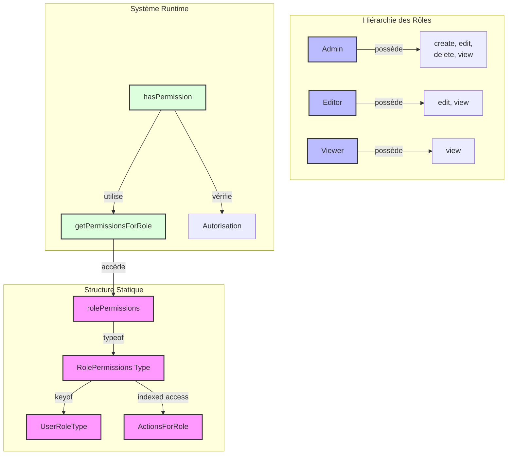

# Système de Permissions en TypeScript : Une Approche Progressive avec les Types Mappés

## Introduction

Les Mapped Types représentent l'une des fonctionnalités les plus puissantes de TypeScript, permettant de transformer et d'adapter vos types de manière dynamique et type-safe. Dans cet article, nous allons découvrir pourquoi ils sont devenus indispensables pour tout projet TypeScript moderne, en prenant comme exemple concret un système de gestion des permissions.

Imaginez pouvoir :

-   Créer des types dynamiques qui s'adaptent automatiquement à vos données
-   Détecter les erreurs de typage à la compilation plutôt qu'à l'exécution
-   Maintenir un code plus robuste avec moins d'efforts

À travers l'implémentation d'un système de permissions, nous verrons comment les Mapped Types peuvent transformer votre approche du développement TypeScript, en combinant flexibilité, sécurité et maintenabilité.

## Architecture du Système



## Table des Matières

1. Concepts de Base
2. Structure des Permissions
3. Système de Types
4. Fonctions d'Exécution
5. Sécurité et Vérifications
6. Cas d'Utilisation Avancés

## 1. Concepts de Base

### 1.1 Qu'est-ce qu'un Système de Permissions ?

Un système de permissions, ou RBAC (Role-Based Access Control), permet de :

-   Définir différents rôles dans une application
-   Attribuer des permissions spécifiques à chaque rôle
-   Vérifier les autorisations avant d'exécuter une action

### 1.2 Pourquoi TypeScript ?

TypeScript nous offre plusieurs avantages cruciaux :

-   Vérification des types à la compilation
-   Détection précoce des erreurs
-   Autocomplétion dans l'IDE
-   Documentation intégrée via les types

## 2. Structure des Permissions

### 2.1 Définition de Base

```typescript
const rolePermissions = {
    admin: ['create', 'edit', 'delete', 'view'],
    editor: ['edit', 'view'],
    viewer: ['view'],
} as const;
```

### 2.2 L'Assertion `as const`

L'assertion `as const` est fondamentale pour trois raisons :

1. **Immutabilité** :

    ```typescript
    // Sans as const
    const roles = { admin: ['create'] }; // type: { admin: string[] }
    roles.admin.push('delete'); // ✅ Autorisé

    // Avec as const
    const roles = { admin: ['create'] } as const; // type: { readonly admin: readonly ["create"] }
    roles.admin.push('delete'); // ❌ Erreur de compilation
    ```

2. **Littéraux de Chaînes** :

    ```typescript
    // Sans as const
    const permission = 'create'; // type: string

    // Avec as const
    const permission = 'create' as const; // type: "create"
    ```

3. **Tuples en Lecture Seule** :

    ```typescript
    // Sans as const
    const adminActions = ['create', 'edit']; // type: string[]

    // Avec as const
    const adminActions = ['create', 'edit'] as const; // type: readonly ["create", "edit"]
    ```

## 3. Système de Types

### 3.1 Type de Base des Permissions

```typescript
type RolePermissions = typeof rolePermissions;
```

Cette définition crée un type qui reflète exactement la structure de notre objet :

```typescript
type RolePermissions = {
    readonly admin: readonly ['create', 'edit', 'delete', 'view'];
    readonly editor: readonly ['edit', 'view'];
    readonly viewer: readonly ['view'];
};
```

### 3.2 Type des Rôles

```typescript
type UserRoleType = keyof RolePermissions;
```

L'opérateur `keyof` extrait les clés de `RolePermissions` :

```typescript
// Équivalent à :
type UserRoleType = 'admin' | 'editor' | 'viewer';
```

### 3.3 Type des Actions par Rôle

```typescript
type ActionsForRole<R extends UserRoleType> = RolePermissions[R][number];
```

Décomposons cette définition complexe :

1. **Générique avec Contrainte** :

    ```typescript
    R extends UserRoleType
    ```

    - R doit être l'un des rôles définis
    - Empêche l'utilisation de rôles invalides

2. **Accès Indexé au Rôle** :

    ```typescript
    RolePermissions[R];
    ```

    - Pour R = "admin" : readonly ["create", "edit", "delete", "view"]
    - Pour R = "editor" : readonly ["edit", "view"]
    - Pour R = "viewer" : readonly ["view"]

3. **Conversion en Union** :
    ```typescript
    [number];
    ```
    - Pour R = "admin" : "create" | "edit" | "delete" | "view"
    - Pour R = "editor" : "edit" | "view"
    - Pour R = "viewer" : "view"

## 4. Fonctions d'Exécution

### 4.1 Récupération des Permissions

```typescript
function getPermissionsForRole<R extends UserRoleType>(role: R): readonly ActionsForRole<R>[] {
    return rolePermissions[role];
}
```

Analysons cette fonction :

1. **Paramètre Générique** :

    - `<R extends UserRoleType>` : R est un type spécifique de rôle
    - Permet de préserver le type exact du rôle

2. **Type de Retour** :

    - `readonly ActionsForRole<R>[]` : tableau en lecture seule
    - Les permissions sont spécifiques au rôle R

3. **Implémentation** :
    - Accès direct à `rolePermissions`
    - TypeScript garantit la correspondance des types

### 4.2 Vérification des Permissions

```typescript
function hasPermission<R extends UserRoleType>(role: R, action: ActionsForRole<R>): boolean {
    const permissionsForRole = getPermissionsForRole(role);
    return permissionsForRole.includes(action);
}
```

Points clés :

1. **Paramètres Typés** :

    - `role: R` : le rôle spécifique
    - `action: ActionsForRole<R>` : action valide pour ce rôle

2. **Sécurité des Types** :
    ```typescript
    // Exemples de vérification à la compilation
    hasPermission('editor', 'edit'); // ✅ OK
    hasPermission('viewer', 'delete'); // ❌ Erreur
    hasPermission('admin', 'unknown'); // ❌ Erreur
    ```

## 5. Sécurité et Vérifications

### 5.1 Vérifications à la Compilation

Le système empêche plusieurs types d'erreurs :

1. **Rôles Invalides** :

    ```typescript
    hasPermission('unknown', 'edit'); // ❌ Erreur : rôle invalide
    ```

2. **Actions Invalides pour un Rôle** :

    ```typescript
    hasPermission('viewer', 'edit'); // ❌ Erreur : action non autorisée
    ```

3. **Actions Inexistantes** :
    ```typescript
    hasPermission('admin', 'deploy'); // ❌ Erreur : action inconnue
    ```

### 5.2 Extension du Système

Pour ajouter un nouveau rôle ou une permission :

```typescript
const rolePermissions = {
    admin: ['create', 'edit', 'delete', 'view'],
    editor: ['edit', 'view'],
    viewer: ['view'],
    moderator: ['edit', 'delete', 'view'], // ✅ Nouveau rôle
} as const;
```

TypeScript :

-   Met à jour automatiquement tous les types
-   Vérifie toutes les utilisations existantes
-   Fournit l'autocomplétion pour le nouveau rôle

## 6. Cas d'Utilisation Avancés

### 6.1 Composition de Permissions

```typescript
type AdminActions = ActionsForRole<'admin'>;
type EditorActions = ActionsForRole<'editor'>;
type ViewerActions = ActionsForRole<'viewer'>;

// Union de permissions
type ModeratorActions = EditorActions | ViewerActions;
```

### 6.2 Vérifications Conditionnelles

```typescript
function checkMultiplePermissions<R extends UserRoleType>(role: R, actions: ActionsForRole<R>[]): boolean {
    return actions.every((action) => hasPermission(role, action));
}
```

### 6.3 Types Utilitaires

```typescript
// Obtenir toutes les actions possibles
type AllActions = ActionsForRole<UserRoleType>;

// Obtenir les rôles ayant une permission spécifique
type RolesWithPermission<A extends AllActions> = {
    [R in UserRoleType]: A extends ActionsForRole<R> ? R : never;
}[UserRoleType];
```

## Conclusion

Ce système de permissions démontre la puissance de TypeScript pour créer des APIs type-safe :

1. **Sécurité** :

    - Vérifications à la compilation
    - Pas d'erreurs d'exécution liées aux permissions

2. **Maintenabilité** :

    - Source unique de vérité
    - Refactoring sûr et facile

3. **Expérience Développeur** :

    - Autocomplétion IDE
    - Documentation via les types
    - Erreurs claires et précises

4. **Performance** :
    - Zéro impact à l'exécution
    - Vérifications effectuées à la compilation

Cette implémentation montre comment utiliser les fonctionnalités avancées de TypeScript pour créer des systèmes robustes et maintenables.
