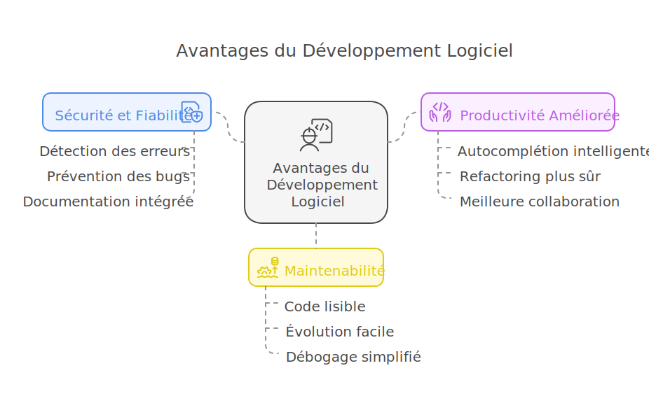
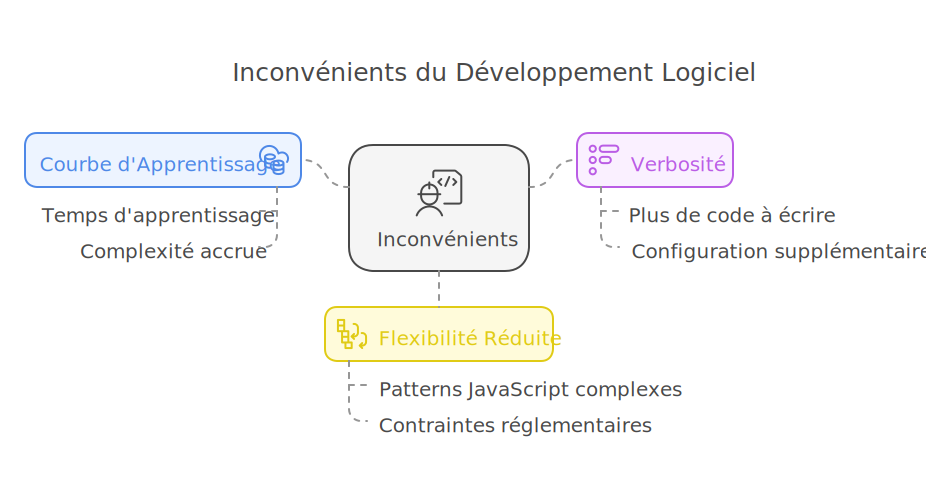
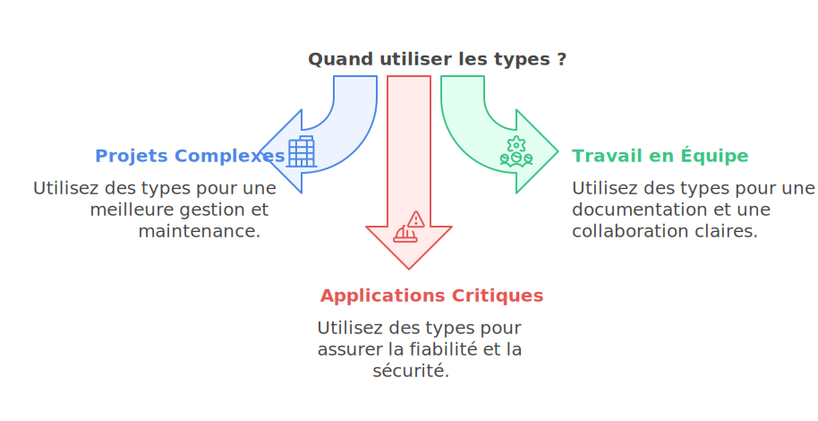
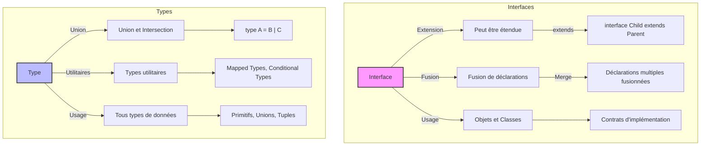
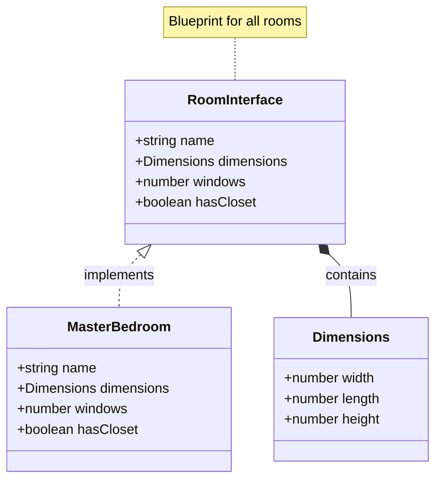
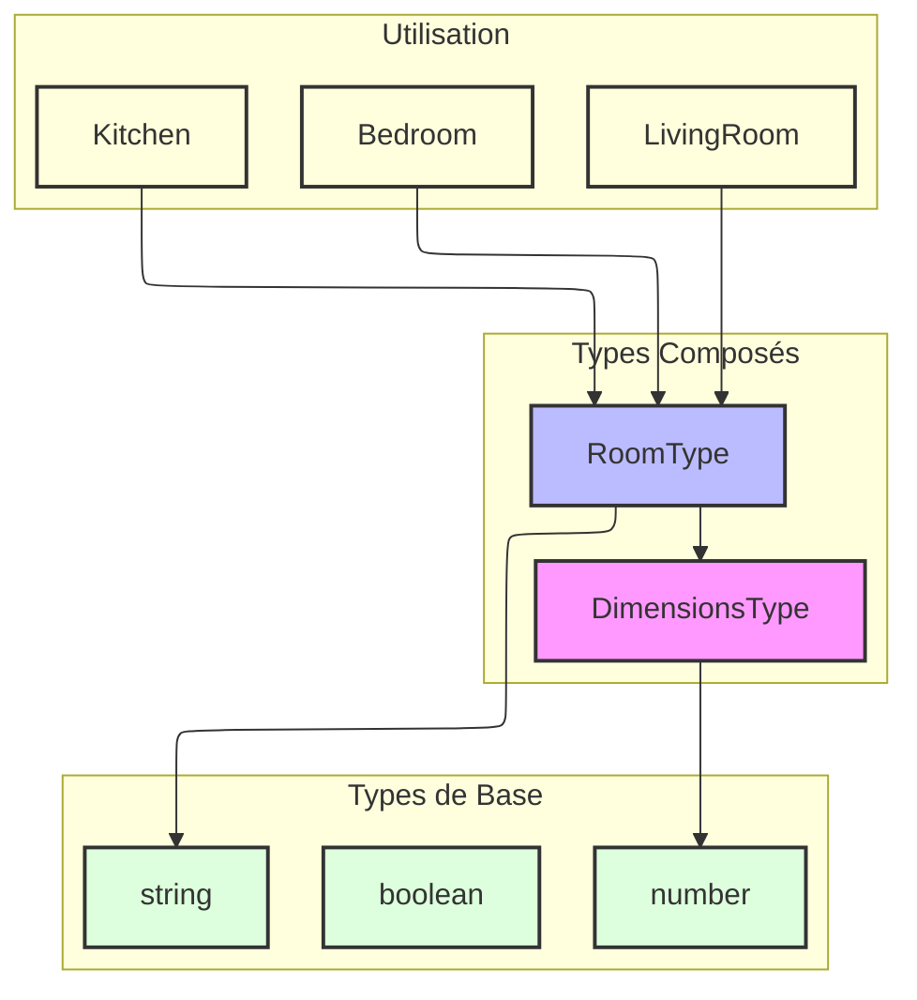
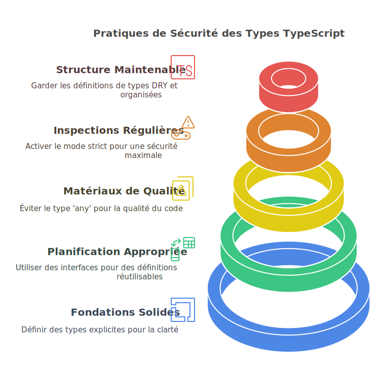
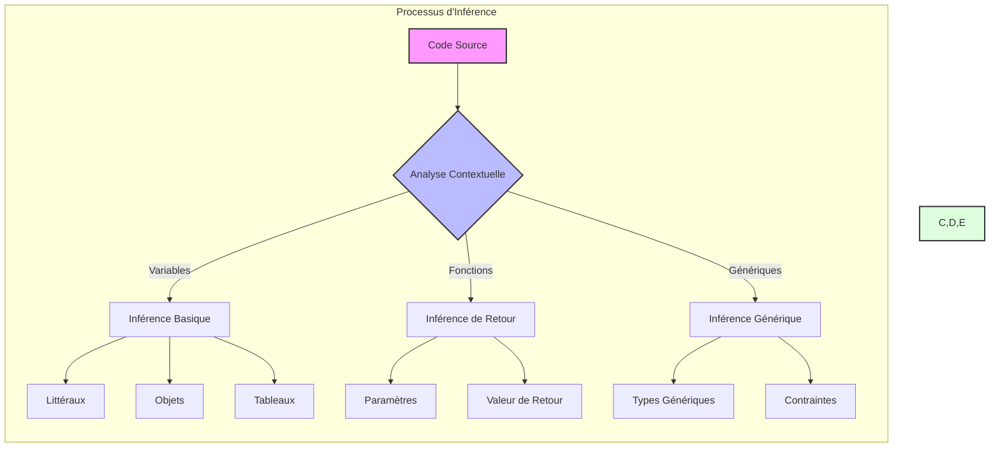
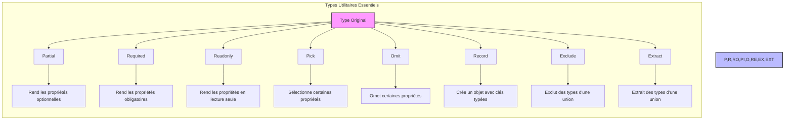
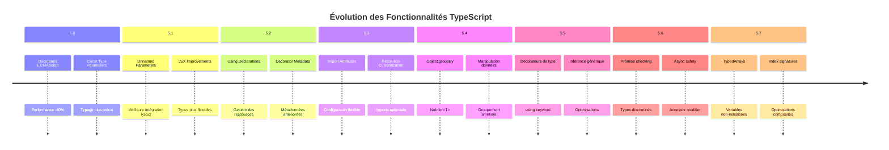

# Les Types en TypeScript : Construire une Base Solide pour Votre Code 🏗️

Imaginez la construction d'une maison. Sans plans détaillés, sans normes de construction, et sans spécifications des matériaux, que se passerait-il ? Le résultat serait probablement instable, difficile à maintenir, et potentiellement dangereux. C'est exactement le rôle que jouent les types dans TypeScript : ils sont les plans, les normes et les spécifications de votre code.

## Pourquoi Utiliser les Types ? 🤔

Tout comme dans la construction :

### Avantages 📈

1. **Sécurité et Fiabilité** 🛡️

    - Détection des erreurs avant l'exécution, comme un inspecteur qui vérifie la conformité avant la construction
    - Prévention des bugs courants, similaire aux normes de construction qui évitent les défauts structurels
    - Documentation intégrée au code, comparable aux plans détaillés d'un architecte

2. **Productivité Améliorée** ⚡

    - Autocomplétion intelligente, comme avoir un assistant qui connaît tous les outils disponibles
    - Refactoring plus sûr, semblable à la rénovation d'une maison avec des plans précis
    - Meilleure collaboration en équipe, comme une équipe de construction qui suit les mêmes plans

3. **Maintenabilité** 🔧
    - Code plus lisible et auto-documenté, tel un plan d'architecte bien annoté
    - Évolution plus facile du code, comme des modifications planifiées d'une maison
    - Débogage simplifié, comparable à l'identification rapide de problèmes structurels



### Inconvénients 📉

1. **Courbe d'Apprentissage** 📚

    - Temps initial d'apprentissage, comme la formation nécessaire pour lire des plans architecturaux
    - Complexité accrue pour les petits projets, similaire à l'utilisation de plans détaillés pour une simple cabane

2. **Verbosité** 📝

    - Plus de code à écrire initialement, comme la documentation exhaustive d'un projet de construction
    - Configuration supplémentaire requise, comparable aux démarches administratives en construction

3. **Flexibilité Réduite** 🔒
    - Certaines patterns JavaScript dynamiques deviennent plus complexes
    - Comme les contraintes réglementaires en construction qui limitent certaines options créatives



## Quand Utiliser les Types ? ⏰

1. **Projets Complexes** 🏗️

    - Applications de grande envergure
    - Systèmes avec beaucoup de logique métier
    - Projets nécessitant une maintenance à long terme

2. **Travail en Équipe** 👥

    - Collaboration entre plusieurs développeurs
    - Projets nécessitant une documentation claire
    - Bases de code partagées

3. **Applications Critiques** ⚠️
    - Systèmes financiers
    - Applications médicales
    - Infrastructures critiques



## La Fondation : Les Types de Base 🏠

Tout comme une maison a besoin d'une fondation solide faite de différents matériaux, TypeScript fournit des blocs de construction fondamentaux :

```typescript
// The concrete of our foundation - numbers
const squareFootage: number = 2000;

// The wooden frame - strings
const address: string = '123 TypeScript Lane';

// The on/off switches - booleans
const isOccupied: boolean = true;

// The blueprint measurements - arrays
const roomDimensions: number[] = [15, 12, 10, 8];
```

## Interface vs Type : Choisir le Bon Outil 🔨

En TypeScript, nous avons deux choix pour décrire le typage de données : les types et les interfaces. Avant de plonger dans les explications détaillées, il est essentiel de comprendre leurs différences et leurs cas d'utilisation spécifiques. Comment choisir entre ces deux outils fondamentaux ?

Comme un architecte choisissant entre différentes méthodes de construction, il est important de comprendre quand utiliser une interface et quand utiliser un type alias :



### Guide de Décision 📋

Imaginez que vous construisez une ville. Les interfaces et les types sont comme deux approches différentes d'urbanisme :

#### Les Interfaces : Le Plan d'Urbanisme Évolutif 🏘️

Les interfaces sont comme un plan d'urbanisme qui peut évoluer dans le temps :

```typescript
// Comme un quartier qui s'agrandit naturellement
interface QuartierInterface {
    rues: string[];
}

// Plus tard, on peut ajouter de nouvelles spécifications
interface QuartierInterface {
    parcs: string[]; // Fusion automatique !
}

// On peut aussi étendre le plan initial
interface QuartierResidentielInterface extends QuartierInterface {
    ecoles: string[];
}

// Utilisation dans une classe
class Quartier implements QuartierInterface {
    rues = ['Rue principale'];
    parcs = ['Parc central'];
}
```

**Avantages des Interfaces** 🌟

-   Extensibles comme une ville qui grandit (declaration merging)
-   Idéales pour les contrats d'API publiques
-   Parfaites pour l'héritage et l'implémentation
-   Messages d'erreur plus clairs et précis

#### Les Types : La Maquette Architecturale Précise 🏗️

Les types sont comme une maquette architecturale fixe mais très détaillée :

```typescript
// Comme un catalogue de matériaux de construction
type MateriauConstruction = 'bois' | 'brique' | 'béton';

// Comme un plan qui combine différentes spécifications
type MaisonModerne = {
    style: 'contemporain';
    materiaux: MateriauConstruction[];
} & DimensionsType;

// Transformation de plans existants
type MaisonOptionnelle = Partial<MaisonModerne>;
type MaisonFinalisee = Readonly<MaisonModerne>;
```

**Avantages des Types** 🎯

-   Plus flexibles pour les transformations
-   Parfaits pour les unions et intersections
-   Excellents pour les types utilitaires
-   Idéaux pour les types primitifs et les tuples

#### Tableau Comparatif 📊

| Caractéristique        | Interface                       | Type                      |
| ---------------------- | ------------------------------- | ------------------------- |
| Extensibilité          | ✅ Peut être étendue plus tard  | ❌ Fixé après définition  |
| Fusion de déclarations | ✅ Supporte la fusion           | ❌ Pas de fusion possible |
| Union & Intersection   | ❌ Limité                       | ✅ Support complet        |
| Performance            | ✅ Relations cachées en mémoire | ⚠️ Doit recalculer        |
| Messages d'erreur      | ✅ Plus clairs et précis        | ⚠️ Peuvent être verbeux   |
| Types primitifs        | ❌ Non supporté                 | ✅ Parfait pour ça        |

#### Règles Pratiques 🎯

1. **Choisissez une Interface quand** :

    ```typescript
    // Pour des contrats d'API publics
    interface APIResponseInterface {
        data: unknown;
        status: number;
    }

    // Pour des objets qui vont évoluer
    interface ConfigInterface {
        version: string;
    }
    // Plus tard...
    interface ConfigInterface {
        environment: string; // Fusion !
    }
    ```

2. **Choisissez un Type quand** :

    ```typescript
    // Pour des unions précises
    type Status = 'success' | 'error' | 'loading';

    // Pour des transformations
    type ReadOnlyConfig = Readonly<ConfigInterface>;

    // Pour des types composés
    type ResponseWithError = APIResponseInterface & {
        error?: string;
    };
    ```

#### En Résumé 💡

-   **Interface** = Plan d'urbanisme évolutif

    -   Parfait pour les APIs publiques
    -   Idéal pour le code orienté objet
    -   Meilleur pour la documentation

-   **Type** = Maquette architecturale précise
    -   Parfait pour les transformations
    -   Idéal pour la programmation fonctionnelle
    -   Meilleur pour les types complexes

## La Structure : Les Interfaces 🏛️

Pensez aux interfaces comme aux plans architecturaux des différentes pièces de votre maison. Elles définissent l'agencement et les caractéristiques attendus :



```typescript
interface DimensionsInterface {
    width: number;
    length: number;
    height: number;
}

interface RoomInterface {
    name: string;
    dimensions: DimensionsInterface;
    windows: number;
    hasCloset: boolean;
}

const masterBedroom: RoomInterface = {
    name: 'Master Bedroom',
    dimensions: {
        width: 15,
        length: 20,
        height: 10,
    },
    windows: 2,
    hasCloset: true,
};
```

## Les Plans Personnalisés : Les Alias de Types 📋

Les alias de types sont comme la création de modèles de plans personnalisés que vous pouvez réutiliser tout au long de votre projet de construction :



```typescript
type DimensionsType = {
    width: number;
    length: number;
    height: number;
};

type RoomType = {
    name: string;
    dimensions: DimensionsType;
    purpose: string;
};
```

## Construction Modulaire : Les Types Unions 🔄

Parfois, vous avez besoin de flexibilité dans vos matériaux de construction. Les types unions sont comme avoir plusieurs matériaux approuvés pour un même usage :

```typescript
// A window can be made of different materials
type WindowMaterialType = 'glass' | 'plexiglass' | 'tempered glass';
/* L'IDE interprète :
type WindowMaterialType = {
    ✓ 'glass'
    ✓ 'plexiglass'
    ✓ 'tempered glass'
}
Autocomplete suggérera ces trois valeurs uniquement
*/

interface WindowInterface {
    material: WindowMaterialType;
    style: 'sliding' | 'fixed' | 'casement';
    dimensions: DimensionsType;
}
/* L'IDE interprète :
interface WindowInterface {
    material: 'glass' | 'plexiglass' | 'tempered glass';
    style: 'sliding' | 'fixed' | 'casement';
    dimensions: {
        width: number;
        length: number;
        height: number;
    }
}
*/

// Exemple d'utilisation avec vérification de type
const window: WindowInterface = {
    material: 'glass', // ✓ OK
    // material: 'wood', // ❌ Error: Type '"wood"' is not assignable to type 'WindowMaterialType'
    style: 'sliding', // ✓ OK
    dimensions: {
        width: 1.5,
        length: 2,
        height: 0.1,
    },
};
```

## Inspections de Sécurité : Les Gardes de Types 🔍

Tout comme les inspecteurs en bâtiment s'assurent que tout est conforme aux normes, les gardes de types nous aident à vérifier les types pendant l'exécution :

```typescript
// Définition des types de pièces
interface RegularRoomInterface {
    type: 'regular';
    squareFootage: number;
}
/* L'IDE interprète :
interface RegularRoomInterface {
    type: "regular"; // Type littéral - ne peut être que 'regular'
    squareFootage: number;
}
*/

interface LuxuryRoomInterface {
    type: 'luxury';
    squareFootage: number;
    premium: boolean;
}
/* L'IDE interprète :
interface LuxuryRoomInterface {
    type: "luxury"; // Type littéral - ne peut être que 'luxury'
    squareFootage: number;
    premium: boolean;
}
*/

// Union des types de pièces
type HouseRoomType = RegularRoomInterface | LuxuryRoomInterface;
/* L'IDE interprète :
type HouseRoomType = {
    type: "regular";
    squareFootage: number;
} | {
    type: "luxury";
    squareFootage: number;
    premium: boolean;
}
L'IDE utilisera la propriété 'type' comme discriminant
*/

// Fonction de calcul de valeur avec garde de type
function calculateRoomValue(room: HouseRoomType): number {
    const baseValue = room.squareFootage * 100;
    // ✓ squareFootage est accessible car commun aux deux types

    if (isLuxuryRoom(room)) {
        // ✓ TypeScript sait que room est LuxuryRoomInterface ici
        return room.premium ? baseValue * 2 : baseValue * 1.5;
        // ✓ premium est accessible car le garde de type confirme que c'est une LuxuryRoom
    }

    // ✓ TypeScript sait que room est RegularRoomInterface ici
    return baseValue;
}

// Garde de type personnalisé
function isLuxuryRoom(room: HouseRoomType): room is LuxuryRoomInterface {
    return room.type === 'luxury';
}
/* L'IDE interprète :
- Si isLuxuryRoom(room) retourne true, room est de type LuxuryRoomInterface
- Si isLuxuryRoom(room) retourne false, room est de type RegularRoomInterface
- Le type guard agit comme un "narrowing" du type HouseRoomType
*/

// Exemples d'utilisation
const regularRoom: RegularRoomInterface = {
    type: 'regular',
    squareFootage: 200,
    // premium: true // ❌ Error: Object literal may only specify known properties
};

const luxuryRoom: LuxuryRoomInterface = {
    type: 'luxury',
    squareFootage: 400,
    premium: true,
};

console.log(calculateRoomValue(regularRoom)); // ✓ OK: 20000
console.log(calculateRoomValue(luxuryRoom)); // ✓ OK: 80000
```

## Designs Extensibles : Les Génériques 🔧

Les génériques sont comme la création de modèles de pièces flexibles qui peuvent s'adapter à différents besoins :

```typescript
// Définition d'une interface générique pour les espaces de stockage
interface StorageSpaceInterface<T> {
    items: T[];
    capacity: number;
    add(item: T): void;
    remove(item: T): void;
}
/* L'IDE interprète :
interface StorageSpaceInterface<T> {
    items: T[]; // T est un type générique qui sera spécifié lors de l'utilisation
    capacity: number;
    add(item: T): void; // La méthode add accepte un argument du type T
    remove(item: T): void; // La méthode remove accepte un argument du type T
}
Le T est un "placeholder" qui sera remplacé par un type concret
*/

// Définition d'un type pour les véhicules
interface VehicleInterface {
    brand: string;
    model: string;
    year: number;
}
/* L'IDE interprète :
interface VehicleInterface {
    brand: string;
    model: string;
    year: number;
}
*/

// Implémentation d'un garage pour les véhicules
class Garage implements StorageSpaceInterface<VehicleInterface> {
    items: VehicleInterface[] = [];
    capacity: number;
    /* L'IDE interprète :
    - items est un tableau de VehicleInterface
    - T a été remplacé par VehicleInterface dans toute l'implémentation
    */

    constructor(capacity: number) {
        this.capacity = capacity;
    }

    add(vehicle: VehicleInterface): void {
        // ✓ vehicle est de type VehicleInterface, avec autocomplétion pour brand, model, year
        if (this.items.length < this.capacity) {
            this.items.push(vehicle);
        }
    }

    remove(vehicle: VehicleInterface): void {
        // ✓ vehicle est de type VehicleInterface
        this.items = this.items.filter((v) => v !== vehicle);
    }
}

// Exemple d'utilisation
const garage = new Garage(3);
/* L'IDE interprète :
const garage: Garage
- Toutes les méthodes attendent des objets de type VehicleInterface
- L'autocomplétion suggérera les propriétés de VehicleInterface
*/

const car: VehicleInterface = {
    brand: 'Tesla',
    model: 'Model 3',
    year: 2023,
}; // ✓ OK

garage.add(car); // ✓ OK
garage.add({ brand: 'BMW', model: 'i4', year: 2024 }); // ✓ OK
// garage.add({ brand: "Toyota" }); // ❌ Error: Property 'model' is missing
// garage.add("Toyota"); // ❌ Error: Argument of type 'string' is not assignable to parameter of type 'VehicleInterface'
```

## Bonnes Pratiques pour la Sécurité des Types ⚡

Tout comme nous suivons les codes du bâtiment pour la sécurité, voici les pratiques clés pour utiliser efficacement les types TypeScript :

1. **Fondations Solides** 🏗️ : Toujours définir des types explicites pour une meilleure clarté du code
2. **Planification Appropriée** 📐 : Utiliser les interfaces et les alias de types pour créer des définitions réutilisables
3. **Matériaux de Qualité** ✨ : Éviter d'utiliser `any` - c'est comme utiliser des matériaux de construction de qualité inférieure
4. **Inspections Régulières** 🔍 : Exploiter le mode strict de TypeScript pour une sécurité maximale des types
5. **Structure Maintenable** 🏢 : Garder les définitions de types DRY (Don't Repeat Yourself)



## Patterns Avancés de Construction 🏰

### Pattern Builder avec Types 🛠️

```typescript
interface HouseInterface {
    foundation: string;
    walls: string[];
    roof: string;
}
/* L'IDE interprète :
interface HouseInterface {
    foundation: string;  // Propriété obligatoire
    walls: string[];     // Tableau de chaînes obligatoire
    roof: string;        // Propriété obligatoire
}
*/

class HouseBuilder {
    private house: Partial<HouseInterface> = {};
    /* L'IDE interprète :
    private house: {
        foundation?: string;  // Toutes les propriétés sont optionnelles grâce à Partial<T>
        walls?: string[];
        roof?: string;
    } = {};
    */

    addFoundation(type: string): this {
        this.house.foundation = type;
        return this;
    }
    /* L'IDE interprète :
    - Paramètre type: string
    - Retour: this (permet le chaînage des méthodes)
    - Vérifie que type est bien une string
    */

    addWalls(materials: string[]): this {
        this.house.walls = materials;
        return this;
    }
    /* L'IDE interprète :
    - Paramètre materials: string[]
    - Retour: this (permet le chaînage des méthodes)
    - Vérifie que materials est bien un tableau de strings
    */

    addRoof(type: string): this {
        this.house.roof = type;
        return this;
    }

    build(): HouseInterface {
        if (!this.house.foundation || !this.house.walls || !this.house.roof) {
            throw new Error('House is incomplete');
        }
        return this.house as HouseInterface;
    }
    /* L'IDE interprète :
    - Retour: HouseInterface (type complet non-partial)
    - Vérifie que toutes les propriétés requises sont présentes
    - Le cast 'as HouseInterface' est sûr grâce à la vérification
    */
}

// Exemple d'utilisation avec vérification de type
const house = new HouseBuilder().addFoundation('concrete').addWalls(['brick', 'insulation']).addRoof('tiles').build();
/* L'IDE interprète et vérifie :
const house: HouseInterface = {
    foundation: "concrete",    // ✓ OK: string
    walls: ["brick", "insulation"], // ✓ OK: string[]
    roof: "tiles"             // ✓ OK: string
}
*/

// Exemples d'erreurs que l'IDE détecterait
// const invalidHouse = new HouseBuilder()
//     .addFoundation(123)          // ❌ Error: Argument of type 'number' is not assignable to parameter of type 'string'
//     .addWalls('brick')           // ❌ Error: Argument of type 'string' is not assignable to parameter of type 'string[]'
//     .build();                    // ❌ Error: Property 'roof' is missing

// const incompleteHouse = new HouseBuilder()
//     .addFoundation('concrete')
//     .build();                    // ❌ Error: House is incomplete
```

### Types Conditionnels : Adaptabilité des Plans 🔀

```typescript
// Définition des matériaux de construction possibles
type BuildingMaterial = 'wood' | 'brick' | 'concrete';
/* L'IDE interprète :
type BuildingMaterial = {
    ✓ 'wood'
    ✓ 'brick'
    ✓ 'concrete'
}
*/

// Type conditionnel pour déterminer la résistance du matériau
type MaterialStrength<T extends BuildingMaterial> = T extends 'wood'
    ? 'medium'
    : T extends 'brick'
    ? 'high'
    : 'very high';
/* L'IDE interprète :
type MaterialStrength<T extends BuildingMaterial> = {
    Si T est 'wood' => 'medium'
    Si T est 'brick' => 'high'
    Si T est 'concrete' => 'very high'
}
Le type est évalué à l'utilisation en fonction du type générique T fourni
*/

// Exemples d'utilisation avec vérification de type
const woodStrength: MaterialStrength<'wood'> = 'medium'; // ✓ OK
// const woodStrength: MaterialStrength<'wood'> = 'high';    // ❌ Error: Type '"high"' is not assignable to type '"medium"'

const brickStrength: MaterialStrength<'brick'> = 'high'; // ✓ OK
const concreteStrength: MaterialStrength<'concrete'> = 'very high'; // ✓ OK

// Exemple d'utilisation avec un type invalide
// const invalidStrength: MaterialStrength<'steel'> = 'high'; // ❌ Error: Type '"steel"' does not satisfy the constraint 'BuildingMaterial'

// Utilisation pratique avec une fonction
function getStructuralCapacity<T extends BuildingMaterial>(material: T): MaterialStrength<T> {
    /* L'IDE interprète :
    - Le paramètre material ne peut être que 'wood', 'brick' ou 'concrete'
    - Le type de retour sera automatiquement déterminé en fonction du matériau
    - L'autocomplétion suggérera les valeurs de retour correctes
    */
    if (material === 'wood') return 'medium' as MaterialStrength<T>;
    if (material === 'brick') return 'high' as MaterialStrength<T>;
    return 'very high' as MaterialStrength<T>;
}

// Exemples d'utilisation de la fonction
const woodCapacity = getStructuralCapacity('wood'); // Type inféré : 'medium'
const brickCapacity = getStructuralCapacity('brick'); // Type inféré : 'high'
const concreteCapacity = getStructuralCapacity('concrete'); // Type inféré : 'very high'
/* L'IDE interprète :
- woodCapacity est de type 'medium'
- brickCapacity est de type 'high'
- concreteCapacity est de type 'very high'
L'IDE fournira l'autocomplétion appropriée pour chaque variable
*/
```

## Meilleures Pratiques Étendues 📈

1. **Utilisation du Mode Strict** 🔒

    - Activer `strictNullChecks`
    - Activer `noImplicitAny`
    - Utiliser `strict: true` dans tsconfig.json

2. **Documentation des Types** 📚

    ```typescript
    /**
     * Représente une pièce dans la maison
     * @property {string} name - Nom de la pièce
     * @property {DimensionsType} dimensions - Dimensions en mètres
     */
    interface PieceInterface {
        name: string;
        dimensions: DimensionsType;
    }
    ```

3. **Tests de Type** ✅
    ```typescript
    // Vérification de type en développement
    if (process.env.NODE_ENV === 'development') {
        const piece: PieceInterface = getMaison().pieces[0];
        type VerifType = typeof piece extends PieceInterface ? true : false;
        const verification: VerifType = true;
    }
    ```

## L'Intelligence du Système : L'Inférence de Types 🧠

L'inférence de types est l'une des fonctionnalités les plus puissantes de TypeScript. C'est comme avoir un architecte expérimenté qui peut déduire automatiquement les spécifications techniques à partir du contexte, sans avoir besoin de tout documenter explicitement.

### Définition et Principes 📚

L'inférence de types est la capacité de TypeScript à déterminer automatiquement le type d'une variable ou d'une expression en analysant son contexte et son utilisation. C'est un mécanisme intelligent qui permet d'écrire du code plus concis tout en maintenant la sécurité des types.

```typescript
// Inférence simple
const age = 30; // TypeScript infère : number
const name = 'TypeScript'; // TypeScript infère : string
const isValid = true; // TypeScript infère : boolean

// Inférence avec les tableaux
const numbers = [1, 2, 3]; // TypeScript infère : number[]
const mixed = [1, 'deux', true]; // TypeScript infère : (string | number | boolean)[]

// Inférence avec les objets
const point = {
    x: 10,
    y: 20,
    describe() {
        return `(${this.x}, ${this.y})`;
    },
}; // TypeScript infère les types de x, y et la signature de describe
```

### Mécanismes d'Inférence 🔄



### Types d'Inférence 🎯

1. **Inférence Basique** 🏠

```typescript
// Inférence à partir de l'initialisation
const dimensions = {
    width: 100, // number
    height: 200, // number
    unit: 'cm', // string
};

// Inférence à partir du contexte
const materials = ['bois', 'brique', 'béton']; // string[]
```

2. **Inférence dans les Fonctions** 🔧

```typescript
// Inférence du type de retour
function calculateArea(width: number, height: number) {
    return width * height; // TypeScript infère return type: number
}

// Inférence avec les fonctions fléchées
const multiply = (a: number, b: number) => a * b; // return type: number
```

3. **Inférence Générique** 🔄

```typescript
// Inférence avec les génériques
function identity<T>(arg: T): T {
    return arg;
}

const value = identity('hello'); // TypeScript infère T comme string
const numbers = identity([1, 2, 3]); // TypeScript infère T comme number[]
```

### Cas Pratiques d'Utilisation 🛠️

1. **Destructuration avec Inférence** 📦

```typescript
const building = {
    name: 'Tour A',
    floors: 10,
    amenities: ['parking', 'gym'],
};

const { name, floors } = building; // Types inférés automatiquement
// name: string, floors: number
```

2. **Inférence avec Promise** ⏳

```typescript
async function fetchBuildingData() {
    const response = await fetch('/api/building');
    const data = await response.json();
    return data; // TypeScript infère le type à partir de la réponse
}
```

3. **Inférence dans les Callbacks** 🔄

```typescript
const rooms = ['salon', 'cuisine', 'chambre'];
rooms.forEach((room) => {
    console.log(room.toUpperCase()); // room est inféré comme string
});
```

### Limites et Bonnes Pratiques ⚠️

1. **Quand Éviter l'Inférence** 🚫

```typescript
// Cas où l'annotation explicite est préférable
interface BuildingConfig {
    name: string;
    floors: number;
}

// Meilleur avec type explicite
function configurerBatiment(config: BuildingConfig) {
    // ...
}
```

2. **Inférence vs Annotation Explicite** ⚖️

```typescript
// Inférence appropriée
const prix = 100; // OK pour les cas simples

// Annotation explicite recommandée
const configurations: BuildingConfig[] = [
    { name: 'Tour A', floors: 10 },
    { name: 'Tour B', floors: 15 },
];
```

3. **Règles d'Or** 🌟

-   Utiliser l'inférence pour le code simple et évident
-   Ajouter des types explicites pour les APIs et interfaces publiques
-   Toujours typer les paramètres de fonction
-   Utiliser des types explicites pour les structures de données complexes

## Flexibilité et Équilibre dans la Construction ⚖️

### Types Explicites vs Implicites 📊

```typescript
// Explicite - Pour les interfaces critiques
interface FondationInterface {
    type: string;
    profondeur: number;
    material: string;
}

// Implicite - Pour le code interne moins critique
const calculerVolumeBeton = (longueur: number, largeur: number) => {
    const hauteur = 0.3; // TypeScript infère number
    return longueur * largeur * hauteur;
};
```

### Chaînage de Méthodes Typé 🔗

```typescript
interface ChantierInterface {
    pieces: PieceInterface[];
}

const chantier: ChantierInterface = {
    pieces: [
        /* ... */
    ],
};

// TypeScript suit intelligemment les types à travers le chaînage
const surfacesTotales = chantier.pieces
    .map((p) => p.dimensions)
    .filter((d) => d.surface > 20)
    .reduce((acc, curr) => acc + curr.surface, 0);
```

## Bonnes Pratiques d'Inférence 📝

1. **Types Explicites Recommandés Pour** :

    - Les opérations externes (API, fichiers)
    - Les structures de données principales
    - Les paramètres de fonction
    - Les retours de fonction complexes

2. **Laisser l'Inférence Pour** :

    - Les variables locales simples
    - Les retours de fonction évidents
    - Les expressions lambda simples
    - Le chaînage de méthodes standard

## Les Outils du Constructeur : Types Utilitaires 🛠️

Comme une boîte à outils bien garnie, TypeScript fournit des types utilitaires puissants qui nous permettent de manipuler et transformer les types existants. Ces outils sont essentiels pour créer des types flexibles et réutilisables.

### Vue d'Ensemble des Types Utilitaires 🔍



### Partial<T> : Construction Progressive 🏗️

Permet de rendre toutes les propriétés d'un type optionnelles, idéal pour la construction progressive d'objets.

```typescript
// Définition de la structure complète d'une maison
interface HouseSpecificationsInterface {
    foundation: string; // Type requis par défaut
    walls: string[]; // Type requis par défaut
    roof: string; // Type requis par défaut
    windows: number; // Type requis par défaut
    floors: number; // Type requis par défaut
    garage: boolean; // Type requis par défaut
}

class HouseBuilder {
    // Partial<T> rend toutes les propriétés optionnelles
    private specs: Partial<HouseSpecificationsInterface> = {}; // TypeScript infère : { foundation?: string, walls?: string[], ... }

    setFoundation(type: string) {
        this.specs.foundation = type; // TypeScript vérifie : type doit être string
        return this; // TypeScript infère : retourne this pour le chaînage
    }

    setWalls(materials: string[]) {
        this.specs.walls = materials; // TypeScript vérifie : materials doit être string[]
        return this; // TypeScript infère : retourne this pour le chaînage
    }

    // Vérifie que toutes les propriétés requises sont présentes avant la construction
    build(): HouseSpecificationsInterface {
        if (!this.isValid()) {
            throw new Error('Spécifications incomplètes');
        }
        return this.specs as HouseSpecificationsInterface; // TypeScript vérifie : conversion sûre après validation
    }

    private isValid(): boolean {
        // TypeScript vérifie : accès sûr aux propriétés optionnelles
        return !!(this.specs.foundation && this.specs.walls && this.specs.roof);
    }
}

// Exemple d'utilisation avec vérification de type
const house = new HouseBuilder()
    .setFoundation('concrete') // TypeScript vérifie : string attendu
    .setWalls(['brick', 'insulation']) // TypeScript vérifie : string[] attendu
    .build(); // TypeScript infère : HouseSpecificationsInterface

// Exemples d'erreurs que TypeScript détecterait
// .setFoundation(123)            // ❌ Error: Type 'number' n'est pas assignable à 'string'
// .setWalls('brick')            // ❌ Error: Type 'string' n'est pas assignable à 'string[]'
// .build() sans foundation      // ❌ Error: Spécifications incomplètes
```

### Required<T> & Readonly<T> : Sécurisation des Spécifications 🔒

Ces utilitaires permettent de renforcer les contraintes sur les types.

```typescript
// Configuration de base avec propriétés optionnelles
interface RoomConfigInterface {
    size?: number; // TypeScript infère : number | undefined
    windows?: number; // TypeScript infère : number | undefined
    orientation?: 'north' | 'south' | 'east' | 'west'; // TypeScript infère : "north" | "south" | "east" | "west" | undefined
}

// Required<T> rend toutes les propriétés obligatoires
type FinalRoomConfig = Required<RoomConfigInterface>; // TypeScript infère : { size: number; windows: number; orientation: 'north' | 'south' | 'east' | 'west' }

// Readonly<T> rend la configuration immuable après initialisation
type ApprovedRoomConfig = Readonly<Required<RoomConfigInterface>>; // TypeScript infère : { readonly size: number; readonly windows: number; readonly orientation: 'north' | 'south' | 'east' | 'west' }

function validateRoom(config: FinalRoomConfig) {
    const approvedConfig: ApprovedRoomConfig = {
        size: config.size, // TypeScript vérifie : la propriété est requise
        windows: config.windows, // TypeScript vérifie : la propriété est requise
        orientation: config.orientation, // TypeScript vérifie : la propriété est requise
    };

    // Exemples d'erreurs que TypeScript détecterait :
    // approvedConfig.size = 20;  // ❌ Error: Cannot assign to 'size' because it is a read-only property
    // const incomplete: FinalRoomConfig = { size: 20 };  // ❌ Error: Property 'windows' is missing
    // const invalid: ApprovedRoomConfig = { size: 20, windows: 2 };  // ❌ Error: Property 'orientation' is missing

    return approvedConfig; // TypeScript infère : retourne ApprovedRoomConfig (readonly)
}
```

### Pick<T, K> & Omit<T, K> : Sélection Précise 🎯

Permettent de créer de nouveaux types en sélectionnant ou en omettant des propriétés spécifiques.

```typescript
// Interface de base d'un bâtiment avec toutes les propriétés
interface BuildingInterface {
    name: string; // TypeScript infère : string
    floors: number; // TypeScript infère : number
    parking: boolean; // TypeScript infère : boolean
    security: boolean; // TypeScript infère : boolean
    swimmingPool: boolean; // TypeScript infère : boolean
    garden: boolean; // TypeScript infère : boolean
}

// Pick<T, K> sélectionne uniquement les propriétés spécifiées
type BasicBuildingInfo = Pick<BuildingInterface, 'name' | 'floors'>;
// TypeScript infère : { name: string; floors: number; }

// Omit<T, K> exclut les propriétés spécifiées et garde le reste
type RequiredFeatures = Omit<BuildingInterface, 'swimmingPool' | 'garden'>;
// TypeScript infère : { name: string; floors: number; parking: boolean; security: boolean; }

// Exemple d'utilisation avec Pick
function displayBasicInfo(building: BasicBuildingInfo) {
    console.log(`${building.name} - ${building.floors} étages`);
    // building.parking // ❌ Error: Property 'parking' does not exist on type 'BasicBuildingInfo'
}

// Exemple d'utilisation avec Omit
const requiredFeatures: RequiredFeatures = {
    name: 'Immeuble A', // ✓ OK: propriété requise
    floors: 5, // ✓ OK: propriété requise
    parking: true, // ✓ OK: propriété requise
    // swimmingPool: true,        // ❌ Error: Property 'swimmingPool' does not exist on type 'RequiredFeatures'
    // garden: true,              // ❌ Error: Property 'garden' does not exist on type 'RequiredFeatures'
};

// Exemple de composition avec d'autres utility types
type BasicReadOnlyBuilding = Readonly<Pick<BuildingInterface, 'name' | 'floors'>>;
// TypeScript infère : { readonly name: string; readonly floors: number; }

const readOnlyBuilding: BasicReadOnlyBuilding = {
    name: 'Immeuble B',
    floors: 3,
    // name = "New Name" // ❌ Error: Cannot assign to 'name' because it is a read-only property
};
```

### Record<K, T> : Catalogues et Mappings 📑

Crée un type avec des clés et des valeurs typées, parfait pour les catalogues et les mappings.

```typescript
// Définition des types de base
type RoomType = 'bedroom' | 'bathroom' | 'kitchen' | 'livingRoom'; // TypeScript infère : union de string literals
type RoomDimensions = {
    width: number; // TypeScript infère : number
    length: number; // TypeScript infère : number
    height: number; // TypeScript infère : number
};

// Création d'un catalogue de dimensions par type de pièce
type HouseDimensions = Record<RoomType, RoomDimensions>;
// TypeScript infère : {
//    bedroom: { width: number; length: number; height: number; }
//    bathroom: { width: number; length: number; height: number; }
//    kitchen: { width: number; length: number; height: number; }
//    livingRoom: { width: number; length: number; height: number; }
// }

// Exemple d'utilisation avec vérification de type
const standardDimensions: HouseDimensions = {
    bedroom: { width: 4, length: 5, height: 2.5 }, // ✓ OK: correspond au type RoomDimensions
    bathroom: { width: 2.5, length: 3, height: 2.5 }, // ✓ OK: correspond au type RoomDimensions
    kitchen: { width: 6, length: 4, height: 2.5 }, // ✓ OK: correspond au type RoomDimensions
    livingRoom: { width: 8, length: 6, height: 2.5 }, // ✓ OK: correspond au type RoomDimensions
    // study: { width: 3, length: 3, height: 2.5 }     // ❌ Error: 'study' does not exist in type 'RoomType'
};

// Création d'un mapping de validation avec Record
type RoomValidation = Record<RoomType, (dimensions: RoomDimensions) => boolean>;
// TypeScript infère : {
//    bedroom: (dimensions: RoomDimensions) => boolean;
//    bathroom: (dimensions: RoomDimensions) => boolean;
//    kitchen: (dimensions: RoomDimensions) => boolean;
//    livingRoom: (dimensions: RoomDimensions) => boolean;
// }

// Implémentation des validateurs avec vérification de type
const roomValidators: RoomValidation = {
    bedroom: (dim) => dim.width * dim.length >= 15, // TypeScript infère : dim est de type RoomDimensions
    bathroom: (dim) => dim.width * dim.length >= 6, // ✓ OK: accès aux propriétés width et length
    kitchen: (dim) => dim.width * dim.length >= 20, // ✓ OK: calcul de surface autorisé
    livingRoom: (dim) => dim.width * dim.length >= 30, // ✓ OK: retourne un boolean comme requis
    // garage: (dim) => true                           // ❌ Error: 'garage' does not exist in type 'RoomType'
};

// Exemple d'utilisation des validateurs
function validateRoom(type: RoomType, dimensions: RoomDimensions): boolean {
    return roomValidators[type](dimensions); // TypeScript vérifie : type existe dans RoomValidation
    // return roomValidators.garage(dimensions);  // ❌ Error: Property 'garage' does not exist
}
```

### Extract<T, U> & Exclude<T, U> : Filtrage de Types 🔍

Permettent de filtrer des types unions en extrayant ou excluant des types spécifiques.

```typescript
// Types de base pour les matériaux
type BuildingMaterial = 'wood' | 'brick' | 'concrete' | 'steel' | 'glass'; // TypeScript infère : union de string literals

// Matériaux pour la structure (Extract garde uniquement les types spécifiés)
type StructuralMaterial = Extract<BuildingMaterial, 'concrete' | 'steel' | 'brick'>;
// TypeScript infère : 'concrete' | 'steel' | 'brick'

// Matériaux non structurels (Exclude retire les types spécifiés)
type NonStructuralMaterial = Exclude<BuildingMaterial, StructuralMaterial>;
// TypeScript infère : 'wood' | 'glass'

// Exemple plus complexe avec des objets
interface MaterialProperties {
    density: number;
    strength: number;
    flexibility: number;
}

type MaterialSpec = {
    [K in BuildingMaterial]: MaterialProperties;
}; // TypeScript infère : un objet avec une clé pour chaque matériau

// Utilisation pratique avec vérification de type
function validateStructuralMaterial(material: StructuralMaterial) {
    const strengthRequirements: Record<StructuralMaterial, number> = {
        concrete: 4000, // ✓ OK: concrete est dans StructuralMaterial
        steel: 10000, // ✓ OK: steel est dans StructuralMaterial
        brick: 2000, // ✓ OK: brick est dans StructuralMaterial
        // wood: 1000     // ❌ Error: 'wood' n'est pas dans StructuralMaterial
    };

    return strengthRequirements[material]; // TypeScript vérifie : accès sûr avec material
}

function validateFinishingMaterial(material: NonStructuralMaterial) {
    const aestheticScores: Record<NonStructuralMaterial, number> = {
        wood: 8, // ✓ OK: wood est dans NonStructuralMaterial
        glass: 9, // ✓ OK: glass est dans NonStructuralMaterial
        // steel: 7 // ❌ Error: 'steel' n'est pas dans NonStructuralMaterial
    };

    return aestheticScores[material]; // TypeScript vérifie : accès sûr avec material
}

// Exemple d'utilisation avec vérification de type
const structuralStrength = validateStructuralMaterial('concrete'); // ✓ OK
// const invalidStrength = validateStructuralMaterial('glass');     // ❌ Error: 'glass' n'est pas assignable à StructuralMaterial

const finishingScore = validateFinishingMaterial('wood'); // ✓ OK
// const invalidScore = validateFinishingMaterial('concrete');      // ❌ Error: 'concrete' n'est pas assignable à NonStructuralMaterial
```

### ReturnType<T> & Parameters<T> : Analyse des Fonctions 🔬

Permettent d'extraire les types de retour et des paramètres des fonctions.

```typescript
// Fonction de calcul de coût de construction
function calculateConstructionCost(
    squareMeters: number, // TypeScript infère : nombre de mètres carrés
    materialCost: number, // TypeScript infère : coût des matériaux par m²
    laborCost: number, // TypeScript infère : coût de la main d'œuvre par m²
) {
    const materials = squareMeters * materialCost; // TypeScript infère : number
    const labor = squareMeters * laborCost; // TypeScript infère : number
    return {
        totalCost: materials + labor, // TypeScript infère : number
        breakdown: { materials, labor }, // TypeScript infère : { materials: number; labor: number }
    };
}

// Extraction du type de retour avec ReturnType
type ConstructionCost = ReturnType<typeof calculateConstructionCost>;
// TypeScript infère : {
//    totalCost: number;
//    breakdown: {
//        materials: number;
//        labor: number;
//    }
// }

// Extraction des types des paramètres avec Parameters
type ConstructionParams = Parameters<typeof calculateConstructionCost>;
// TypeScript infère : [number, number, number]

// Exemple d'utilisation avec vérification de type
function validateCostCalculation(
    params: ConstructionParams, // TypeScript vérifie : tableau de 3 nombres
    result: ConstructionCost, // TypeScript vérifie : structure de coût complète
) {
    const [squareMeters, materialCost, laborCost] = params; // TypeScript infère chaque variable comme number
    const expectedTotal = squareMeters * (materialCost + laborCost); // TypeScript infère : number

    // Validation du résultat
    const isValid = Math.abs(result.totalCost - expectedTotal) < 0.01; // TypeScript infère : boolean

    if (!isValid) {
        // TypeScript permet l'accès sûr à toutes les propriétés
        console.error('Erreur de calcul', {
            expected: expectedTotal, // ✓ OK: number
            actual: result.totalCost, // ✓ OK: number
            materials: result.breakdown.materials, // ✓ OK: number
            labor: result.breakdown.labor, // ✓ OK: number
        });
    }

    return isValid; // TypeScript infère : boolean
}

// Exemples d'utilisation avec vérification de type
const cost = calculateConstructionCost(100, 500, 200); // ✓ OK: tous les paramètres sont des numbers
const params: ConstructionParams = [100, 500, 200]; // ✓ OK: correspond au type [number, number, number]
const isValid = validateCostCalculation(params, cost); // ✓ OK: types correspondent

// Exemples d'erreurs que TypeScript détecterait
// const invalidParams: ConstructionParams = [100, "500", 200];  // ❌ Error: Type 'string' n'est pas assignable à 'number'
// const invalidCost = calculateConstructionCost(100);           // ❌ Error: Nombre incorrect d'arguments
// validateCostCalculation([100], cost);                        // ❌ Error: Le tableau doit contenir exactement 3 éléments
```

### Bonnes Pratiques d'Utilisation 📝

1. **Composition des Types Utilitaires** 🔄

```typescript
// Combine Readonly et Required pour créer un type totalement sécurisé
type SafeReadOnly<T> = Readonly<Required<T>>; // TypeScript infère : type avec propriétés requises et readonly

// Exemple d'utilisation
interface ConfigInterface {
    name?: string; // TypeScript infère : string | undefined
    value?: number; // TypeScript infère : number | undefined
}

// Application de SafeReadOnly
type SafeConfig = SafeReadOnly<ConfigInterface>;
// TypeScript infère : {
//    readonly name: string;    // Plus optionnel, lecture seule
//    readonly value: number;   // Plus optionnel, lecture seule
// }
```

2. **Validation et Transformation** ✅

```typescript
// Fonction générique pour valider et transformer les données
function validateAndTransform<T extends object>(
    input: Partial<T>, // TypeScript infère : toutes les propriétés sont optionnelles
    validator: (input: T) => boolean, // TypeScript infère : fonction de validation
): SafeReadOnly<T> | null {
    // TypeScript infère : retourne un type sécurisé ou null

    if (validator(input as T)) {
        return Object.freeze({ ...input }) as SafeReadOnly<T>; // TypeScript vérifie : conversion sûre après validation
    }
    return null; // TypeScript vérifie : retour null si invalide
}

// Exemple d'utilisation
interface UserInterface {
    name: string;
    age: number;
}

const validator = (user: UserInterface) => user.name?.length > 0 && user.age >= 18; // ✓ OK: vérifie name et age

const partialUser = { name: 'John' }; // TypeScript infère : Partial<UserInterface>
const validatedUser = validateAndTransform<UserInterface>(partialUser, validator); // ✓ OK: retourne SafeReadOnly<UserInterface> | null

// Exemples d'erreurs que TypeScript détecterait
// validateAndTransform<UserInterface>({ invalid: true }, validator);  // ❌ Error: Property 'invalid' does not exist
// validatedUser.name = "Jane";  // ❌ Error: Cannot assign to 'name' because it is a read-only property
```

3. **Documentation des Types Utilitaires** 📚

```typescript
/**
 * Crée un type avec toutes les propriétés requises et en lecture seule
 * @template T - Le type à transformer
 */
type SafeReadOnly<T> = Readonly<Required<T>>; // TypeScript infère : type avec propriétés requises et readonly

// Exemple d'utilisation avec documentation
interface ApiConfigInterface {
    endpoint?: string; // TypeScript infère : string | undefined
    timeout?: number; // TypeScript infère : number | undefined
    retries?: number; // TypeScript infère : number | undefined
}

// Application du type utilitaire documenté
type SafeApiConfig = SafeReadOnly<ApiConfigInterface>;
// TypeScript infère : {
//    readonly endpoint: string;  // Documentation aide à comprendre la transformation
//    readonly timeout: number;   // Propriétés maintenant requises
//    readonly retries: number;   // Et en lecture seule
// }

const config: SafeApiConfig = {
    endpoint: 'api.example.com', // ✓ OK: propriété requise fournie
    timeout: 5000, // ✓ OK: propriété requise fournie
    retries: 3, // ✓ OK: propriété requise fournie
    // ❌ Error si une propriété manque ou si on essaie de modifier après création
};
```

## Cas d'Usage Courants 🎯

### 1. Types pour la Validation de Données 🔍

```typescript
// Type générique pour les résultats de validation
type ValidationResult<T> = {
    isValid: boolean; // TypeScript infère : boolean
    data: T | null; // TypeScript infère : T ou null
    errors: string[]; // TypeScript infère : tableau de strings
};

// Interface pour les données utilisateur
interface UserDataInterface {
    username: string; // TypeScript infère : string
    email: string; // TypeScript infère : string
    age: number; // TypeScript infère : number
}

// Fonction de validation avec types génériques
function validateUserData(data: unknown): ValidationResult<UserDataInterface> {
    const errors: string[] = []; // TypeScript infère : string[]
    const typedData = data as UserDataInterface; // Cast sécurisé avec vérification

    // Validation du nom d'utilisateur
    if (typeof typedData.username !== 'string' || typedData.username.length < 3) {
        errors.push("Le nom d'utilisateur doit contenir au moins 3 caractères");
    }

    // Validation de l'email avec regex
    if (!/^[^\s@]+@[^\s@]+\.[^\s@]+$/.test(typedData.email)) {
        errors.push('Email invalide');
    }

    // Retourne le résultat typé
    return {
        isValid: errors.length === 0, // ✓ OK: boolean
        data: errors.length === 0 ? typedData : null, // ✓ OK: UserDataInterface | null
        errors, // ✓ OK: string[]
    };
}
```

### 2. Types pour la Gestion d'État 📊

```typescript
// Types discriminés pour les états de requête
type RequestState<T> =
    | { status: 'idle' } // TypeScript infère : état initial
    | { status: 'loading' } // TypeScript infère : chargement en cours
    | { status: 'success'; data: T } // TypeScript infère : données chargées avec succès
    | { status: 'error'; error: string }; // TypeScript infère : erreur avec message

// Interface utilisateur
interface UserInterface {
    id: number; // TypeScript infère : number
    name: string; // TypeScript infère : string
    email: string; // TypeScript infère : string
}

// État complet d'un composant
type UserComponentState = {
    userRequest: RequestState<UserInterface>; // TypeScript infère : état de la requête utilisateur
    isEditing: boolean; // TypeScript infère : boolean
    validationErrors: string[]; // TypeScript infère : string[]
};

// Exemple d'utilisation
const initialState: UserComponentState = {
    userRequest: { status: 'idle' }, // ✓ OK: état initial
    isEditing: false, // ✓ OK: boolean
    validationErrors: [], // ✓ OK: string[]
};

// Exemple de mise à jour d'état
function updateState(state: UserComponentState, user: UserInterface) {
    return {
        ...state,
        userRequest: { status: 'success', data: user }, // ✓ OK: type success avec données
    };
}
```

### 3. Types pour les APIs 🌐

```typescript
// Définition typée des endpoints
interface APIEndpointsInterface {
    '/users': {
        GET: {
            response: UserInterface[]; // TypeScript infère : tableau d'utilisateurs
            query: {
                // TypeScript infère : paramètres de requête
                role?: string; // TypeScript infère : string optionnel
                status?: 'active' | 'inactive'; // TypeScript infère : union type
            };
        };
        POST: {
            body: Omit<UserInterface, 'id'>; // TypeScript infère : UserInterface sans id
            response: UserInterface; // TypeScript infère : UserInterface complet
        };
    };
    '/users/:id': {
        GET: {
            params: { id: string }; // TypeScript infère : paramètre id
            response: UserInterface; // TypeScript infère : UserInterface
        };
        PUT: {
            params: { id: string }; // TypeScript infère : paramètre id
            body: Partial<UserInterface>; // TypeScript infère : champs partiels
            response: UserInterface; // TypeScript infère : UserInterface
        };
    };
}

// Helper type pour extraire les types de réponse
type APIResponse<
    T extends keyof APIEndpointsInterface, // TypeScript vérifie : clé valide
    M extends keyof APIEndpointsInterface[T], // TypeScript vérifie : méthode valide
> = APIEndpointsInterface[T][M]['response']; // TypeScript infère : type de réponse

// Exemple d'utilisation
type GetUsersResponse = APIResponse<'/users', 'GET'>; // ✓ OK: UserInterface[]
type CreateUserResponse = APIResponse<'/users', 'POST'>; // ✓ OK: UserInterface
```

### 4. Types pour la Sécurité des Données 🔒

```typescript
// Types pour les permissions
type Permission = 'read' | 'write' | 'admin'; // TypeScript infère : union de strings

// Map des permissions avec valeurs booléennes
type PermissionMap = {
    [K in Permission]: boolean; // TypeScript infère : map de booléens
};

// Interface pour les ressources sécurisées
interface SecureResourceInterface<T> {
    data: T; // TypeScript infère : données génériques
    permissions: PermissionMap; // TypeScript infère : map des permissions
    lastAccessed: Date; // TypeScript infère : Date
    accessLog: Array<{
        // TypeScript infère : tableau de logs
        userId: string; // TypeScript infère : string
        action: string; // TypeScript infère : string
        timestamp: Date; // TypeScript infère : Date
    }>;
}

// Fonction utilitaire pour vérifier les permissions
function hasPermission<T>(
    resource: SecureResourceInterface<T>, // TypeScript vérifie : ressource sécurisée
    permission: Permission, // TypeScript vérifie : permission valide
): boolean {
    return resource.permissions[permission] ?? false; // ✓ OK: retourne boolean
}

// Exemple d'utilisation
const secureDoc: SecureResourceInterface<string> = {
    data: 'Contenu sensible',
    permissions: {
        read: true,
        write: false,
        admin: false,
    },
    lastAccessed: new Date(),
    accessLog: [],
};

const canRead = hasPermission(secureDoc, 'read'); // ✓ OK: vérifie la permission
// const canEdit = hasPermission(secureDoc, 'edit');  // ❌ Error: 'edit' n'est pas une Permission valide
```

## Conclusion 🎯

Tout comme une maison bien construite offre sécurité, confort et valeur, un code TypeScript correctement typé offre fiabilité, maintenabilité et confiance aux développeurs. En comprenant et en utilisant efficacement le système de types de TypeScript, nous créons des bases de code qui résistent à l'épreuve du temps, tout comme une maison bien construite.

À retenir 💡 : Le temps investi dans le typage correct de votre code est comme le temps passé sur une bonne planification de construction - il rapporte des dividendes à long terme en prévenant les erreurs coûteuses et en rendant les modifications futures plus faciles et plus sûres.

## Ressources Additionnelles 📚

-   [Documentation Officielle TypeScript](https://www.typescriptlang.org/docs/)
-   [TypeScript Deep Dive](https://basarat.gitbook.io/typescript/)
-   [TypeScript Playground](https://www.typescriptlang.org/play)

## Comparaison des Versions > Évolution de TypeScript : Construction Progressive 🔄



Voici un résumé des principales améliorations par version :

| Version | Fonctionnalités Clés                          | Impact sur le Développement                    |
| ------- | --------------------------------------------- | ---------------------------------------------- |
| 5.0     | Decorators ECMAScript, Const Type Parameters  | Performance améliorée (-40% taille du package) |
| 5.1     | Unnamed Parameters, JSX Element Types         | Meilleure intégration avec React               |
| 5.2     | Using Declarations, Decorator Metadata        | Gestion améliorée des ressources               |
| 5.3     | Import Attributes, Resolution Customization   | Configuration plus flexible                    |
| 5.4     | Object.groupBy, Map.groupBy, NoInfer<T>       | Manipulation de données simplifiée             |
| 5.5     | Décorateurs de type, `using`                  | Meilleure gestion des ressources               |
| 5.6     | Vérification des promesses, Types discriminés | Code asynchrone plus sûr                       |
| 5.7     | TypedArrays, Variables non-initialisées       | Typage plus précis                             |

### Points Clés par Version 🔍

#### TypeScript 5.0

-   Réduction de 40% de la taille du package
-   Support des décorateurs ECMAScript
-   Paramètres de type constants
-   Optimisations majeures de performance

#### TypeScript 5.1

-   Paramètres de type sans nom
-   Amélioration des types JSX
-   Support amélioré pour React
-   Inférence de type plus intelligente

#### TypeScript 5.2

-   Déclarations `using` pour la gestion des ressources
-   Métadonnées pour les décorateurs
-   Amélioration de la sécurité des types
-   Support des modules plus robuste

#### TypeScript 5.3

-   Attributs d'importation
-   Personnalisation de la résolution
-   Meilleure gestion des chemins d'importation
-   Performance optimisée

#### TypeScript 5.4

-   Nouvelles méthodes de groupement
-   Type utilitaire NoInfer<T>
-   Amélioration des messages d'erreur
-   Support étendu des fonctionnalités ES2024

#### TypeScript 5.5

-   Support amélioré des décorateurs de type
-   Nouveau mot-clé `using` pour la gestion des ressources
-   Amélioration de l'inférence des types génériques
-   Support du pattern `Disposable` pour la gestion des ressources
-   Optimisations de performance pour les projets volumineux

#### TypeScript 5.6

-   Vérification plus stricte des promesses oubliées
-   Amélioration des types discriminés (union types)
-   Nouveau modificateur d'accès `accessor`
-   Support amélioré pour les classes et les méthodes
-   Meilleure détection des erreurs asynchrones

#### TypeScript 5.7

-   Support des TypedArrays avec génériques
-   Détection des variables non-initialisées
-   Amélioration des signatures d'index pour les classes
-   Réécriture des chemins d'importation relatifs
-   Support de la recherche de fichiers de configuration ancêtres
-   Optimisations de performance pour les projets composites
